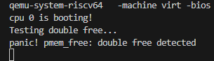

# LAB-2: 内存管理初步


在lab-2中, 我们实现了**物理内存和内核态虚拟内存的管理**。

我们的分工如下：  
**丁熙妍**：完成了**物理内存**部分，以及对应的实验文档。  
**吴晨曦**：完成了**虚拟内存**部分，以及对应的实验文档。

---


## 代码组织结构

```
ANOS
├── LICENSE        开源协议
├── .vscode        配置了可视化调试环境
├── registers.xml  配置了可视化调试环境
├── common.mk      Makefile中一些工具链的定义
├── Makefile       编译运行整个项目 (CHANGE, 增加trap和mem目录作为target)
├── kernel.ld      定义了内核程序在链接时的布局 (CHANGE, 增加一些关键位置的标记)
├── pictures       README使用的图片目录 (CHANGE, 日常更新)
├── README.md      实验报告 (CHANGE, 日常更新)
└── src            源码
    └── kernel     内核源码
        ├── arch   RISC-V相关
        │   ├── method.h
        │   ├── mod.h
        │   └── type.h
        ├── boot   机器启动
        │   ├── entry.S
        │   └── start.c
        ├── lock   锁机制
        │   ├── spinlock.c
        │   ├── method.h
        │   ├── mod.h
        │   └── type.h
        ├── lib    常用库
        │   ├── cpu.c
        │   ├── print.c
        │   ├── uart.c
        │   ├── utils.c (NEW, 工具函数)
        │   ├── method.h (CHANGE, utils.c的函数声明)
        │   ├── mod.h
        │   └── type.h
        ├── mem    内存模块
        │   ├── pmem.c (本实验完成, 物理内存管理)
        │   ├── kvm.c (本实验完成, 内核态虚拟内存管理)
        │   ├── method.h (NEW)
        │   ├── mod.h (NEW)
        │   └── type.h (NEW)
        ├── trap   陷阱模块
        │   ├── method.h (NEW)
        │   ├── mod.h (NEW)
        │   └── type.h (NEW, 增加CLINT和PLIC寄存器定义)
        └── main.c (本实验完成)
```

相比于上一个实验，本次实验主要增加了以下功能：

- 物理内存管理：实现了基于空闲链表的物理页分配和回收机制。
- 内核虚拟内存管理：建立了内核页表，实现了内核地址空间的映射。

---


## 第一阶段: 物理内存

### 函数实现

首先，我先确定了**物理内存的管理范围**，通过查看`kernel.ld`文件，发现我们需要管理的物理内存范围为**ALLOC_BEGIN ~ ALLOC_END** —— **未使用的可分配的物理页**。

并且本实验考虑到内核与用户空间的强制隔离, 基于`KERNEL_PAGE`进行边界，将这块物理内存划分为**内核区域**和**用户区域**两个独立的管理区域，分别管理内核空间和用户空间的空闲物理页。

其次，我采用**4KB物理页切分 + 空闲链表组织**来管理物理内存：

- **页切分**：
    将**ALLOC_BEGIN ~ ALLOC_END**物理空间均匀切分为N个4KB物理页，不会有剩余。

- **链表组织**：
    使用两个**单向链表**来分别管理内核区域和用户区域的所有空闲物理页。

    ```c
    // 物理页节点
    typedef struct page_node
    {
        struct page_node *next;
    } page_node_t;
    ```

    本实验直接**利用空闲物理页的前8字节存储next指针**，当这个物理页被分配出去时，这8个字节可以被覆盖，不会有任何影响，因为分配出去的页面将作为普通内存使用，不再需要链表指针。

    这样就**无需单独分配内存来存储元数据**【这是上学期csapp中实验我使用的方法】，大大减少了内存开销。

- **分配算法**：
    采用**头删法**从链表头部快速获取空闲页，时间复杂度仅为**O(1)**。

- **回收算法**：
    采用**头插法**将释放的页快速插入链表头部，时间复杂度仅为**O(1)**。

然后就可以实现核心的`pmem_free` （**释放页面**）和`pmem_alloc`（**申请页面**）函数。

最后，要实现`pmem_init`函数来**初始化物理内存**，重点是需要建立最初的空闲链表，此时所有的物理页都是空闲的，因此我通过**循环调用`pmem_free`**，将物理内存中每一个页都“释放”到对应的空闲链表中。


### 测试用例

#### test-1

这个测试用例的作用是：

1. cpu-0和cpu-1并行申请内核空间的全部物理内存, 赋值并输出信息

2. 待申请全部结束, 并行释放所有申请的物理内存


成功通过test_1！


#### test-2

这个测试用例的作用是：

1. 测试内存耗尽的panic是否正常触发

2. 测试用户空间物理页申请和释放的正确性

test_case_1时发现`panic`未能正常触发, 经过排查是**因为`panic`逻辑有误**：  

`panic`里先设置`panicked=1`，再调用`printf`；而`printf`开头检测到如果`panicked==1`就直接返回，因此看不到`panic`的输出信息。

**修改`panic`函数**：将`panicked=1`放到`printf`之后。

```c
/* 报错并终止输出 */
void panic(const char *s)
{
    push_off(); //关中断

    if(!panicked){ //避免不同核重复调用
        printf("panic! %s\n", s?s:"<null>"); //先报错
        panicked = 1; //再锁死
    }

    while (1){
        asm volatile("wfi"); //安全停机
    }
}
```

test_case_1输出结果如下：


成功通过test_case_1！


test_case_2输出结果如下：

```
cpu 0 is booting!
=== test_case_2: Phase 1 - Allocate User Pages ===
Allocated user page[0] @ 87fff000
Allocated user page[1] @ 87ffe000
Allocated user page[2] @ 87ffd000
Allocated user page[3] @ 87ffc000
Allocated user page[4] @ 87ffb000
Allocated user page[5] @ 87ffa000
Allocated user page[6] @ 87ff9000
Allocated user page[7] @ 87ff8000
Allocated user page[8] @ 87ff7000
Allocated user page[9] @ 87ff6000
=== test_case_2: Phase 2 - Pre-free Check ===
Expected allocable: 31730, Actual: 31730
=== test_case_2: Phase 3 - Free Pages ===
Free user page[0] @ 87fff000
Free user page[1] @ 87ffe000
Free user page[2] @ 87ffd000
Free user page[3] @ 87ffc000
Free user page[4] @ 87ffb000
Free user page[5] @ 87ffa000
Free user page[6] @ 87ff9000
Free user page[7] @ 87ff8000
Free user page[8] @ 87ff7000
Free user page[9] @ 87ff6000
=== test_case_2: Phase 4 - Post-free Check ===
Expected allocable: 31740, Actual: 31740
Free list head @ 87ff6000
=== test_case_2: Phase 5 - Reallocate & Verify Zero ===
Reallocated page[0] @ 87ff6000
Zero verification passed
Reallocated page[1] @ 87ff7000
Zero verification passed
Reallocated page[2] @ 87ff8000
Zero verification passed
Reallocated page[3] @ 87ff9000
Zero verification passed
Reallocated page[4] @ 87ffa000
Zero verification passed
Reallocated page[5] @ 87ffb000
Zero verification passed
Reallocated page[6] @ 87ffc000
Zero verification passed
Reallocated page[7] @ 87ffd000
Zero verification passed
Reallocated page[8] @ 87ffe000
Zero verification passed
Reallocated page[9] @ 87fff000
Zero verification passed
test_case_2 passed!
cpu 0 test over
```

成功通过test_case_2！

#### 补充测试用例

这个测试用例主要测试了重复释放时的panic触发。

``` c
void test_double_free() {
    // 测试重复释放 
    printf("Testing double free...\n");
    uint64 pa1 = (uint64)pmem_alloc(true); 
    if (!pa1) panic("robustness test: alloc failed");

    pmem_free(pa1, true); // 第一次释放
    pmem_free(pa1, true); // 再次释放
}
```

考虑到不禁止重复释放的话，会破坏空闲链表结构，导致后续分配错误，因此在`pmem_free`函数（原本仅对不合法的地址进行检验）中**增加了对重复释放的检测**，具体实现是**扫描空闲链表**，检查要释放的页是否已经在链表中，如果在则触发`panic`。

```c
 for (page_node_t *cur = ar->list_head.next; cur; cur = cur->next) {
        if ((uint64)cur == page) {
            spinlock_release(&ar->lk);
            panic("pmem_free: double free detected");
        }
    }
```     

输出结果如下：


   
成功通过重复释放测试！


### 思考

本次实验采用简单的空闲链表管理，该策略存在以下优缺点：

- **优点**：

  - 物理页自身存储链表指针，无需额外元数据，**管理开销 = 0**

  - 分配/释放都是**O(1)**操作，性能稳定，不受空闲页长度影响

  - 将内核空间与用户空间分离，**隔离性强**

- **缺点**：

  - 未实现**相邻空闲块合并**（如buddy system的伙伴合并），导致**外部碎片**

  - 每次总是分配空闲链表的第一个物理页，把所有内存需求当作同质化问题处理，**缺乏智能决策**


## 第二阶段：内核态虚拟内存

本实验使用RISC-V体系结构中的**SV39**作为虚拟内存的设计规范：即**39 位虚拟地址，三级页表**。

首先，为了实现内核态虚拟内存管理，我们整理并明确了**虚拟地址**和**页表项**的核心结构：

- **虚拟地址（VA**）结构：

  - VPN[2] + VPN[1] + VPN[0] + OFFSET
  - 9bit         9bits        9bits        12bits   （共39bits）
  - **VPN**为对应层级的**虚拟页号**，每一级的 `VPN[i]` 占 9 位，每级最多索引 512 项（因为 2^9 = 512）

- **页表项（PTE**）结构：

  - reserved + PPN + RSW + D A G U X W R V

  - 10bits         44bits  2bits  8bits                   （共64bits）

  - **一个页表项对应一个物理页**，**PPN**为该页表项管理的物理页的**页号**，**低10bits**为它所管理的物理页的**标志位**

  - **页表项和物理地址（PA）：**

    - 物理地址（PA）结构位：PPN（44位有效）+ OFFSET（12位），其中offset为0。

    - 页表项与物理地址的转换：页表项和物理地址中的**PPN相等**，不同点在于PA的**低12位**是offset，PTE的**低10位**是标志位。在`mem/type.h`中定义了如下**页表项与物理地址的转换**的宏`PA_TO_PTE`和`PTE_TO_PA`


### 核心操作函数实现

在`kvm.c`中我们按照`vm_getpte -> vm_mappages -> vm_unmappages`的顺序实现了三个核心的操作函数。

####  1.`vm_getpte`函数

这个函数的目的是根据`pagetable`,找到`va`对应的`pte`，参数`alloc`表示**是否**允许在路径缺失时**自动分配中间页表**，若查找成功则返回对应的`pte`, 失败返回NULL。

  首先，通过与`mem/type.h`中定义的`VA_MAX`相比较检查**虚拟地址的合法性**：

  ```c
if (va >= VA_MAX)
    return NULL;
  ```

然后，利用`VA_TO_VPN`来逐个提取当前层级的**虚拟页号**，并结合当前**页表**获取当前层级的**PTE**。接着，进行逐层遍历，遍历**中间层**时先检查**获取的PTE是否有效**，：

  - PTE有效时，利用`PTE_CHECK`检查是否符合中间节点的要求（R/W/X均为0），若符合要求，则**利用`PTE_TO_PA`讲当前层PTE设为下一级的页表首地址**
  - PTE无效：根据`alloc`参数判断是否需要自动分配中间页，若不允许分配，直接返回失败NULL；若允许分配，则利用`pmem_alloc(true)`分配新一页作为下一页的页表，并利用`PA_TO_PTE`设置 PTE 指向新页表。

  遍历到`level=0`时直接返回当前PTE：

  ```c
int idx = VA_TO_VPN(va, 0);
return &curr[idx]; //直接返回当前PTE
  ```

  ####  2.`vm_mappages`函数

  这个函数的作用是在页表`pgtbl`中**建立**` [va, va + len)` -> `[pa, pa + len)` 的**映射**，参数`perm`表示构造的新的PTE的**权限标志**（标记可读、可写、可执行等）。

  具体实现上，首先，要进行**参数检查**，主要检查三点：`len`（长度）必须大于 0；`va` 和 `pa` 必须页对齐；`va+len`后不能越界。

  ```c
if (len == 0) panic("vm_mappages: len is zero");// 1. 长度必须大于 0
if (va % PGSIZE != 0 || pa % PGSIZE != 0) panic("vm_mappages: va or pa not page-aligned");// 2. va 和 pa 必须页对齐
if (va + len > VA_MAX) panic("vm_mappages: virtual address overflow");//3. 不能越界
  ```

  接着，进行**逐页映射**（已`PGSIZE`整页为单位进行逐页映射），建立映射的本质是**找到`va`在页表对应位置的`pte`并修改它**，找到对应PTE指针的过程需要需要用到我们刚刚前面实现的`vm_getpte`函数（`alloc`参数设为true，表示如果路径不存在，自动创建中间页表），修改PTE的就相当于给对应的`pte`设置正确的**物理页号**（PPN），**权限**（perm）和**有效位**（V=1），核心代码：

  ```c
pte_t *pte = vm_getpte(pgtbl, va, true); //获取当前虚拟地址对应的 PTE 指针
*pte = PA_TO_PTE(pa) | perm | PTE_V;//修改 PTE
  ```

  #### 3. `vm_unmappages`函数

  这个函数的作用和上一个`vm_mappages`函数相对，用来在页表 `pgtbl` 中**解除虚拟地址区间 `[va, va + len)` 的映射并释放资源**的函数，参数`freeit`表示**是否释放对应的物理资源**，如果`freeit` = true则释放对应物理页（因为题目中说**默认释放的是用户的物理页**，所以使用`pmem_free(pa, false)`释放物理页的时候第二个参数**可以这样直接写为`false`，不用再判断`pa`到底属于哪个区域**了，之前刚开始写的时候还有点拿不准）。

  具体实现上，首先，与`vm_mappages`函数一样，先进行**参数检查**。

  然后，**逐页解除映射**，先**获取当前虚拟地址对应的 PTE 指针**，同样是调用已实现的`vm_getpte`函数，但和`vm_mappages`中不同的是`alloc`参数应设为`false`，表示不允许自动创建中间页表)。然后**将该PTE标记为无效**；如果需要（即`freeit`参数为`true`），还要**释放对应的物理页**（默认是用户的物理页）。核心代码：

  ```c
pte_t *pte = vm_getpte(pgtbl, va, false);//获取当前虚拟地址对应的 PTE 指针
if (freeit) {// 如果需要，释放对应的物理页
  uint64 pa = PTE_TO_PA(*pte);
  pmem_free(pa, false);// 释放（默认是用户的物理页）
}
*pte = 0;//3将 PTE 标记为无效（解除映射）
  ```

---

  ### 设置内核页表映射并启用

  完成三个核心的页表操作函数后，需要给内核页表` kernel_pgtbl`设置映射关系并为每个CPU启用它，对应的函数在：`kvm_init` -> `kvm_inithart`

  #### 1. `kvm_init`函数

  该函数的作用是完成UART、CLINT、PLIC、内核代码区、内核数据区、可分配区域的页表映射。

  具体实现上，首先，**分配根页表**（即第2级页表）。从内核区域**分配一页**并**将该页清零**。

  然后，**映射内核代码和数据区**。首先获取内核代码和数据的范围，然后利用上面写的`vm_mappages`函数建立映射，为恒等映射（`pa`=`va`）

```c
// 映射到内核代码和数据区
vm_mappages(kernel_pgtbl,text_start,text_start,map_size,PTE_R | PTE_W | PTE_X);//va=pa
```

  接着，对`UART/CLINT/PLIC`等设备的寄存器进行映射，同样是利用上面写的`vm_mappages`函数建立恒等映射。本来以为源码中没有设定这些设备的物理地址，还手动利用宏定义自行进行了自认为合理的设置，后来**在`trap/type.h`中发现了CLIENT和PLIC的物理地址定义，在`lib/type.h`中发现了UART设备的物理地址**，如下所示：

  ```c
//lib/type.h中UART的物理基地址
#define CLINT_BASE 0x2000000ul
//trap/type.h中的CLIENT和PLIC物理基地址
#define CLINT_BASE 0x2000000ul
#define PLIC_BASE 0x0c000000ul
  ```

  由于kvm.c的头文件`#include 'mod.h'`包含了这些type.h文件，所以在kvm.c中直接使用这些基地址进行映射即可：

  ```c
vm_mappages(kernel_pgtbl,UART_ADDR,UART_ADDR,PGSIZE,PTE_R | PTE_W);  // UART
vm_mappages(kernel_pgtbl,CLINT_ADDR,CLINT_ADDR,0x10000,PTE_R | PTE_W); // CLINT
vm_mappages(kernel_pgtbl,PLIC_ADDR,PLIC_ADDR,0x4000000,PTE_R | PTE_W); // PLIC
  ```

  最后，**映射可用内存区域**` [ALLOC_BEGIN, ALLOC_END)`，为了**防止未来成为攻击者注入代码的目标**，设定为不可执行（X=0）：

  ```c
vm_mappages(kernel_pgtbl,phy_pool_begin,phy_pool_begin,phy_pool_sz,PTE_R | PTE_W);  // 不可执行
  ```

  #### 2. `kvm_inithart`函数

  这是用于在每个 CPU 核心（hart）上初始化虚拟内存系统 的函数，即**启用分页机制，切换到内核页表**。`satp`寄存器是一个告诉 CPU **当前使用的页表根地址**在哪里，以及**是否启用虚拟内存**（分页机制）的寄存器。这个启动函数源码中已经写好了，包含以下两个步骤：

  - 写入 `satp` 寄存器
  - 刷新TLB缓存

  调用了这个函数后，就**启用了内核页表**，也**就是可以开始使用虚拟地址**了！


### 测试用例

#### test-1

这个测试用例测试了两件事情:

1. 使用内核页表后OS内核是否还能**正常执行**
2. 使用映射和解映射操作**修改你的页表**, 使用`vm_print`输出它被修改前后的对比

测试的输出结果如下：


#### test-2

这个测试用例主要关注**映射和解映射是否正确执行**

在`main.c`中调用`test_mapping_and_unmapping()`进行测试，输出：`test_mapping_and_unmapping passed!`，表示**通过测试**，截图如下：


#### 补充测试用例

为了进一步增强代码的稳定性，增加了一些内存映射的**边缘测试用例**，主要通过测试**映射VA=0，映射接近 VA_MAX 的地址，重复映射到同一虚拟地址**等情况进行测试，补充测试函数如下：

```c
void test_vm_edge_cases()
{
    pgtbl_t pgtbl = (pgtbl_t)pmem_alloc(true);
    memset(pgtbl, 0, PGSIZE);

    uint64 pa1 = (uint64)pmem_alloc(false);
    uint64 pa2 = (uint64)pmem_alloc(false);

    pte_t *pte;

    // Test 1: 映射 VA=0
    vm_mappages(pgtbl, 0, pa1, PGSIZE, PTE_R);
    pte = vm_getpte(pgtbl, 0, false);
    assert(pte && (*pte & PTE_V), "test_vm_edge_cases: mapping va=0 failed");
    assert(PTE_TO_PA(*pte) == pa1, "test_vm_edge_cases: pa mismatch at va=0");

    // Test 2: 映射接近 VA_MAX 的地址
    uint64 high_va = VA_MAX - PGSIZE;
    vm_mappages(pgtbl, high_va, pa2, PGSIZE, PTE_X);
    pte = vm_getpte(pgtbl, high_va, false);
    assert(pte && (*pte & PTE_V), "test_vm_edge_cases: high va mapping failed");
    assert(PTE_TO_PA(*pte) == pa2, "test_vm_edge_cases: pa mismatch at high va");

    // Test 3: 解除映射并验证
    vm_unmappages(pgtbl, 0, PGSIZE, true);
    pte = vm_getpte(pgtbl, 0, false);
    assert(pte && !(*pte & PTE_V), "test_vm_edge_cases: unmap failed for va=0");

    // Test 4: 尝试 remap 到同一 VA（更新权限）
    uint64 pa3 = (uint64)pmem_alloc(false);
    vm_mappages(pgtbl, 0, pa3, PGSIZE, PTE_W | PTE_X);
    pte = vm_getpte(pgtbl, 0, false);
    assert((*pte & (PTE_W | PTE_X)) == (PTE_W | PTE_X), 
           "test_vm_edge_cases: permission not set correctly");

    printf("test_vm_edge_cases passed!\n");
}
```

最终打印出`test_vm_edge_cases passed!`，表示通过了补充的边缘测试！

