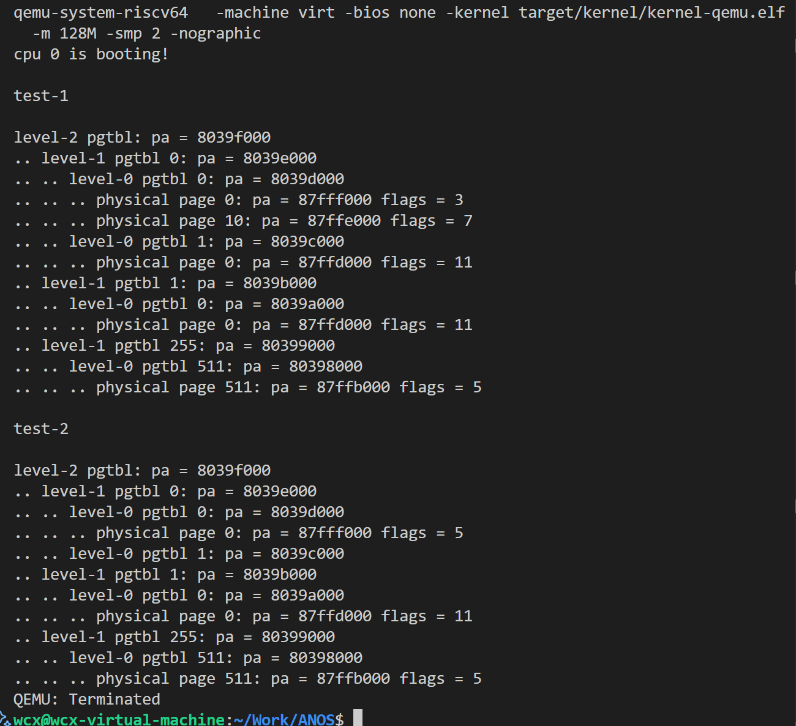
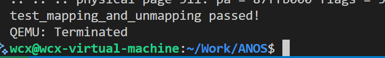
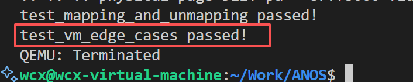

# LAB-2: 内存管理初步


在lab-2中, 我们实现了**物理内存和内核态虚拟内存的管理**。

我们的分工如下：  
**丁熙妍**：完成了**物理内存**部分，以及对应的实验文档。  
**吴晨曦**：完成了**虚拟内存**部分，以及对应的实验文档。


## 代码组织结构

```
ECNU-OSLAB-2025-TASK
├── LICENSE        开源协议
├── .vscode        配置了可视化调试环境
├── registers.xml  配置了可视化调试环境
├── common.mk      Makefile中一些工具链的定义
├── Makefile       编译运行整个项目 (CHANGE, 增加trap和mem目录作为target)
├── kernel.ld      定义了内核程序在链接时的布局 (CHANGE, 增加一些关键位置的标记)
├── pictures       README使用的图片目录 (CHANGE, 日常更新)
├── README.md      实验指导书 (CHANGE, 日常更新)
└── src            源码
    └── kernel     内核源码
        ├── arch   RISC-V相关
        │   ├── method.h
        │   ├── mod.h
        │   └── type.h
        ├── boot   机器启动
        │   ├── entry.S
        │   └── start.c
        ├── lock   锁机制
        │   ├── spinlock.c
        │   ├── method.h
        │   ├── mod.h
        │   └── type.h
        ├── lib    常用库
        │   ├── cpu.c
        │   ├── print.c
        │   ├── uart.c
        │   ├── utils.c (NEW, 工具函数)
        │   ├── method.h (CHANGE, utils.c的函数声明)
        │   ├── mod.h
        │   └── type.h
        ├── mem    内存模块
        │   ├── pmem.c (本实验完成, 物理内存管理)
        │   ├── kvm.c (本实验完成, 内核态虚拟内存管理)
        │   ├── method.h (NEW)
        │   ├── mod.h (NEW)
        │   └── type.h (NEW)
        ├── trap   陷阱模块
        │   ├── method.h (NEW)
        │   ├── mod.h (NEW)
        │   └── type.h (NEW, 增加CLINT和PLIC寄存器定义)
        └── main.c (本实验完成)
```

相比于上一个实验，本次实验主要增加了以下功能：

- 物理内存管理：实现了基于空闲链表的物理页分配和回收机制。

- 内核虚拟内存管理：建立了内核页表，实现了内核地址空间的映射。


## 第一阶段: 物理内存

### 物理内存管理的函数实现


在 `pmem.c`中完成了：

- `pmem_init`: 初始化物理内存

- `pmem_alloc`: 申请空闲页面

- `pmem_free`: 释放物理页


在实现以上三个物理内存管理的核心函数时，我主要考虑到了以下内容：

1. 物理内存布局与划分

先查看 `kernel.ld` 文件，发现我们需要管理的物理内存范围为**ALLOC_BEGIN ~ ALLOC_END** —— **未使用的可分配的物理页**。 

此外，考虑到内核与用户空间的强制隔离, 我们设置了两个`alloc_region`, 基于`KERNEL_PAGE`进行边界划分：
 
- 内核区域 `kern_region`：**ALLOC_BEGIN ~ ALLOC_BEGIN + KERN_PAGES * PGSIZE** ，管理内核空间的空闲物理页

- 用户区域 `user_region`：**ALLOC_BEGIN + KERN_PAGES * PGSIZE ~ ALLOC_END** ，管理用户空间的空闲物理页

2. 空闲链表管理策略

本实验采用**4KB物理页切分 + 空闲链表组织**来管理物理内存：

- 页切分：

将**ALLOC_BEGIN ~ ALLOC_END**物理空间均匀切分为N个4KB物理页，不会有剩余。

- 链表组织：

使用两个**单向链表**来分别管理内核区域和用户区域的所有空闲物理页。

```c
// 物理页节点
typedef struct page_node
{
    struct page_node *next;
} page_node_t;
```

本实验直接**利用空闲物理页的前8字节存储next指针**，当这个物理页被分配出去时，这8个字节可以被覆盖，不会有任何影响，因为分配出去的页面将作为普通内存使用，不再需要链表指针。

这样我们就无需单独分配内存来存储元数据【这是上学期csapp中实验我使用的方法】，大大减少了内存开销。

- 分配算法：

采用**头删法**从链表头部快速获取空闲页，时间复杂度仅为**O(1)**。

- 回收算法：

采用**头插法**将释放的页快速插入链表头部，时间复杂度仅为**O(1)**。

- 初始化策略：

先设置内核区域好用户区域的基本参数，然后通过**循环调用`pmem_free`将所有物理页加入空闲链表**。


### 测试结果

#### test-1


成功通过test_1！


#### test-2

test_case_1时发现`panic`未能正常触发, 经过排查是**因为`panic`逻辑有误**：  

`panic`里先设置`panicked=1`，再调用`printf`；而`printf`开头检测到如果`panicked==1`就直接返回，因此看不到`panic`的输出信息。

**修改`panic`函数**：将`panicked=1`放到`printf`之后。

```c
/* 报错并终止输出 */
void panic(const char *s)
{
    push_off(); //关中断

    if(!panicked){ //避免不同核重复调用
        printf("panic! %s\n", s?s:"<null>"); //先报错
        panicked = 1; //再锁死
    }

    while (1){
        asm volatile("wfi"); //安全停机
    }
}
```

test_case_1输出结果如下：


成功通过test_case_1！


test_case_2输出结果如下：

```
cpu 0 is booting!
=== test_case_2: Phase 1 - Allocate User Pages ===
Allocated user page[0] @ 87fff000
Allocated user page[1] @ 87ffe000
Allocated user page[2] @ 87ffd000
Allocated user page[3] @ 87ffc000
Allocated user page[4] @ 87ffb000
Allocated user page[5] @ 87ffa000
Allocated user page[6] @ 87ff9000
Allocated user page[7] @ 87ff8000
Allocated user page[8] @ 87ff7000
Allocated user page[9] @ 87ff6000
=== test_case_2: Phase 2 - Pre-free Check ===
Expected allocable: 31730, Actual: 31730
=== test_case_2: Phase 3 - Free Pages ===
Free user page[0] @ 87fff000
Free user page[1] @ 87ffe000
Free user page[2] @ 87ffd000
Free user page[3] @ 87ffc000
Free user page[4] @ 87ffb000
Free user page[5] @ 87ffa000
Free user page[6] @ 87ff9000
Free user page[7] @ 87ff8000
Free user page[8] @ 87ff7000
Free user page[9] @ 87ff6000
=== test_case_2: Phase 4 - Post-free Check ===
Expected allocable: 31740, Actual: 31740
Free list head @ 87ff6000
=== test_case_2: Phase 5 - Reallocate & Verify Zero ===
Reallocated page[0] @ 87ff6000
Zero verification passed
Reallocated page[1] @ 87ff7000
Zero verification passed
Reallocated page[2] @ 87ff8000
Zero verification passed
Reallocated page[3] @ 87ff9000
Zero verification passed
Reallocated page[4] @ 87ffa000
Zero verification passed
Reallocated page[5] @ 87ffb000
Zero verification passed
Reallocated page[6] @ 87ffc000
Zero verification passed
Reallocated page[7] @ 87ffd000
Zero verification passed
Reallocated page[8] @ 87ffe000
Zero verification passed
Reallocated page[9] @ 87fff000
Zero verification passed
test_case_2 passed!
cpu 0 test over
```

成功通过test_case_2！


### 思考

本次实验采用简单的空闲链表管理，该策略存在以下优缺点：

- 优点：

  - 物理页自身存储链表指针，无需额外元数据，**管理开销 = 0**

  - 分配/释放都是**O(1)**操作，性能稳定，不受空闲页长度影响

  - 将内核空间与用户空间分离，**隔离性强**

- 缺点：
  
 - 未实现**相邻空闲块合并**（如buddy system的伙伴合并），导致**外部碎片**
 
 - 每次总是分配空闲链表的第一个物理页，把所有内存需求当作同质化问题处理，**缺乏智能决策**


## 第二阶段：内核态虚拟内存

使用RISC-V体系结构中的**SV39**作为虚拟内存的设计规范：即**39 位虚拟地址，三级页表**。

### 2.1 相关概念与原理

- **虚拟地址（VA**）结构：

  - VPN[2] + VPN[1] + VPN[0] + OFFSET
  - 9bit         9bits        9bits        12bits   （共39bits）
  - **VPN**为对应层级的**虚拟页号**，每一级的 `VPN[i]` 占 9 位，每级最多索引 512 项（因为 2^9 = 512）
  - 在`mem/type.h`中定义的宏`VA_TO_VPN(va, level)`：用于**提取第 `level` 层的虚拟页号**（9 bits）

- **页表项（PTE**）结构：

  - reserved + PPN + RSW + D A G U X W R V

  - 10bits         44bits  2bits  8bits                   （共64bits）

  - **一个页表项对应一个物理页**，**PPN**为该页表项管理的物理页的**页号**，**低10bits**为它所管理的物理页的**标志位**

  - 页表本身也是存放在物理页中, 这种物理页的特点是PTE的标志位中`PTE_R PTE_W PTE_X`都是0，因此可以说，物理页被组织为：**存放页表的物理页&存放数据的物理页**

    - 在`mem/type.h`中定义的宏`PTE_CHECK(pte)`：用于**检查一个PTE是否属于页表**（是否是存放页表的物理页）

  - **关于页表和页表项：**

    页表由页表项构成的, 页表相当于数组，页表项相当于数组里的元素

    ```c
    // 页表项和页表(页表项数组)
    typedef uint64 pte_t; //页表项pte_t ：64位无符号数
    typedef pte_t* pgtbl_t; //页表pte_t* ：指向pte_t数组的指针
    ```

  - **关于页表项和物理地址（PA）：**

    - 物理地址（PA）结构位：PPN（44位有效）+ OFFSET（12位），其中offset为0，因为**页（Page**）是内存管理的基本单位，操作系统只按“整页”来分配和映射内存。所以所有被映射的物理地址都必须是 **4KB 对齐**的，即**低 12 位为 0** → offset = 0。

    - 页表项与物理地址的转换：页表项和物理地址中的**PPN相等**，不同点在于PA的**低12位**是offset，PTE的**低10位**是标志位。在`mem/type.h`中定义了如下**页表项与物理地址的转换**的宏：

      ```c
      #define PA_TO_PTE(pa)  ((((uint64)(pa)) >> 12) << 10)
      先直接去掉为0的12位offset 再左移10位给flag挪位置
      #define PTE_TO_PA(pte) (((uint64)(pte) >> 10) << 12)
      先去掉10位标志位再恢复12位offset
      ```

  ### 2.2 核心操作函数实现

  在`kvm.c`中按照`vm_getpte -> vm_mappages -> vm_unmappages`的顺序实现三个核心的操作函数。

  #### 2.2.1 `vm_getpte`函数

  - 目的：根据`pagetable`,找到`va`对应的`pte`。

  - 参数：

    - `pgtbl`：**根页表指针**（类型为`pgtbl_t`，即`pte_t*`）
    - `va`：uint64（64位无符号整数），即**要查找的虚拟地址**
    - `alloc`：bool类型，**是否**允许在路径缺失时**自动分配中间页表**

  - 返回值：

    若成功返回`va`对应的`pte`, 失败返回NULL。

  - 具体实现：

    首先检查虚拟地址的合法性（与`mem/type.h`中定义的`VA_MAX`）相比较

    ```c
    // 检查地址合法性
    if (va >= VA_MAX)
        return NULL;
    ```

    然后利用`VA_TO_VPN`来逐个提取当前层级的**虚拟页号**，并结合当前**页表**获取当前层级的**PTE**。遍历到`level=0`时直接返回当前PTE，遍历中间层时先检查获取的PTE是否有效：

    - PTE有效：利用`PTE_CHECK`检查是否符合中间节点的要求（R/W/X均为0），若符合要求，则**利用`PTE_TO_PA`讲当前层PTE设为下一级的页表首地址**
    - PTE无效：根据`alloc`参数判断是否需要自动分配中间页，若不允许分配，直接返回失败NULL；若允许分配，则利用`pmem_alloc(true)`分配新一页作为下一页的页表，并利用`PA_TO_PTE`设置 PTE 指向新页表。

    具体代码如下：

    ```c
    pgtbl_t curr = pgtbl;  // 当前正在查看的页表
    
    // level=2 和 level=1（中间层）
    for (int level = 2; level > 0; level--) {
        int idx = VA_TO_VPN(va, level);   // 获取当前层级虚拟页号
        pte_t *pte = &curr[idx];          // 当前层级的 PTE
    
        if (*pte & PTE_V) {               // PTE 有效
            if (PTE_CHECK(*pte)) {        // 是中间节点（R/W/X=0）
                uint64 child_pa = PTE_TO_PA(*pte);
                curr = (pgtbl_t)child_pa; // 跳转到下一级页表
            } else {
                return NULL; // 非法：中间节点设置了 R/W/X
            }
        } else {                          // PTE 无效
            // 不允许分配
            if (!alloc)                   
                return NULL;
    		//允许分配
            void *pa = pmem_alloc(true);  // 分配一页作为下一级页表
            if (!pa) return NULL;
            memset(pa, 0, PGSIZE);        // 清零
    
            uint64 child_ppn = PA_TO_PTE((uint64)pa);
            *pte = child_ppn | PTE_V;     // 设置 PTE 指向新页表
    
            curr = (pgtbl_t)pa;           // 更新当前页表为新分配的
        }
    }
    
    // 到达 level=0
    // 直接返回 level-0 的 PTE 指针
    int idx = VA_TO_VPN(va, 0);
    return &curr[idx];
    ```

  #### 2.2.4 `vm_mappages`函数

  - 目的：在页表`pgtbl`中**建立**` [va, va + len)` -> `[pa, pa + len)` 的**映射**

  - 参数：

    - `pgtbl`：**根页表指针**（类型为`pgtbl_t`，即`pte_t*`）
    - `va`：uint64（64位无符号整数），**虚拟地址映射区间首地址**
    - `pa`：uint64（64位无符号整数），**物理地址映射区间首地址**
    - `len`：uint64（64位无符号整数），**要建立映射的区间的长度**
    - `perm`：int类型，构造的新的PTE的**权限标志**（如可读、可写、可执行等）

  - 无返回值

  - 具体实现：

    - 首先，要进行**参数检查**，主要检查三点：

      - `len`（长度）必须大于 0
      - `va` 和 `pa` 必须页对齐
      - `va+len`后不能越界

      ```c
      //参数检查
          // 1. 长度必须大于 0
          if (len == 0) {
              panic("vm_mappages: len is zero");
          }
      
          // 2. va 和 pa 必须页对齐
          if (va % PGSIZE != 0 || pa % PGSIZE != 0) {
              panic("vm_mappages: va or pa not page-aligned");
          }
      
          // 3. 不能越界
          if (va + len > VA_MAX) {
              panic("vm_mappages: virtual address overflow");
          }
      ```

    - 接着，进行**逐页映射**（已`PGSIZE`整页为单位进行逐页映射）

      建立映射的本质是**找到`va`在页表对应位置的`pte`并修改它**，即给对应的`pte`设置正确的**物理页号**（PPN），**权限**（perm）和**有效位**（V=1）

      ```c
      //逐页映射
      uint64 end = va + len;  // 结束虚拟地址
      
      while (va < end) {
          // Step 1: 获取当前虚拟地址对应的 PTE 指针
          //         如果路径不存在，自动创建中间页表)
          pte_t *pte = vm_getpte(pgtbl, va, true);
          if (!pte) {
              panic("vm_mappages: cannot create PTE (out of memory?)");
          }
      
          // Step 2: 修改 PTE
          //         将物理地址 pa 编码为 PPN 字段，并加上权限和 V 标志
          uint64 pte_flags = PA_TO_PTE(pa) | perm | PTE_V;
          *pte = pte_flags;
      
          // Step 3: 前进到下一页
          va += PGSIZE;
          pa += PGSIZE;
      }
      ```

  #### 2.2.3 `vm_unmappages`函数

  - 目的：在页表 `pgtbl` 中解除虚拟地址区间 `[va, va + len)` 的映射并释放资源

  - 参数：

    - `pgtbl`：**根页表指针**（类型为`pgtbl_t`，即`pte_t*`）
    - `va`：uint64（64位无符号整数），**要解除的虚拟地址映射区间首地址**
    - `len`：uint64（64位无符号整数），**要解除的虚拟地址映射区间长度**
    - `freeit`：bool类型，**是否释放对应的物理资源**，如果`freeit` = true则释放对应物理页, **默认是用户的物理页**

  - 无返回值

  - 具体实现：

    - 首先，与`vm_mappages`函数一样，先进行**参数检查**

      ```c
      //参数检查
      // 1. 长度必须大于 0
      if (len == 0) {
          panic("vm_unmappages: len is zero");    
      // 2. va 必须页对齐
      } else if (va % PGSIZE != 0) {
          panic("vm_unmappages: va not page-aligned");
      // 3. 不能越界
      } else if (va + len > VA_MAX) {
          panic("vm_unmappages: virtual address overflow");   
      }
      ```

    - 然后，**逐页解除映射**，先获取当前虚拟地址对应的 PTE 指针(不允许自动创建中间页表)，然后将该PTE标记为无效；如果需要，还要释放对应的物理页（默认是用户的物理页）。

      ```c
      //逐页解除映射
      uint64 end = va + len;  // 结束虚拟地址
      while (va < end) {
          // Step 1: 获取当前虚拟地址对应的 PTE 指针(不允许自动创建)
          pte_t *pte = vm_getpte(pgtbl, va, false);
          if (!pte || !(*pte & PTE_V)) {
              panic("vm_unmappages: unmap a not mapped page");
          }
      
          // Step 2: 如果需要，释放对应的物理页
          if (freeit) {
              uint64 pa = PTE_TO_PA(*pte);
      
              // 释放 默认是用户的物理页
              pmem_free(pa, false);
          }
      
          // Step 3: 将 PTE 标记为无效（解除映射）
          *pte = 0;
      
          // Step 4: 前进到下一页
          va += PGSIZE;
      }
      ```

  ### 2.3 设置内核页表映射并启用

  完成三个核心的页表操作函数后，需要给内核页表` kernel_pgtbl`设置映射关系并为每个CPU启用它，对应的函数在：`kvm_init` -> `kvm_inithart`

  #### 2.3.1 `kvm_init`函数

  - 目的：完成UART、CLINT、PLIC、内核代码区、内核数据区、可分配区域的页表映射

  - 具体实现：

    - 首先，**分配根页表**（即第2级页表）。从内核区域分配一页并将该页清零

    ```c
    kernel_pgtbl = (pgtbl_t)pmem_alloc(true);  // 从内核区域分配一页
    if (!kernel_pgtbl) {
        panic("kvm_init: cannot allocate root page table");
    }
    memset(kernel_pgtbl, 0, PGSIZE);  // 清零
    ```

    - 然后，**映射内核代码和数据区**。首先获取内核代码和数据的范围，然后利用上面写的`vm_mappages`函数建立映射，为恒等映射（`pa`=`va`）

    ```c
    // === 获取内核代码和数据的范围 ===
    uint64 text_start = KERNEL_BASE; //代码段开始的位置          
    uint64 data_end   = (uint64)ALLOC_BEGIN;  // 数据段结束位置
    uint64 size = data_end - text_start; //长度
    uint64 map_size = (size + PGSIZE - 1) & ~(PGSIZE - 1);//对齐为整页
    
    
    // 映射到内核代码和数据区===
    vm_mappages(kernel_pgtbl,text_start,text_start,map_size,PTE_R | PTE_W | PTE_X);//pa=va 恒等映射
    ```

    - 接着，对`UART/CLINT/PLIC`等设备的寄存器进行映射，同样是利用上面写的`vm_mappages`函数建立恒等映射。（并且由于源码没有这些设备的位置，就先在`kvm.c`中人为define了这些设备的物理地址，不知道对不对，，）

    ```c
    //设定设备的物理地址(函数外)
    #define UART_ADDR      0x10000000ULL
    #define CLINT_ADDR     0x02000000ULL
    #define PLIC_ADDR      0x0C000000ULL
    
    //建立映射
    vm_mappages(kernel_pgtbl,UART_ADDR,UART_ADDR,PGSIZE,PTE_R | PTE_W);  // 不可执行
    
    vm_mappages(kernel_pgtbl,CLINT_ADDR,CLINT_ADDR,0x10000,PTE_R | PTE_W); // 不可执行
    
    vm_mappages(kernel_pgtbl,PLIC_ADDR,PLIC_ADDR,0x4000000,PTE_R | PTE_W); // 不可执行
    ```

    - 最后，**映射可用内存区域**` [ALLOC_BEGIN, ALLOC_END)`，为了**防止未来成为攻击者注入代码的目标**，设定为不可执行

    ```c
    uint64 phy_pool_begin = (uint64)ALLOC_BEGIN;
    uint64 phy_pool_end   = (uint64)ALLOC_END;
    uint64 phy_pool_sz    = phy_pool_end - phy_pool_begin;
    
    vm_mappages(kernel_pgtbl,phy_pool_begin,phy_pool_begin,phy_pool_sz,PTE_R | PTE_W);  // 不可执行
    ```

  #### 2.3.2 `kvm_inithart`函数

  这是用于在每个 CPU 核心（hart）上初始化虚拟内存系统 的函数，即**启用分页机制，切换到内核页表**。

  - **关于`satp`寄存器：**

    - 作用：**告诉 CPU 当前使用的页表根地址在哪里，以及是否启用虚拟内存（分页机制）**
    - 结构：
      - MODE：4bit-地址翻译模式（如8=SV39）
      - ASID：16bit-地址空间ID（可加快TLB切换）
      - PPN：44bit-页表根节点的**物理页号**
    - 在`mem/type.h`中定义的宏，可设置`satp`寄存器的MODE和PPN字段

    ```c
    #define SATP_SV39 (8L << 60)   // MODE = SV39
    #define MAKE_SATP(pagetable) (SATP_SV39 | (((uint64)pagetable) >> 12)) // 设置MODE和PPN字段
    ```

  - 函数流程
    - 写入 `satp` 寄存器
    - 刷新TLB缓存

  ```c
  void kvm_inithart()
  {
      w_satp(MAKE_SATP(kernel_pgtbl));//写入 satp 寄存器
      sfence_vma();// 刷新TLB缓存
  }
  ```

  也就是说，调用了这个函数后，就**启用了内核页表**，可以开始使用虚拟地址了！

  ### 2.4 测试用例

  #### test-1

  ```c
  int main()
  {
      int cpuid = r_tp();
  
      if(cpuid == 0) {
  
          print_init();
          pmem_init();
          kvm_init();
          kvm_inithart();
  
          printf("cpu %d is booting!\n", cpuid);
          __sync_synchronize();
          // started = 1;
  
          pgtbl_t test_pgtbl = pmem_alloc(true);
          uint64 mem[5];
          for(int i = 0; i < 5; i++)
              mem[i] = (uint64)pmem_alloc(false);
  
          printf("\ntest-1\n\n");    
          vm_mappages(test_pgtbl, 0, mem[0], PGSIZE, PTE_R);
          vm_mappages(test_pgtbl, PGSIZE * 10, mem[1], PGSIZE / 2, PTE_R | PTE_W);
          vm_mappages(test_pgtbl, PGSIZE * 512, mem[2], PGSIZE - 1, PTE_R | PTE_X);
          vm_mappages(test_pgtbl, PGSIZE * 512 * 512, mem[2], PGSIZE, PTE_R | PTE_X);
          vm_mappages(test_pgtbl, VA_MAX - PGSIZE, mem[4], PGSIZE, PTE_W);
          vm_print(test_pgtbl);
  
          printf("\ntest-2\n\n");    
          vm_mappages(test_pgtbl, 0, mem[0], PGSIZE, PTE_W);
          vm_unmappages(test_pgtbl, PGSIZE * 10, PGSIZE, true);
          vm_unmappages(test_pgtbl, PGSIZE * 512, PGSIZE, true);
          vm_print(test_pgtbl);
  
      } else {
  
          while(started == 0);
          __sync_synchronize();
          printf("cpu %d is booting!\n", cpuid);
           
      }
      while (1);    
  }
  ```

  这个测试用例测试了两件事情:

  1. 使用内核页表后OS内核是否还能**正常执行**
  2. 使用映射和解映射操作**修改你的页表**, 使用vm_print输出它被修改前后的对比

​	测试的输出结果如下：



#### test-2

```c
/*---------------------------------- 测试代码 --------------------------------*/

void test_mapping_and_unmapping()
{
    // 1. 初始化测试页表
    pte_t* pte;
    pgtbl_t pgtbl = (pgtbl_t)pmem_alloc(true);
    memset(pgtbl, 0, PGSIZE);

    // 2. 准备测试条件
    uint64 va_1 = 0x100000;
    uint64 va_2 = 0x8000;
    uint64 pa_1 = (uint64)pmem_alloc(false);
    uint64 pa_2 = (uint64)pmem_alloc(false);

    // 3. 建立映射
    vm_mappages(pgtbl, va_1, pa_1, PGSIZE, PTE_R | PTE_W);
    vm_mappages(pgtbl, va_2, pa_2, PGSIZE, PTE_R);

    // 4. 验证映射结果
    pte = vm_getpte(pgtbl, va_1, false);
    assert(pte != NULL, "test_mapping_and_unmapping: pte_1 not found");
    assert((*pte & PTE_V) != 0, "test_mapping_and_unmapping: pte_1 not valid");
    assert(PTE_TO_PA(*pte) == pa_1, "test_mapping_and_unmapping: pa_1 mismatch");
    assert((*pte & (PTE_R | PTE_W)) == (PTE_R | PTE_W), "test_mapping_and_unmapping: flag_1 mismatch");

    pte = vm_getpte(pgtbl, va_2, false);
    assert(pte != NULL, "test_mapping_and_unmapping: pte_2 not found");
    assert((*pte & PTE_V) != 0, "test_mapping_and_unmapping: pte_2 not valid");
    assert(PTE_TO_PA(*pte) == pa_2, "test_mapping_and_unmapping: pa_2 mismatch");
    assert((*pte & (PTE_R | PTE_W)) == (PTE_R | PTE_W), "test_mapping_and_unmapping: flag_2 mismatch");

    // 5. 解除映射
    vm_unmappages(pgtbl, va_1, PGSIZE, true);
    vm_unmappages(pgtbl, va_2, PGSIZE, true);

    // 6. 验证解除映射结果
    pte = vm_getpte(pgtbl, va_1, false);
    assert(pte != NULL, "test_mapping_and_unmapping: pte_1 not found");
    assert((*pte & PTE_V) == 0, "test_mapping_and_unmapping: pte_1 still valid");
    pte = vm_getpte(pgtbl, va_2, false);
    assert(pte != NULL, "test_mapping_and_unmapping: pte_2 not found");
    assert((*pte & PTE_V) == 0, "test_mapping_and_unmapping: pte_2 still valid");

    // 7. 由于页表的释放函数还没实现, 作为测试用例可以展示不释放页表空间

    printf("test_mapping_and_unmapping passed!\n");
}
```

这个测试用例主要关注**映射和解映射是否正确执行**

在`main.c`中调用`test_mapping_and_unmapping()`进行测试，输出：`test_mapping_and_unmapping passed!`，表示**通过测试**，截图如下：



#### 补充测试用例

为了进一步增强代码的稳定性，增加了一些内存映射的**边缘测试用例**，测试函数如下：

```c
void test_vm_edge_cases()
{
    pgtbl_t pgtbl = (pgtbl_t)pmem_alloc(true);
    memset(pgtbl, 0, PGSIZE);

    uint64 pa1 = (uint64)pmem_alloc(false);
    uint64 pa2 = (uint64)pmem_alloc(false);

    pte_t *pte;

    // Test 1: 映射 VA=0
    vm_mappages(pgtbl, 0, pa1, PGSIZE, PTE_R);
    pte = vm_getpte(pgtbl, 0, false);
    assert(pte && (*pte & PTE_V), "test_vm_edge_cases: mapping va=0 failed");
    assert(PTE_TO_PA(*pte) == pa1, "test_vm_edge_cases: pa mismatch at va=0");

    // Test 2: 映射接近 VA_MAX 的地址
    uint64 high_va = VA_MAX - PGSIZE;
    vm_mappages(pgtbl, high_va, pa2, PGSIZE, PTE_X);
    pte = vm_getpte(pgtbl, high_va, false);
    assert(pte && (*pte & PTE_V), "test_vm_edge_cases: high va mapping failed");
    assert(PTE_TO_PA(*pte) == pa2, "test_vm_edge_cases: pa mismatch at high va");

    // Test 3: 解除映射并验证
    vm_unmappages(pgtbl, 0, PGSIZE, true);
    pte = vm_getpte(pgtbl, 0, false);
    assert(pte && !(*pte & PTE_V), "test_vm_edge_cases: unmap failed for va=0");

    // Test 4: 尝试 remap 到同一 VA（更新权限）
    uint64 pa3 = (uint64)pmem_alloc(false);
    vm_mappages(pgtbl, 0, pa3, PGSIZE, PTE_W | PTE_X);
    pte = vm_getpte(pgtbl, 0, false);
    assert((*pte & (PTE_W | PTE_X)) == (PTE_W | PTE_X), 
           "test_vm_edge_cases: permission not set correctly");

    printf("test_vm_edge_cases passed!\n");
}
```

最终打印出`test_vm_edge_cases passed!`，表示通过了补充的边缘测试！

