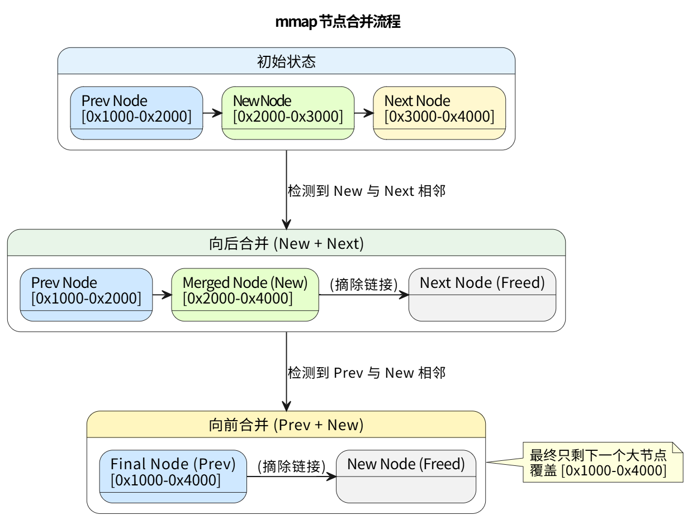
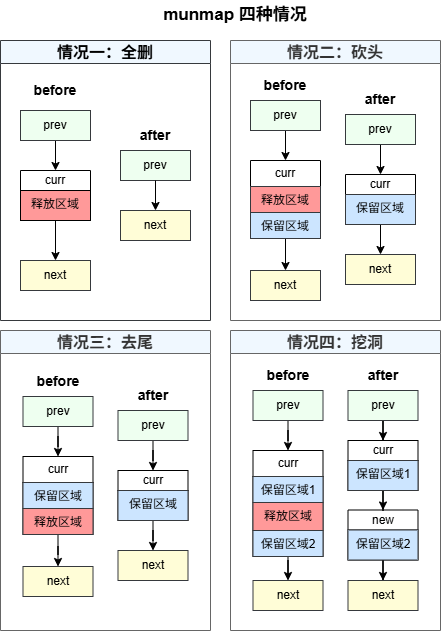
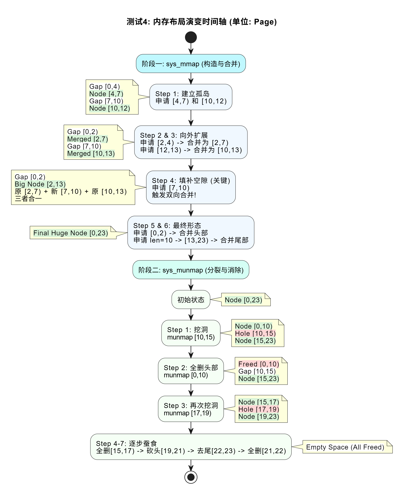
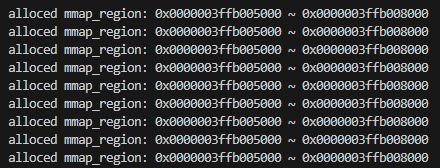

# LAB-5: 系统调用流程建立 + 用户态虚拟内存管理

在lab-5中，我们继续**完善和发展了第一个用户进程`proczero`**，赋予`proczero`**更强的内存掌控能力**（包括堆、栈、离散映射三个部分）以及**完善的请求服务能力**（建立真正的系统调用流程），具体分为五个小任务。

我们的分工如下：

**丁熙妍**：完成了**任务3**（mmap_region_node 仓库管理）、**任务4**（mmap 与 munmap），以及对应的README文档。

**吴晨曦**：完成了**任务1**（用户态和内核态的数据迁移）、**任务2**（堆的手动管理与栈的自动管理），**任务5**（页表的复制和销毁），以及对应的README文档

---

## 代码组织结构

```
ECNU-OSLAB-2025-TASK
├── LICENSE        开源协议
├── .vscode        配置了可视化调试环境
├── registers.xml  配置了可视化调试环境
├── .gdbinit.tmp-riscv xv6自带的调试配置
├── common.mk      Makefile中一些工具链的定义
├── Makefile       编译运行整个项目 (CHANGE, 新增目录syscall)
├── kernel.ld      定义了内核程序在链接时的布局
├── pictures       README使用的图片目录 (CHANGE, 日常更新)
├── README.md      实验指导书 (CHANGE, 日常更新)
└── src            源码
    ├── kernel     内核源码
    │   ├── arch   RISC-V相关
    │   │   ├── method.h
    │   │   ├── mod.h
    │   │   └── type.h
    │   ├── boot   机器启动
    │   │   ├── entry.S
    │   │   └── start.c
    │   ├── lock   锁机制
    │   │   ├── spinlock.c
    │   │   ├── method.h
    │   │   ├── mod.h
    │   │   └── type.h
    │   ├── lib    常用库
    │   │   ├── cpu.c
    │   │   ├── print.c
    │   │   ├── uart.c
    │   │   ├── utils.c
    │   │   ├── method.h
    │   │   ├── mod.h
    │   │   └── type.h
    │   ├── mem    内存模块
    │   │   ├── pmem.c
    │   │   ├── kvm.c
    │   │   ├── uvm.c (本实验完成, 用户态虚拟内存管理主体)
    │   │   ├── mmap.c (本实验完成, mmap节点资源仓库)
    │   │   ├── method.h (CHANGE, 日常更新)
    │   │   ├── mod.h
    │   │   └── type.h (CHANGE, 日常更新)
    │   ├── trap   陷阱模块
    │   │   ├── plic.c
    │   │   ├── timer.c
    │   │   ├── trap_kernel.c
    │   │   ├── trap_user.c (本实验完成, 系统调用处理 + pagefault处理)
    │   │   ├── trap.S
    │   │   ├── trampoline.S
    │   │   ├── method.h
    │   │   ├── mod.h (CHANGE, 日常更新)
    │   │   └── type.h
    │   ├── proc   进程模块
    │   │   ├── proc.c (本实验完成, proczero->mmap初始化)
    │   │   ├── swtch.S
    │   │   ├── method.h
    │   │   ├── mod.h
    │   │   └── type.h (CHANGE, 进程结构体里新增mmap字段)
    │   ├── syscall 系统调用模块
    │   │   ├── syscall.c (NEW, 系统调用通用逻辑)
    │   │   ├── sysfunc.c (本实验完成, 各个系统调用的处理逻辑) 
    │   │   ├── method.h (NEW)
    │   │   ├── mod.h (NEW)
    │   │   └── type.h (NEW)
    │   └── main.c
    └── user       用户程序
        ├── initcode.c (CHANGE, 按照测试需求来设置)
        ├── sys.h
        ├── syscall_arch.h
        └── syscall_num.h (CHANGE, 日常更新)
```

相比于上一个实验，本次实验主要增加了以下功能：

- 实现了**用户态和内核态的数据迁移**：上次的lab4中实现了`sys_helloworld`，让内核成功输出了`"hello world"`，但用户态程序无法向内核程序传递参数，在本次实验中我们借助trapframe中保存的寄存器值实现了用户态和内核态之间的**值传递**，借助物理地址的过渡实现了用户态和内核态之间的**地址传递**。
- 实现了**用户地址空间中堆的手动管理与栈的自动管理**：上次的lab4中栈空间和堆空间被简单地设置为4KB和0KB，本次实验初步实现了动态的堆栈管理，包括**堆的伸缩**和**栈缺页的处理**。
- 实现了**mmap 节点资源的静态仓库管理**：由于目前的内核物理页分配器是以**页（4KB）为粒度**的，不适合分配小对象（如 `mmap_region_t` 节点），因此我们设计了一个基于**静态数组 + 单向空闲链表**的资源仓库，实现了 `mmap_region_t` 节点的高效复用与并发管理。
- 实现了**用户态虚拟内存的离散映射 (mmap/munmap)**：目前已实现的堆适合管理大片连续内存，而栈无法手动释放，因此为了满足应用程序**动态申请离散内存**的需求，我们为用户进程引入了 `mmap` 链表机制（支持 `mmap + munmap`）来管理离散的虚拟内存区域，赋予了**用户进程灵活管理虚拟内存**的能力。
- 实现了**页表的复制与销毁**：完成了页表复制和销毁的函数`uvm_destroy_pgtbl()`和`uvm_copy_pgtbl()`，为下一个实验**进入多进程做准备**。

---

## 具体实现

### 1.用户态和内核态的数据迁移

为实现和测试数据迁移，完成了`sys_copyin`、`sys_copyout`、`sys_copyinstr`这三个**临时系统调用**，分别用于**用户态拷贝至内核态**、**内核态拷贝至用户态**、**用户态字符串拷贝到内核态**。调用流程：

```tex
在initcode.c中调用syscall->进入trap_user_handler识别该系统调用，并调用sysfunc.c的对应函数进行处理->在sysfunc.c的对应函数中获取参数，并调用uvm.c中的对应函数进行实际拷贝
```

因此我所做的就是在uvm.c和sysfunc.c中实现了对应的处理函数

#### （1）uvm.c中的支撑函数

在[uvm.c](src/kernel/mem/uvm.c)的`uvm_copyin`，`uvm_copyout`和`uvm_copyin_str`函数中，我主要完成的事就是**使用`memmove`函数来执行拷贝**，`memmove`函数原型：

```c
void *memmove(void *dest, const void *src, size_t n);
```

不过其中对dest、src以及拷贝长度n这三个参数的处理有以下两个细节：

- **用户地址空间和内核地址空间不匹配**的问题（用户传入的地址空间是基于用户页表的, 但是进入内核后使用的是内核页表)，在进行**地址传递**时，要首先查询用户页表, 找到了虚拟地址对应的**物理地址,** 然后再做数据迁移：

  ```c
  // 获取src对应的PTE和物理地址
  pte_t *pte = vm_getpte(pgtbl, src, false); 
  uint64 pa = PTE_TO_PA(*pte); 
  ```

- 数据传递的**src和dst 不一定是page-aligned**的问题，拷贝时不能直接整页大小的拷贝，可能会**因为不对齐而跨页从而拷贝错误**，于是我首先通过计算页内偏移和剩余可拷贝字节数，**计算实际需要拷贝字节数**，再进行拷贝。

#### （2）sysfunc.c中的系统调用函数

对于[sysfunc.c](src/kernel/syscall/sysfunc.c)的`sys_copyin`，`sys_copyout`和`sys_copyinstr`这三个函数，我首先利用`arg_uint32`和`arg_uint64`**获取用户态传来的参数**（通过`proc->tf->ax`拿到这些参数），然后**调用上面在uvm.c中实现的对应的`uvm_copyxx`函数进行拷贝**，比如`sys_copyout()`如下，`sys_copyin`和`sys_copyinstr`也类似：

```c
static int kernel_array[5] = {1, 2, 3, 4, 5}; // 内核中的测试数组
uint64 sys_copyout()
{
    uint64 addr;
    arg_uint64(0, &addr); // 获取第0号参数
    uvm_copyout(myproc()->pgtbl, addr, (uint64)kernel_array, 5 * sizeof(int)); // 调用uvm_copyout从内核拷贝到用户态
    return 0;
}
```

#### （3）测试1：用户态和内核态的数据迁移

测试逻辑:

- 用户读取内核中的数组 (1 2 3 4 5)
- 用户将读到的数组传递给内核, 内核收到后打印出来
- 用户将自己的字符串传递给内核, 内核收到后打印出来

测试代码在[initcode.c](src/user/initcode.c)中的对应注释部分，在sysfunc.c的函数中添加了一些调试信息，测试结果见[`pictures/test1.png`](pictures/test1.png)

---

### 2.堆的手动管理与栈的自动管理

#### 2.1 堆的手动管理

这个功能的实现与任务一的逻辑类似，完成了：

- [sysfunc.c](src/kernel/syscall/sysfunc.c)中`sys_brk`**系统调用函数**，用于实现**用户堆空间的伸缩和查找**
- 对应的**支撑函数**，[uvm.c](src/kernel/mem/uvm.c)中的`uvm_heap_grow`和`uvm_heap_ungrow`函数

##### （1）uvm_heap_grow和uvm_heap_ungrow

这是`sys_brk`的两个支撑函数，我实现的核心方法为：

- `uvm_heap_grow`函数对应**用户堆空间增加**，通过一个**for循环**为每个增加的页**分配物理页并映射**：

  ```c
  void *pa = pmem_alloc(false); // 分配物理页
  vm_mappages(pgtbl, va, (uint64)pa, PGSIZE, PTE_R | PTE_W | PTE_U);//映射
  ```

- `uvm_heap_ungrow`函数对应**用户堆空间减少**，通过一个**for循环**把每一个要释放的页**解映射**：

  ```c
  vm_unmappages(pgtbl, va, PGSIZE, true); //解映射
  ```

细节上，考虑到可能出现新/旧**堆顶不page-aligned**的情况，我统一采用按页向上取整的方式进行对齐：

```c
uint64 cur_pages = (cur_heap_top + PGSIZE - 1) / PGSIZE; // 向上取整
uint64 new_pages = (new_top + PGSIZE - 1) / PGSIZE; // 向上取整
```

同时，也进行了**边界检查**：

```c
if (new_pages * PGSIZE > (uint64)MMAP_BEGIN) 
    return (uint64)-1;
```

##### （2）sys_brk

和`sys_copyxx`类似，同样是先通过`arg_uint64`**从用户态获取参数`new_top`(新堆顶)**。

若`new_top=0`则代表**查询当前堆顶**，返回现堆顶`cur`；若`new_top>cur`，则进行**堆增长**，调用`uvm_heap_grow(p->pgtbl, cur, len)`；若`new_top<cur`，则进行**堆收缩**，调用`uvm_heap_ungrow(p->pgtbl, cur, len)`（`new_top=cur`也合并在这个情况）

##### （3）测试2.1：堆的手动管理

测试逻辑：

- 传入参数0，**查询栈顶**
- 向上**拓展**9 pages的堆空间
- `new_heap_top=old_heap_top`，保持**不变**
- 向下**收缩**5 pages的堆空间

测试代码在[initcode.c](src/user/initcode.c)中的对应注释部分，在`sys_brk`中增加了一些调试性输出，调用kvm.c中的`vm_print`函数打印页表内容来进行验证。测试结果见[`pictures/test2(1).png`](pictures/test2(1).png)，从打印的页表可以看出，伸缩堆空间的时候，页表映射确实随之改变。

#### 2.2 栈的自动管理

用户栈空间是**根据程序运行的需要**逐步分配的，并且扩展后**不会收缩**。当用户读或写一块未分配的地址空间时, 会触发**13号异常(Load Page Fault)** / **15号异常(Store/AMO Page Fault)**，从而通过**处理缺页异常**拓展所需页面。

我首先在`trap_user_handler`里的异常处理中增加了case 13和case 15来识别这两种异常（stval寄存器中放的是page fault的地址）：

```c
case 13:
case 15:
    uint64 old_ustack_npage = p->ustack_npage;
    uint64 ret = uvm_ustack_grow(p->pgtbl, old_ustack_npage, r_stval());
    break;
```

然后实现了[uvm.c](src/kernel/mem/uvm.c)中`uvm_ustack_grow`函数负责的**缺页异常的处理**。

##### （1）uvm_ustack_grow

实现起来和`uvm_heap_grow`类似，核心就是利用`pmem_alloc`**分配新的物理页**，然后利用`vm_mappages`进行**映射**。就是流程上首先需要**判断发生page fault的地址是否是合理的栈扩展地址**：

```c
if (fault_addr >= TRAPFRAME || fault_addr <= MMAP_END) 
    return (uint64)-1; 
```

确认合法性后，再计算计算需要拓展的栈页数并进行**物理页面的申请和映射**，最后还要**更新`proc->ustack_npage`**，同时，依然也有**边界检查**（栈不能越过 `MMAP_END`）：

```c
uint64 max_stack_pages = (TRAPFRAME - (uint64)MMAP_END) / PGSIZE;
if (need_pages > max_stack_pages) 
    return (uint64)-1;
```

##### （2）测试2.2：栈的自动管理

测试逻辑：

- 通过定义**非static（确保在栈上）的长数组**，让栈的大小超过4KB，从而测试栈的自动拓展能力

测试代码在[initcode.c](src/user/initcode.c)中的对应注释部分，在`trap_user_handler`中增加了一些调试性输出。测试结果见[`pictures/test2(2).png`](pictures/test2(2).png)，从输出可以看出，确实触发了缺页异常，并且拓展了对应的栈空间。

---

### 3.mmap_region_node仓库管理

为了支持离散内存分配（mmap），我们需要一种机制来管理 `mmap_region_t` 结构体本身。由于内核中不便使用动态内存分配（malloc），我们采用**静态资源仓库**的方式来管理这些节点。

#### （1）mmap_region_node 结构体与静态仓库

我在[mmap.c](src/kernel/mem/mmap.c)中设计了**固定大小的资源池** `node_list[N_MMAP]`，并通过单向链表将所有空闲节点串联起来。为了复用 `mmap_region_t` 并维护链表结构，我们定义了一个**包装结构体**：

```c
typedef struct mmap_region_node {
    mmap_region_t mmap;            // 实际对外提供的资源
    struct mmap_region_node *next; // 仓库内部维护空闲链表用的指针
} mmap_region_node_t;
```

同时，我定义了以下**全局变量**，来管理这个资源仓库：

- `node_list`：静态数组，作为物理存储。
- `list_head`：哨兵头节点，指向空闲链表的第一个可用节点。
- `list_lk`：全局自旋锁，保护 list_head 的操作。

#### （2）仓库的初始化、申请与释放

- **初始化（ `mmap_init` ）**：
  在系统启动时，将**静态数组 `node_list` 中的所有元素**通过 `next` 指针串联起来，并将 `list_head.next` 指向数组的第一个元素，从而形成一个**完整的空闲链表**。

- **申请节点（ `mmap_region_alloc` ）**：
  从**链表头部**摘取节点，时间复杂度为 **O(1)**。

- **释放节点（ `mmap_region_free` ）**：
  采用**头插法**将节点归还至空闲链表，时间复杂度为 **O(1)**。
  但这里需要注意的是：如何找到 `mmap_region_t mmap` 对应的节点？
  通过再次查看 `mmap_region_node_t` 结构体的定义，我发现 `mmap` 是该结构体的第一个成员，因此它们的**地址相同**。于是我可以利用**指针强制转换**来实现： 

  ``` c
  // 找到 mmap 所在的 node
  mmap_region_node_t *node = (mmap_region_node_t *)mmap;
  ```

#### （3）测试3：mmap_region_node 仓库管理

测试逻辑：

- CPU0 初始化系统及 mmap 仓库，并打印初始状态。
- CPU0 和 CPU1 **并发竞争申请资源**：CPU0 试图申请并填充 mmap_list 的前半部分，CPU1 负责后半部分。
- CPU0 和 CPU1 **并发竞争释放资源**：将各自持有的节点归还给仓库。
- 最后打印仓库状态，检查链表是否完整恢复，无资源泄露、重复释放等问题。

测试代码在[main.c](src/kernel/main.c)中的对应注释部分，测试结果见[`pictures/test3(1).png`](pictures/test3(1).png) - [`pictures/test3(4).png`](pictures/test3(4).png)，成功申请与释放所有节点！

调试与结果分析：

在观察测试输出时，我发现第二阶段（释放阶段）的输出有时是整齐的交替（即理想的 `255-128, 127-0` 交替），但有时会出现**乱序**（如 `255-167-254-165...`）。

经过分析，我发现这是**多核并发竞争**的正常现象：

- 测试中 `mmap_list` 的下标只是测试数组的**逻辑位置**（CPU0 填 `0-127`、CPU1 填 `128-255`），并**不是**静态数组 `node_list` 里节点的**物理编号**。而 `mmap_show_nodelist()` 打印的是节点在 `node_list` 中的**物理下标**。
- 由于 CPU0 和 CPU1 是**并发**去仓库里抢节点的，因此任意一次申请可能取到**任意物理下标**的节点，释放时也以**头插法**归还。
- 这样就很少出现 CPU0 正好释放物理下标为 `0-127` 的节点，CPU1 正好释放物理下标为 `128-255` 的节点的理想情况（即打印输出为 `255-128、127-0` 交替）。

若需要每次运行结果都是确定的 `255` 与 `127` 开头的交替序列，则需在 `main.c` 中**串行化分配过程**，即要求 **CPU1 在申请前必须等待 CPU0 完成申请**：

``` c
// CPU1 代码段
while (started == 0);
while (over_1 == false); // 【关键】等待 CPU0 完成前 128 个节点的分配
// CPU1 再开始分配，此时就只能拿到剩余的后 128 个节点
for(int i = N_MMAP / 2; i < N_MMAP; i++)
    mmap_list[i] = mmap_region_alloc();
over_2 = true;
```

但乱序情况仅是输出顺序问题，**不影响功能正确性**（乱序时：所有节点仍都能被正确分配与回收），因此我觉得可以**保留并接受**这种多核并发的随机性。

---

### 4.mmap 与 munmap

有了 mmap_region_node 的管理后，我们就可以实现用户态的**离散内存映射（mmap）**与**解除映射（munmap）**功能了。

为了支持 mmap 机制，我首先完善了进程结构体和初始化进程的逻辑：

- **进程结构体扩展**：在 `proc_t` 中增加了 **`mmap` 字段**（`mmap_region_t *`），作为进程私有离散内存区域链表的头指针。
- **进程初始化**：在 `proc_make_first` 创建第一个用户进程时，将 `p->mmap` 初始化为 `NULL`。

#### （1）sys_mmap 系统调用

我在[sysfunc.c](src/kernel/syscall/sysfunc.c)中实现了`sys_mmap`函数，它是用户**请求内存**的入口。

- **参数获取与检查**：获取用户传入的 `start` (起始地址) 和 `len` (长度)，并检查地址是否页对齐，长度是否大于0。

- **调用 uvm_mmap**：调用[uvm.c](src/kernel/mem/uvm.c)中的`uvm_mmap`函数进行实际的内存映射操作。

  - 这里与给出框架不同的是：我将 `uvm_mmap` 的返回值从 `void` 修改为 `uint64`（映射起始地址），这是因为：是因为当用户传入 `start = 0` 时，内核会自动分配地址，而我们需要在 `sys_mmap` 中将这个实际分配的地址返回给用户。

    ```c
    // sys_mmap中：
    uint64 ret_addr = uvm_mmap(start, npages, perm);
    return ret_addr;
    ```


#### （2）uvm_mmap 内存映射

我在[uvm.c](src/kernel/mem/uvm.c)中实现了`uvm_mmap`函数，它是`sys_mmap`的核心函数，负责在进程虚拟地址空间中**建立新的内存映射**。

- **寻找空闲位（First-Fit）**：当用户**传入 `start = 0`** 时 ，则调用 `uvm_mmap_find` 遍历进程的 `mmap` 链表，寻找**第一个足够大的空闲区间**，作为映射起始地址。
- **节点申请与插入**：调用 `mmap_region_alloc` 从仓库中申请一个新的节点，并按照**地址升序**的顺序插入到 `mmap` 链表中。
- **物理页分配与映射**：为每个需要映射的页调用 `pmem_alloc` 分配物理页，并调用 `vm_mappages` 建立映射。
- **相邻节点合并**：这是逻辑最复杂的部分。如果新映射的区域与链表中**前/后节点相邻**，则需要调用 `mmap_merge` 将它们合并为一个更大的节点，以**减少碎片**。

具体的合并逻辑如下图所示：



#### （3）sys_munmap 系统调用

同理，我在[sysfunc.c](src/kernel/syscall/sysfunc.c)中实现了`sys_munmap`函数，它是用户请求**解除内存映射**的入口。

- **参数获取与检查**：同样获取和检查用户传入的 `start` 和 `len` 参数。
- **调用 uvm_munmap**：调用[uvm.c](src/kernel/mem/uvm.c)中的`uvm_munmap`函数进行实际的内存解除映射操作。

#### （4）uvm_munmap 解除映射

我在[uvm.c](src/kernel/mem/uvm.c)中实现了`uvm_munmap`函数，它是`sys_munmap`的核心函数，负责在进程虚拟地址空间中**解除指定的内存映射**。

`uvm_munmap` 先遍历 `mmap` 链表，找到**包含指定区间的节点**，然后根据释放区域与节点的**相对位置关系**，分为以下四种情况进行处理：

1. **全删**：释放区域覆盖整个节点 —> **归还节点**。
2. **砍头**：释放区域覆盖节点前半段 —> **修改 begin 和 npages**。
3. **去尾**：释放区域覆盖节点后半段 —> **修改 npages**。
4. **挖洞**：释放区域在节点中间 —> **节点分裂**，修改原节点，并**申请新节点**表示后半段。

这四种情况的处理逻辑如下图所示：




#### （5）测试4：mmap 与 munmap

测试逻辑：

- **构造与合并 (mmap)**：通过一系列非连续的申请，形成内存“孤岛”，然后申请中间区域将它们连成一片，验证**双向合并**逻辑；同时测试 `addr=0` 时的**自动分配**策略。
- **分裂与消除 (munmap)**：对合并后的大节点进行**挖洞**、**砍头**、**去尾**以及**全删**操作，验证链表分裂与回收逻辑。

具体的测试流程如下图所示：




测试代码在[initcode.c](src/user/initcode.c)中的对应注释部分，在`sys_mmap`和`sys_munmap`中增加了一些调试性输出。测试结果见[`pictures/test4(1).png`](pictures/test4(1).png) - [`pictures/test4(7).png`](pictures/test4(7).png)，可以看出：

- 在 `mmap` 阶段，随着我们不断填补空隙，`allocated mmap_region` 最终**成功合并为一整块** ，验证了合并逻辑的完备性。
- 在 `munmap` 阶段，链表正确地发生了分裂和缩小，最终**完全清空**，未发生内存泄漏或 panic。

调试与bug修复：

一开始 `uvm_show_mmaplist` 输出时出现了**死循环**，如下图所示：



经过检查，我发现是因为：`mmap_merge` 函数仅负责“**属性合并**”和“**释放多余节点**”，它并**不负责维护链表的 `next` 指针**，因此需要**手动更新链表指针**。

而一开始我在 `uvm_mmap` 中调用 `mmap_merge` 时，释放了被合并的节点，但**没有更新链表中前一个节点的 `next` 指针**。这导致链表中保留了一个指向已释放内存的**悬挂指针**，因此 `uvm_show_mmaplist` 在遍历链表时，顺着这个悬挂指针跑进了“死循环”。

所以在调用 `mmap_merge` 前，必须**先手动更新链表指针**，摘除即将被合并的节点，修复代码如下：

```c
// 先向后合并：若后继节点紧邻则合并，保留node
    if (node->next != NULL && node->begin + node->npages * PGSIZE == node->next->begin) {
        mmap_region_t *next_node = node->next; // 暂存即将被合并的节点
        node->next = next_node->next; // 【关键修复】先从链表中摘除 next_node
        mmap_merge(node, next_node, true); // 然后合并并释放 next_node
    }
```

#### （6）补充测试：mmap 与 munmap 的边界情况

为了进一步验证 `mmap` 和 `munmap` 的正确性，我设计了一个补充测试，来测试**错误处理**、**重叠检测**、**自动分配策略**和**跨节点操作**这些边界情况。

测试逻辑：

1.  **参数合法性检查**：
    - 尝试传入**非页对齐**的起始地址、长度以及**长度为 0** 的参数。
    - 预期结果：内核应拒绝这些非法请求并返回 -1，而不会触发 panic 导致系统崩溃。
2.  **重叠检测**：
    - 先申请一块内存区域，随后再次申请完全相同的区域。
    - 预期结果：内核能检测到**地址空间冲突（Overlap）**，并且触发 panic。
3.  **自动分配策略验证 (First-Fit)**：
    -   构造 `[P1] [P2] [P3]` 的连续内存布局。
    -   释放中间的 `P2`，制造一个内存空洞。
    -   再次请求自动分配 (`addr=0`)。
    -   预期结果：内核应**优先填补 `P2` 留下的空洞**，而不是在 `P3` 后面追加，从而验证 **First-Fit 策略**的正确性。
4.  **跨节点解除映射**：
    -   构造两个不连续的节点：Node A `[0, 2)` 和 Node B `[3, 5)`，中间留有空洞 `[2, 3)`。
    -   执行一次范围为 `[1, 4)` 的 `munmap` 操作，该范围**同时覆盖了 A 的尾部、中间的空洞以及 B 的头部**。
    -   预期结果：Node A 被“去尾”变为 `[0, 1)`，Node B 被“砍头”变为 `[4, 5)`，且内核能正确跳过中间未映射的空洞，验证 `uvm_munmap` **循环处理多个节点**的逻辑是否健壮。

测试代码在[initcode.c](src/user/initcode.c)中的对应注释部分，测试结果见[`pictures/test_added1.png`](pictures/test_added1.png) - [`pictures/test_added4(3).png`](pictures/test_added4(3).png)，成功通过所有边界测试用例，验证了 `mmap` 和 `munmap` 的健壮性。

---

### 5.页表的复制与销毁

为了实现页表的复制和销毁，我实现了`uvm.c`中的`destroy_pgtbl`和`uvm_copy_pgtbl`函数。然后仿照前4个测试点的设计，补充了一个`sys_test_pgtbl`的临时系统调用来测试页表的复制和销毁。

#### （1）destroy_pgtbl和uvm_copy_pgtbl

在`destroy_pgtbl`中实现了利用**递归**释放存放数据的物理页和存放页表的物理页：

- 如果遇到**存放数据的物理页**，则直接使用`pmem_free(pa,false)`进行释放
- 如果遇到**存放页表的物理页**，则递归销毁下一次页表`destroy_pgtbl((pgtbl_t)pa, level - 1);`
- 最后**释放当前页表（存放页表的物理页）**，`pmem_free((uint64)pgtbl, true);`
- 需要注意的是`pmem_free`的第二个bool参数表示**要释放的物理页是否在内核区域**，数据页存放在`user_region`，调用`pmem_free`时用**false**，页表页存放在`kernel_region`，调用`pmem_free`时用**true**！

在`uvm_copy_pgtbl`中实现了**页表的拷贝 (不包括 trapframe 和 trampoline)**，根据用户地址空间的不同区域的特点分成三部分处理并调用`copy_range`进行映射：

- **code/data/heap区域**`[PGSIZE, heap_top)`：要注意不是从0到heap_top！因为用户地址空间中0-PGSIZE是未映射的保护页，无法复制

- **mmap链表所描述的离散映射区域**：根据链表的特点逐个节点进行映射
- **用户栈区域**`[TRAPFRAME - ustack_npage*PGSIZE,TRAPFRAME)`

具体实现代码在[`uvm.c`](src/kernel/mem/uvm.c)

#### （2）sys_test_pgtbl

设计了一个具有**查询、复制和销毁**功能的临时系统调用函数，首先通过`arg_uint32(0, &choice);`获取参数`choice`，然后根据参数执行操作：

- 若参数为0，则**打印当前页表**（用于核对复制得页表对不对）
- 若参数为1，则**复制页表**（由于`uvm_copy_pgtbl`中没有复制 trapframe 和 trampoline，所以还要在新的页表补充这两个部分的映射，TRAMPOLINE是多个进程共享的，重映射即可；TRAPFRAME是每个用户进程私有的，需分配新页并拷贝）并**打印复制的新页表**
- 若参数为2，则**销毁页表**，如果要销毁的页表不存在则打印对应的错误信息，销毁成功则打印成功的信息

具体实现代码在[`sysfunc.c`](src/kernel/syscall/sysfunc.c)

#### （3）测试5：页表的复制与销毁

为了成功调用这个`sys_test_pgtbl`，我在`user/syscall_num.h`和`kernel/syscall/type.h`中首先注册了新的**系统调用号**：

```c
#define SYS_test_pgtbl 7 // 注册新的系统调用号
```

然后在`kernel/syscall`中的`method.h`和`syscall.c`的**系统调用跳转表**中也注册了该系统调用函数：

```c
// 跳转表: 系统调用号 -> 系统调用服务函数
static uint64 (*syscalls[])(void) = {
    [SYS_copyin] sys_copyin,
    [SYS_copyout] sys_copyout,
    [SYS_copyinstr] sys_copyinstr,
    [SYS_brk] sys_brk,
    [SYS_mmap] sys_mmap,
    [SYS_munmap] sys_munmap,
    [SYS_test_pgtbl] sys_test_pgtbl, // 在跳转表中补充新的系统调用
};
```

测试逻辑：

- 先**查询**当前页表
- **复制**当前页表并打印
- **销毁**复制的页表
- **再次销毁**，测试销毁不存在的页表时的**错误处理**

测试代码在[initcode.c](src/user/initcode.c)中的对应部分，测试结果见[`pictures/test5.png`](pictures/5.png)，测试结果显示复制的页表与查询的页表一致，成功销毁了复制的页表，再次销毁时也输出了对应的错误信息。


---

## 总结与思考

- **逐层封装的设计**  

  本次实验建立了完整的调用流程，基于逐层封装的设计完成了各个任务的功能和测试。由`initcode.c`中用户代码的**系统调用**，经过跳转表跳转到`sysfunc.c`中对应的**系统调用接口**，然后进入`uvm.c`提供的**虚拟内存逻辑**，再进入更为底层的**资源管理与物理内存分配函数**。

  比如 `mmap` 的调用流程就非常清晰的体现了这种封层的设计：`sys_mmap` (系统调用接口) -> `uvm_mmap` (虚拟内存逻辑) -> `mmap_region_alloc` (资源管理) -> `pmem_alloc` (物理内存分配)。   

  这种**分层设计**不仅使得每个模块职责单一、易于维护，也使得调试变得更加容易。当出现 Bug 时，我可以快速定位是**逻辑层（uvm）**的问题还是**系统调用层（sysfunc）**的问题。

- **mmap 节点仓库的设计权衡**  

  在实现 `mmap` 节点仓库时，我们选择了**静态数组 + 单向链表的静态资源池**来管理节点。它实现简单且性能较好（O(1) 的申请与释放），但代价是容量固定（N_MMAP）且不够灵活。  

  因此在真实的操作系统内核（如 Linux）中，为了追求更好的空间利用率和可伸缩性，会引入 **`slab/kmalloc` 等复杂的动态分配器**，来管理**小对象的分配与回收**，这也是我们实验未来可以改进的方向。