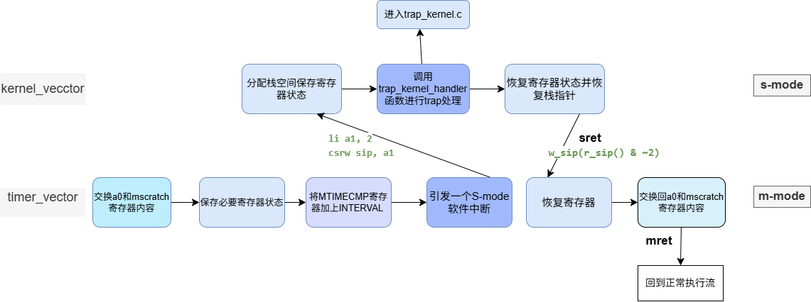
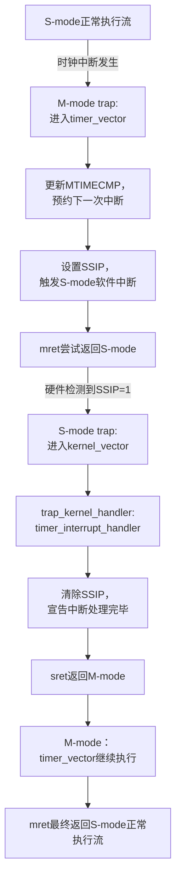
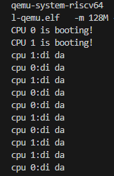
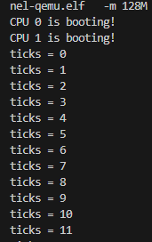
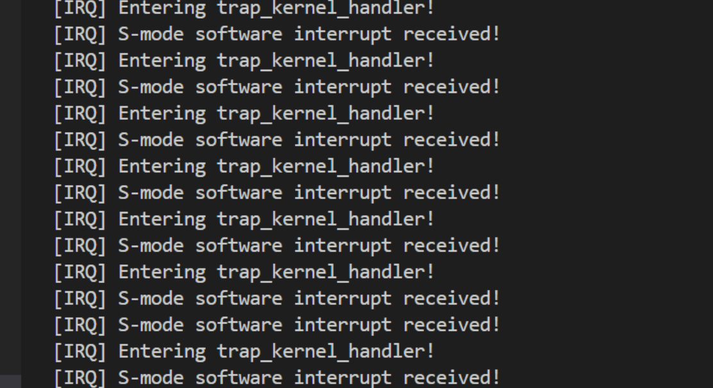
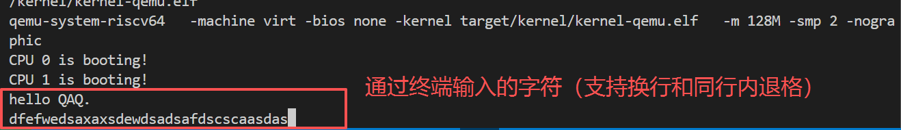
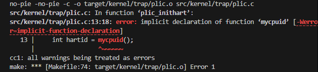
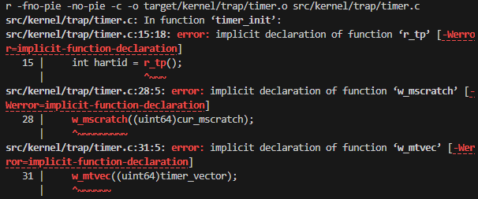

# LAB-3: 中断异常初步

在lab-3中，我们实现了初级的中断和异常处理机制，重点完成了**串口中断**和**时钟中断**的支持。

我们的分工如下：

**丁熙妍**：完成了**时钟中断**部分，包括`timer.c`和`main.c`，以及对应的实验文档。

**吴晨曦**：完成了**串口中断**部分，包括`trap_kernel.c`和`start.c`，以及对应的实验文档

---

## 代码组织结构

```
ANOS
├── LICENSE        开源协议
├── .vscode        配置了可视化调试环境
├── registers.xml  配置了可视化调试环境
├── common.mk      Makefile中一些工具链的定义
├── Makefile       编译运行整个项目
├── kernel.ld      定义了内核程序在链接时的布局
├── pictures       README使用的图片目录 (CHANGE, 日常更新)
├── README.md      实验报告 (CHANGE, 日常更新)
└── src            源码
    └── kernel     内核源码
        ├── arch   RISC-V相关
        │   ├── method.h
        │   ├── mod.h
        │   └── type.h (CHANGE, 新增一些RISC-V中断相关宏定义)
        ├── boot   机器启动
        │   ├── entry.S
        │   └── start.c (本实验完成, 在M-mode多做一些事情再进入S-mode)
        ├── lock   锁机制
        │   ├── spinlock.c
        │   ├─
        │   ├── mod.h
        │   └── type.h
        ├── lib    常用库
        │   ├── cpu.c
        │   ├── print.c
        │   ├── uart.c
        │   ├── utils.c
        │   ├── method.h
        │   ├── mod.h
        │   └── type.h
        ├── mem    内存模块
        │   ├── pmem.c
        │   ├── kvm.c
        │   ├── method.h
        │   ├── mod.h
        │   └── type.h
        ├── trap   陷阱模块
        │   ├── plic.c (NEW, 使得os可以响应UART外设中断)
        │   ├── timer.c (本实验完成, 时钟中断和计时器相关操作)
        │   ├── trap_kernel.c (本实验完成, 内核态trap处理的核心逻辑)
        │   ├── trap.S (NEW, 是trap处理的汇编入口)
        │   ├── method.h (CHANGE)
        │   ├── mod.h
        │   └── type.h (CHANGE)
        └── main.c (本实验完成, 更多的初始化)
```

相比于上一个实验，本次实验主要增加了以下功能：

- 建立了**陷阱系统**的基本框架
- 完成了外设中断中的**串口中断**处理，使系统能够**输入字符并回显**
- 完成了由M-mode时钟中断和S-mode软件中断共同组成的**时钟中断**处理，使系统能够进行**时钟滴答**输出

---

## 具体实现概述

### 1.对trap.S的理解

我们对陷阱系统的初步实现**首先从理解trap.S开始**。trap.S中包含陷阱系统处理的核心流程，有`kernel_vector`和`timer_vector`两部分。

`kernel_vector`是写入`stvec`寄存器的**中断处理程序入口地址**（s-mode）；`timer_vector`是写入`mtvec`寄存器的**时钟中断处理程序入口**（m-mode）。

为了理解得更清楚，我们将trap.S的执行流程整理为如下图所示：



我们发现其中有几点比较重要：

- 引发s-mode软件中断的`li a1, 2`，`csrw sip, a1`和`w_sip(r_sip() & ~2)`互为逆过程，将SSIP bit置为1后**还要清除SSIP bit**才能彻底结束软件中断，否则会一直持续陷入s-mode软件中断导致系统死机（**原先因为没有意识到这一点，在后面的串口输入测试中de了很久的bug**！！）（**虽然再后来又发现是个不必要的bug**！！！）
- 时钟中断是**先进入S-mode软件中断**，从而调用`trap_kernel_handler`来进行陷阱处理的，因此时钟中断时在`trap_kernel_handler`后进入的是`switch-case`的**S-mode软件中断case**，这个在后面写`trap_kernel_handler`时要明确
- `mscratch`寄存器指向一个用于**临时保存寄存器状态**的**专用内存区域**，是每个CPU独立的，在后面的start.c中也要用到

### 2.start.c

我们在start.c中实现了两件事：

- **委托S-mode处理所有trap**：通过写入`medeleg`和`mideleg`寄存器来分别委托异常和中断，并使能（enable）三种中断（软件/外设/时钟）
- **时钟中断初始化**：首先为当前CPU分配并初始化mscratch保存区域，然后设置 mscratch寄存器指向该保存区域（即在trap.S理解中提到的每个CPU独立的专用内存区域），随后将`timer_vector`写入mtvec寄存器作为时钟中断处理程序入口，并设置第一次的MTIMECMP比较寄存器的时间，最后使能（enable）M-mode的时钟中断

### 3.trap_kernel.c

内核态trap处理逻辑的核心代码，我们在这里写的本质上就是**两个`switch-case`**。

在`trap_kernel_handler()`中，通过scause的**标记位**判断是中断还是异常（不过本实验还未涉及异常处理），然后结合`interrupt_info`数组给出的信息判断**中断产生的原因（对应的数字）**。

在前面trap.S的理解中已写到，时钟中断是通过S-mode软件中断进入的trap_kernel.c，所以时钟中断产生的原因属于**S-mode软件中断（case 1）**；串口中断是外设中断的一种，所以属于**S-mode外设中断（case 9）**。具体的`switch-case`代码如下：

```c
if (scause & 0x8000000000000000ul) {
    // 1-中断处理
    switch (trap_id) // 中断产生原因分类
    {
        case 1: // S-mode软件中断--时钟中断走这个case
            timer_interrupt_handler(); break;
        case 9: // S-mode外设中断--串口中断走这个case
            external_interrupt_handler(); break;
        default: // 例外
            panic("trap_kernel_handler");
    }
} else {
    // 2-异常处理
    switch (trap_id) // 异常产生原因分类
    {
        //本实验目前还未涉及异常处理的内容
    }
}
```

在`external_interrupt_handler()`中，基于PLIC，先通过`plic_claim()`**获取中断号**，再通过一个`switch-case`来根据中断号**识别并处理中断**，然后通过`plic_complete(irq)`确认**完成该中断**。

串口中断的中断号定义在`lib/type.h`中，其余中断本实验未涉及，中断号为0代表没用外设中断。对应代码逻辑如下：

```c
int irq = plic_claim();//获取中断号

switch (irq){ //识别并处理中断
    case 0:// 没有中断
        break;
    case UART_IRQ:// UART输入中断  
        uart_intr();
        break;
    default: // 其他中断（本实验暂不处理）
        printf("\nunexpected external interrupt irq=%d\n", irq);
        break;
}

plic_complete(irq);//完成中断
```

串口中断是通过调用`uart_intr()`来处理的，`uart_intr()`函数在uart.c中，本实验对其实现的功能是**能够将输入的字符回显到屏幕上并支持换行和Backspace**。（虽然助教文档里好像没写uart.c是TODO，但是我觉得通过修改uart_intr()来实现最佳）

具体在`uart_intr()`中，使用while循环是为了处理输入多个字符只引发了一次串口中断的情形。处理**换行**时考虑到不同系统按下Enter键后的输入不同，统一同时输出\r\n。通过先左移光标(\b)，再用空格覆盖原先字符，再左移光标的方式来达到了**退格**的效果。

### 4.timer.c

我们主要实现了对全局时钟`sys_timer`的三个操作函数：

- `timer_create()`：初始化全局时钟的`ticks`与锁

- `timer_update()`：原子的自增`ticks`

- `timer_get_ticks()`：不暴露`sys_timer`的条件下，提供获取`ticks`的接口

在实现完这三个非常简单的函数之后，我们就成功实现时钟中断，这是因为**源码中已经帮我们把时钟中断的复杂框架搭建好了**，我们实现的操作函数只是这个精巧机制中被调用的一小环。

整个时钟中断的运行依赖于以下几个源码提供的关键部分：

1.  **M-mode初始化 (`timer_init()`)**：在系统启动时，该函数在M-mode下完成时钟初始化，包括设置`mtvec`指向`timer_vector`，并预约第一次硬件时钟中断。
2.  **M-mode中断入口 (`trap.S`中的`timer_vector`)**：当硬件时钟中断发生，CPU跳转至此。它负责更新下一次中断时间，并通过触发一个**S-mode软件中断**，将控制权“委托”给S-mode的内核。
3.  **S-mode中断处理 (`timer_interrupt_handler()`)**：在`trap_kernel.c`中，S-mode软件中断会调用此函数。它的核心工作就是调用我们自己实现的 `timer_update()` 来更新系统`ticks`，并清除S-mode软件中断挂起位（SSIP），宣告中断处理完成。

通过以上机制，系统实现了**M-mode与S-mode的协作处理时钟中断**，完整的流程如下图所示：



---

## 测试用例

#### 1.时钟滴答测试

一开始将`timer_interrupt_enable()`函数放在了`trap_kernel_handler()`函数中`switch`语句的`S-mode timer interrupt`分支内，导致并没有正确启用时钟中断。将其移到`S-mode software interrupt`后，就成功触发了时钟中断。

而我再次仔细查看`trap.S`文件后发现：M-mode中断通过设置SSIP触发的**是S-mode的软件中断，而不是S-mode的时钟中断！** 因此，需要将`trap_kernel_handler()`修改为：在处理S-mode软件中断的分支内调用`timer_interrupt_handler()`，其内部会调用`timer_update()` 并清SSIP，这样才能正确启用时钟中断。



成功通过时钟滴答测试！

#### 2.时钟快慢测试

通过修改`type.h`中`INTERVAL`的值，具体我尝试了原始的 1000000 (100ms) 以及修改后的 10000 (1ms) 和 10000000 (1s)，直观感受到了时钟滴答的快慢变化。



#### 3.串口输入测试

一开始在终端中始终无法输入字符，debug的过程首先在main.c中加入调试代码打印相关**硬件寄存器**的配置状况（对应的[DEBUG]代码在main.c的注释里），然后显示初始化后配置都已正常。然后开始检查**相关函数**，在与串口中断处理相关的`trap_kernel_handler()`，`external_interrupt_handler()`和`uart_intr()`中分别加入调试代码，结果运行后显示**一直在重复地陷入S-mode软件中断，系统根本没有空闲处理输入字符引起的外设中断**！调试输出如下所示：



原因是**我们原先在`trap_kernel_handler()`函数中没有对case 1（S-mode软件中断）进行任何处理**！系统在通过时钟中断进入S-mode软件中断后没有清除 SSIP bit，导致SSIP 一直为 1，于是CPU 每次返回都会再次触发中断，由此陷入了无限中断循环

后来在case 1中补上了`w_sip(r_sip() & ~2)`这行代码清空SSIP bit,再后来发现只需要在case 1中调用`timer_interrupt_handler()`(这个函数中写了`w_sip(r_sip() & ~2)`)即可，就能成功触发了串口中断！（并且也保证时钟中断可以正常触发！）



串口输入测试也通过！能输入字符并回显到屏幕上(包括Backspace和换行)

#### 4. 补充测试

为了进一步验证系统的稳定性，我们设计了**UART与Timer共存性测试**，检验了在时钟中断存在时，串口I/O是否仍然能够正常工作：

```c
uint64 last = 0, last_print = 0;
    const uint64 print_every = 50;   // 每 50 个 tick 打一次, 避免刷屏干扰 UART 回显

    while (1) {
        if (cpuid == 0) {             // 仅 CPU0 打印心跳
            uint64 t = timer_get_ticks();
            if (t != last) {          // 只在 tick 变化时处理
                last = t;
                if (t - last_print >= print_every) {
                    last_print = t;
                    printf("ticks=%d\n", (int)t);
                }
            }
        }
        asm volatile("wfi");          // 让位给中断 (Timer / UART)
    }
```


可以一边看到时钟滴答输出，一边进行串口输入，退格与换行行为均可以正常工作，说明两者可以**良好共存**，成功通过测试！

---

## 实验中的问题与思考

#### 1.源码的小问题

(1) 运行后发现由于trap/mod.h中没有包含一些其他模块的头文件，但使用了其他模块中定义的函数，导致编译报错，截图如下：
   




因此我在`trap/mod.h`中**添加了对`lock/mod.h`的引用**（`lock/mod.h`中除了自旋锁相关的内容，还包含了`lib/mod.h`和`arch/mod.h`），成功解决了编译报错问题。

(2) 在调试`uart.c`中的`uart_intr()`函数时，需要用到在`lib/type.h`中对于LSR寄存器`IER_RX_ENABLE`(接收中断使能位)的宏定义，然后发现助教给的源码中对于IER_RX_ENABLE（接收中断使能位）和IER_TX_ENABLE（空中断使能位）的宏定义好像写反了，进行了修改:relaxed:

```c
//lib/type.h 修改前
#define IER_TX_ENABLE (1 << 0)
#define IER_RX_ENABLE (1 << 1)
//lib/type.h 修改后
#define IER_TX_ENABLE (1 << 1) // 空中断使能位为倒数第二位
#define IER_RX_ENABLE (1 << 0) // 接收中断使能是倒数第一位
```

#### 2.退格处理不完善

在串口输入测试中，目前本系统已支持换行和退格的基本操作，但**对于已经换行后的前一行内容无法进行删除**！这是由于**终端显示机制（QEMU 的 `-nographic` ）限制**导致终端的光标无法上移一行，若想要完善的话需要引入**行缓冲区**和一些其他与**命令行编辑器**的有关的特殊处理。

但我们考虑到本次实验的重点是**中断的处理逻辑**，输入测试的目的也是验证串口中断的正常运行，没必要在输入逻辑中做过多复杂的处理，所以对于“删除输入的上一行”暂时没有进行过多的完善。

#### 3.写OS时一定要“有进有出”

我们在上面串口输入测试时，刚开始就是因为没有调用`w_sip(r_sip() & ~2)`清空SSIP bit结束软件中断，导致系统一直陷入S-mode软件中断而无法执行串口中断。得到的教训是，在写与硬件相关的程序中，**启用某个处理程序后一定要记得在处理完后手动关闭**（或手动进行关闭程序相关的处理）！也就是说，**中断不是处理完后“自动消失”** 的，必须主动告诉硬件已经处理完成。

在本次实验中借用PLIC能力实现外设中断时也体现了这个原则，在进入外设中断处理函数后通过`plic_claim()`获取中断号并处理完中断后，**一定还要`plic_complete(irq)`确认完成该中断**。在之前实验的自旋锁使用上也是如此，利用`spinlock_acquire(&print_lk)`加锁以后，**还要记得利用`spinlock_release(&print_lk) `解锁**，不然就会“一直被锁在厕所里“​！:stuck_out_tongue_closed_eyes:

#### 4. 对M/S-mode协作处理中断的理解

本次实验的时钟中断实现，让我们深刻理解了RISC-V中**M/S-mode之间的协作模式**。

时钟中断的问题很明确：时钟相关的寄存器（如`MTIME`, `MTIMECMP`）只能在M-mode下访问，但我们的OS内核（需要更新系统`ticks`）运行在S-mode。

为了解决这个**权限隔离**带来的问题，系统采用了一种很巧妙的 **“委托”机制** ：

1.  **M-mode 负责硬件层**：
   作为最底层的固件层，它的逻辑非常简洁，只做最简单的**硬件操作**：更新下一次中断的时间（写`MTIMECMP`），然后**立即触发一个S-mode软件中断**，不执行任何复杂的OS逻辑。

2.  **S-mode 负责内核逻辑层**：
   S-mode接受到M-mode触发的软件中断后，执行**内核的trap处理逻辑**，调用我们实现的`timer_update()`来更新系统的`ticks`，最后再清除SSIP位，结束中断处理。

通过这种方式，M-mode扮演了“**硬件代理**”的角色，而S-mode则专注于**执行操作系统的核心逻辑**。

这种设计带来了几个显著的好处：

-   **权限分离**：M-mode掌握最高权限，但其代码量少，逻辑简单，只负责最基础、最可信的硬件操作，从而提高了系统的安全性。
-   **逻辑解耦**：复杂的OS逻辑（如`ticks`更新）被封装在S-mode，与底层硬件细节解耦，使得内核代码更清晰，更易于维护。

这让我们认识到，操作系统并非一个单一的整体，而是**构建在不同特权级之上、层层协作**的复杂系统。
