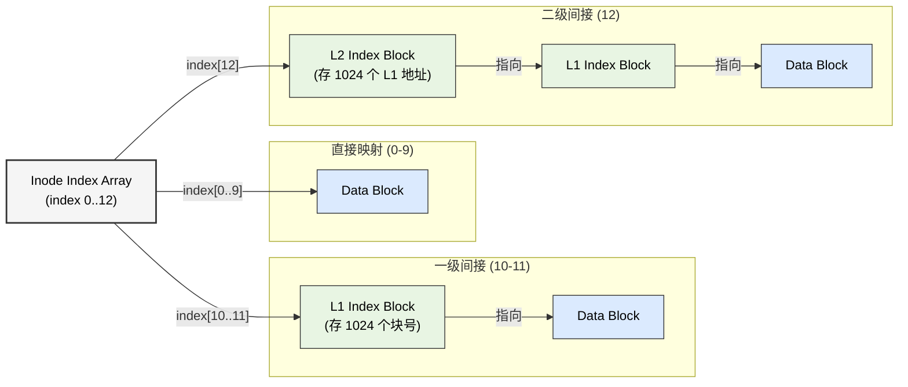
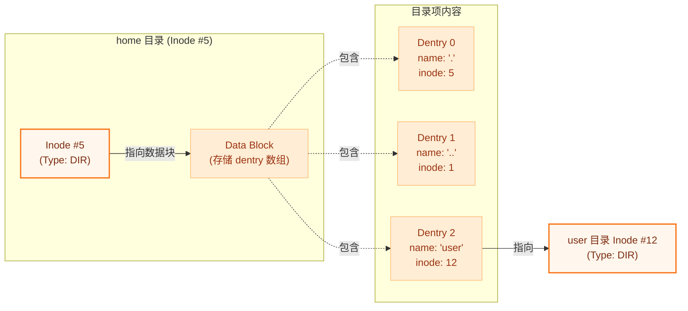
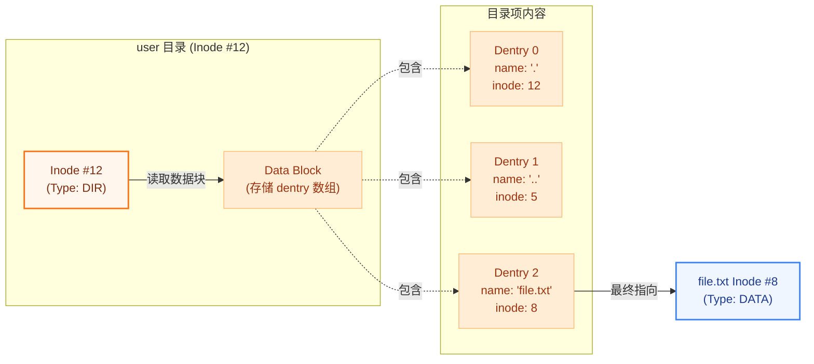

# LAB-8: 文件系统 之 数据组织与层次结构

经过 Lab-7 的磁盘管理实验，我们已经能够通过 Buffer Cache 高效地读写磁盘块。在 Lab-8 中，我们在此基础上构建了文件系统的核心逻辑，并解决了两个关键问题：**如何组织并管理大文件的数据（Inode）** 以及**如何构建人类可读的目录树（Dentry）**。

我们的分工如下：

**吴晨曦**：完成了 **Inode 管理** 的核心逻辑，包括多级索引映射、数据读写接口以及 Inode 的生命周期管理。

**丁熙妍**：完成了 **目录项（Dentry）** 的管理逻辑，实现了从文件名到 Inode 的映射；构建了 **路径（Path）解析系统**，支持从绝对路径查找目标文件或父目录。

---


## 代码组织结构

```
ANOS
├── LICENSE        开源协议
├── .vscode        配置了可视化调试环境
├── registers.xml  配置了可视化调试环境
├── .gdbinit.tmp-riscv xv6自带的调试配置
├── common.mk      Makefile中一些工具链的定义
├── Makefile       编译运行整个项目
├── kernel.ld      定义了内核程序在链接时的布局
├── picture        README使用的图片目录 (CHANGE)
├── README.md      实验指导书 (CHANGE)
└── src            源码
    ├── kernel     内核源码
    │   ├── arch   RISC-V相关
    │   │   ├── method.h
    │   │   ├── mod.h
    │   │   └── type.h
    │   ├── boot   机器启动
    │   │   ├── entry.S
    │   │   └── start.c
    │   ├── lock   锁机制
    │   │   ├── spinlock.c
    │   │   ├── sleeplock.c
    │   │   ├── method.h
    │   │   ├── mod.h
    │   │   └── type.h
    │   ├── lib    常用库
    │   │   ├── cpu.c
    │   │   ├── print.c
    │   │   ├── uart.c
    │   │   ├── utils.c (CHANGE, 新增strlen函数)
    │   │   ├── method.h (CHANGE)
    │   │   ├── mod.h
    │   │   └── type.h
    │   ├── mem    内存模块
    │   │   ├── pmem.c
    │   │   ├── kvm.c
    │   │   ├── uvm.c
    │   │   ├── mmap.c
    │   │   ├── method.h
    │   │   ├── mod.h
    │   │   └── type.h
    │   ├── trap   陷阱模块
    │   │   ├── plic.c
    │   │   ├── timer.c
    │   │   ├── trap_kernel.c
    │   │   ├── trap_user.c
    │   │   ├── trap.S
    │   │   ├── trampoline.S
    │   │   ├── method.h
    │   │   ├── mod.h
    │   │   └── type.h
    │   ├── proc   进程模块
    │   │   ├── proc.c
    │   │   ├── swtch.S
    │   │   ├── method.h
    │   │   ├── mod.h
    │   │   └── type.h
    │   ├── syscall 系统调用模块
    │   │   ├── syscall.c
    │   │   ├── sysfunc.c
    │   │   ├── method.h
    │   │   ├── mod.h
    │   │   └── type.h
    │   ├── fs     文件系统模块
    │   │   ├── bitmap.c
    │   │   ├── buf.c
    │   │   ├── inode.c (本实验完成, 核心工作)
    │   │   ├── dentry.c (本实验完成, 核心工作)
    │   │   ├── fs.c (本实验补充, 增加inode初始化逻辑和测试用例)
    │   │   ├── virtio.c
    │   │   ├── method.h (CHANGE)
    │   │   ├── mod.h
    │   │   └── type.h (CHANGE)
    │   └── main.c
    ├── mkfs       磁盘映像初始化
    │   ├── mkfs.c (CHANGE, 更复杂的文件系统初始化)
    │   └── mkfs.h (CHANGE)
    └── user       用户程序
        ├── initcode.c
        ├── sys.h
        ├── syscall_arch.h
        └── syscall_num.h
```

相对于上一个实验, 本实验主要增加了以下功能：

- 实现了**Inode的生命周期管理**，包括创建、引用计数管理和释放。
- 实现了**多级索引机制**，使文件系统能够支持从 40KB 到 4GB 的大文件存储，并提供了统一的数据读写接口。
- 实现了**目录项（Dentry）管理**，包括目录项的增、删、查操作，支持文件名到Inode的映射。
- 实现了**路径（Path）解析系统**，支持从绝对路径查找目标文件或父目录。

---

## 具体实现

### 1. inode.c

在[inode.c](src/kernel/fs/inode.c)中，我们实现了文件系统中**Inode**（索引节点）这个核心元数据的管理。在实现中，我们主要考虑了两个核心问题：

- **如何将离散的磁盘块组织成连续的逻辑文件**（对应**数据组织**）
- **如何在内存与磁盘之间维护文件元数据的一致性**（对应**生命周期管理**）。

#### 1.1 数据组织

数据组织部分，我们构建了一套从**用户视角的连续字节流**到**磁盘视角的离散物理块**的映射体系。利用 **Inode索引节点** 作为中枢，通过 **磁盘/内存双层结构** 确立元数据的存在形式，并借助 **多级索引机制** 完成了逻辑块号到物理块号的转换。

**inode的基本数据结构：**

我们使用`inode_disk_t`和`inode_t`这两个结构体，分别对应**inode_disk**（磁盘）与 **inode_memory**（内存） ：

- `inode_disk_t` **磁盘中的inode**：仅 64 字节，紧凑地存储`type`（文件类型）、`size`（大小）、`nlink`（硬链接数）和`index`（索引数组）等文件信息。关机后依然存在。

- `inode_t` **内存中的inode**：在内存中包裹了 `disk_info`，并增加了 `ref`（引用计数）、`slk`（睡眠锁）、`valid_info`（有效性标记）等**运行时状态**，用于操作系统运行时的并发管理。

其中容易混淆的是`inode_disk_t`中的`nlink`（**硬连接数**）和`inode_t`中的`ref`（**引用计数**），同为共享计数但是前者存在于**硬盘**，表示有多少个**文件名**指向它；后者存在于**内存**，表示有多少个**进程/指针**正在用它。在后面实现inode资源释放时，一定要`nlink`和`ref`都等于0，才能够进行物理资源的删除（在后面的“测试与修复”中我们也补充了与共享机制有关的test5）。

**磁盘和内存inode数据的同步**：

`inode_t` 中的 `disk_info` 本质上是`inode_disk_t`磁盘数据的**缓存副本**。为了保证二者的一致性，我们需要一个**同步机制**。

于是我们实现了`inode_rw`函数。通过`inode_t`的`inode_num`字段**实现磁盘和内存的对应**，并利用 **Buffer Cache** 作为中转站：

- **Read (磁盘 -> 内存)**：当 `inode_get` 首次加 载 inode 时，`inode_rw` **通过 `buffer_get` 读取磁盘块**，将数据拷贝到 `ip->disk_info`，并标记 `valid_info = true`。
- **Write (内存 -> 磁盘)**：当文件属性（如 `size`）发生变化时，`inode_rw` 将 `ip->disk_info` 的最新状态**拷贝回 Buffer**，并立即调用 `buffer_write` 标记脏块，等待刷盘。

**逻辑与物理块号映射**：

有了 Inode 结构后，接下来的挑战是如何利用它来**索引文件数据**。文件系统需要将inode记录的**逻辑块号**（Logical Block Num, 第几个块）转换为磁盘上的**物理块号**（Physical Block Num）。于是我们针对`inode_disk_t`的`index`字段实现了**多级索引机制**的设计。

我们在 `locate_or_add_block` 函数中实现了**三级映射**逻辑，并支持**按需分配**（即当逻辑块不存在时，自动分配物理块并清零）。

具体的映射逻辑如下图所示：



具体实现逻辑：

1.  **直接映射 (Direct Mapping)**：
    - **范围**：逻辑块号 `0 ~ 9`。
    - **实现**：直接从 `inode->index[0...9]` 中获取物理块号。这是访问最快的方式，覆盖了 40KB 以内的小文件。
2.  **一级间接映射 (Level 1 Indirect)**：
    - **范围**：逻辑块号 `10 ~ 10 + 2048 - 1`。
    - **实现**：`inode->index[10]` 和 `inode->index[11]` 指向**一级索引块**。每个索引块中存储了 1024 个物理块号。
    - **计算**：通过 `(lbn - 10) / 1024` 确定使用哪个一级索引块，通过取模确定块内偏移。
3.  **二级间接映射 (Level 2 Indirect)**：
    - **范围**：逻辑块号 `2058` 起，支持 GB 级大文件。
    - **实现**：`inode->index[12]` 指向一个**二级索引块**。该块中存储了 1024 个一级索引块的地址，每个一级索引块再指向 1024 个数据块。
    - **计算**：需要先读取二级索引块，再读取一级索引块，最后获取数据块。

**回收释放**：

为了防止内存泄漏，我们在 `free_data_blocks` 中也基于**索引的树形结构**实现了的**递归释放**逻辑：

-  采用**深度优先**策略，先释放叶子节点（数据块），再释放中间节点（索引块）。
-  `__free_data_blocks` 函数接收当前块号和层级（level），如果 `level > 0`，则读取该块内容并**递归调用自身**释放子块，最后释放当前块。

**字节级数据流读写**：

可以看到，文件系统底层存储的是**离散的 Block**，而上层应用实际看到的应是连续的**字节流**（如 `read(fd, buf, 100)`）。

于是我们在`inode_read_data` 和 `inode_write_data`函数实现了这种**字节级读写**。

这一过程的核心在于**坐标变换**、**块号转化**与**缓冲流转**，具体实现流程：

1. **坐标计算**：根据文件偏移量 `offset` 计算出逻辑块号 `lbn = offset / BLOCK_SIZE` 和块内偏移 `boff`。
2. **块号转化**：调用 `locate_or_add_block(ip->disk_info.index, lbn)` 查询上述 `index` 数组，获取**物理块号 `pbn`** 。
3. **Buffer 介入**：通过 `buffer_get(pbn)` 获取数据块在内存中的缓存，完成数据的最终拷贝。

#### 1.2 生命周期管理

构建好**连续逻辑文件的相关数据组织**后，我们还需要来管理这些 **Inode 在文件系统运行时的状态流转**并做好**并发处理**。

Inode 的生命周期管理围绕**内存缓存池 (`inode_cache`)** 展开，我们在 `inode.c` 中实现了以下核心函数：

- **`inode_init`**：**初始化 Inode 缓存池**及全局自旋锁 `lk_inode_cache`
- **`inode_get`**：**获取 Inode 的使用权**
  - **Cache Hit**：若在缓存中找到，直接 `ref++`
  - **Cache Miss**：分配空闲槽位，并调用 `inode_rw` 从磁盘加载元数据
- **`inode_dup`**：**复制 Inode 引用**。仅增加引用计数 `ref++`（如 `fork` 时父子进程共享文件）。
- **`inode_put`**：**释放 Inode 的使用权**。减少引用计数 `ref--`。当 `ref==0` 且 `nlink==0`（**文件被删除**且**无人引用**）时，调用 `inode_delete` 彻底回收资源。
- **`inode_lock`**：**获取锁并按需加载**。获取睡眠锁 `slk`，并检查 `valid_info`。若数据无效（刚分配的空槽），则在此处触发磁盘读取，实现了 **Lazy Loading**
- **`inode_unlock`**：**释放锁**。释放睡眠锁。
- **`inode_create`**：**创建新文件**。
  - 通过`bitmap_alloc_inode()`分配一个新的inode号
  - 通过`inode_get(inode_num)`获得inode in memory
  - 填充inode_region对应位置的inode
  - 把初始化也同步写回磁盘
- **`inode_delete`**：**物理删除**。递归调用 `free_data_blocks` 释放所有数据块和索引块，清空 Inode 本身，并释放 Bitmap。

这些函数的**典型调用流程示例**：

```c
/* 创建文件 */
inode_create()
    
/* 文件的打开与读写 */
(先通过路径解析找到目标inode...)
inode_get() // 获取inode
inode_lock() // 加锁并验证是否有数据
inode_read/write_data // 读写数据
inode_rw() // 如果写操作改变了文件大小，需同步元数据回磁盘
inode_unlock() //释放锁 唤醒其他进程
   
/* 文件的复制和共享 */
inode_dup() // ref++

/* 文件的关闭与销毁 */
inode_put() // 关闭文件，释放inode资源，ref--
(若ref==0 且 nlink==0 触发加锁回收)
inode_lock()
inode_delete() // 物理回收
inode_unlock()
```

同时我们也小心地处理了**并发控制**，使用了**两种不同粒度的锁**：

- **全局自旋锁 `lk_inode_cache` (Spinlock)**：保护全局的缓存池结构和 `ref` 计数。因为这些操作是纯内存的、极快的，所以使用自旋锁。
- **Inode睡眠锁 `ip->slk` (Sleeplock)**：保护**单个 Inode 的内容**（`size`, `index`）以及**磁盘 I/O**。因为 `inode_rw` 和 `inode_read/write_data` 涉及磁盘读写，**持有锁期间必须允许睡眠**，因此必须使用睡眠锁。

### 2. dentry.c

对于用户而言，记忆数字形式的 `inode_num` 是痛苦的。文件系统通过 **目录（Directory）** 和 **目录项（Dentry）** 建立 **文件名 -> Inode** 的映射。

#### 目录项管理

目录本质上是一种特殊的**文件**，其数据块中存储的是 `dentry_t` 结构体数组：

```c
typedef struct dentry {
    char name[MAXLEN_FILENAME]; // 文件名
    uint32 inode_num;           // 对应的 Inode 编号
} dentry_t;
```

为了管理目录项，我们实现了以下核心操作：

-  **`dentry_search`**：
   -  读取目录的数据块，遍历所有 `dentry` 槽位。
   -  比较 `dentry->name` 与目标文件名，若匹配则返回对应的 `inode_num`。

-  **`dentry_create`**：
   -  在目录中寻找一个空闲槽位（`name[0] == 0`）。
   -  如果目录块未分配，则**自动分配并初始化**。
   -  写入新的文件名和 Inode 编号，并**更新目录大小**。

-  **`dentry_delete`**：
   -  找到目标目录项，将其 `name` 清零，标记为空闲。
   -  这实现了文件的**解引用**：当 Inode 的引用计数归零时，文件才会被真正删除。


#### 路径解析

为了支持 `/home/user/file.txt` 这样的绝对路径访问，我们在 `__path_to_inode` 中实现了路径解析逻辑。

这是一个**循环查找**的过程 —— 系统从根目录出发，**通过每一级目录项找到下一级的 Inode**，最终到达目标文件。如下图所示，以 `/home/user/file.txt` 为例：

**第一步**：在根目录中找到 `home` (Inode #5)，接着在 `home` 目录中找到 `user` (Inode #12)。



**第二步**：进入 **user 目录 (Inode #12)**，在其数据块中寻找 `file.txt` 对应的目录项，最终定位到目标文件的 Inode (#8)。



**具体实现逻辑**：

基于上述的循环查找思想，我们在 `__path_to_inode` 函数中实现了具体的解析逻辑。该函数是 `path_to_inode` 和 `path_to_parent_inode` 的核心后端。

其核心流程如下：

1. **初始化**：从**根目录 Inode** (`ROOT_INODE`) 开始，获取其 Inode 并加锁。

2. **循环解析**：使用 `get_element` 函数逐级提取路径分量（例如从 `/home/user` 中提取 `home`）。

3. **父目录判断**：

   - 如果调用者请求**查找父目录**（`find_parent_inode == true`），且当前提取的 name 是路径的最后一级（`*path == '\0'`），则说明**当前的 `ip` 就是目标父目录**，解锁 `ip` 并返回。
   - **注意**：这里必须调用 `inode_unlock(ip)` 解锁 `ip` 后再返回，否则会导致**调用者再次加锁时发生死锁**！

4. **目录项查找**：

   - 调用 `dentry_search` 在当前目录 `ip` 中查找名为 `name` 的子项。
   - 如果未找到或当前 `ip` 不是目录类型，则解析失败，释放资源并返回 `NULL`。

5. **切换目录**：

   - **交替加锁**：注意在切换到下一级目录前，必须严格遵守 “**先解锁当前层，再获取下一层**” 的顺序：

     ```c
     inode_unlock(ip);      // 1. 释放当前目录锁
     next_ip = inode_get(next_inode_num);
     inode_put(ip);         // 2. 释放当前目录引用
     ip = next_ip;
     inode_lock(ip);        // 3. 锁定下一级目录
     ```

​		否则会导致死锁！

6. **继续循环**：直到路径解析完毕，如果**不需要找父目录** （`find_parent_inode == false`）），则当前的 `ip` 即为目标文件的 Inode，解锁并返回。

---

##  测试与修复

我们在 `fs_init` 中添加了 inode 初始化函数 `inode_init()` 以及相关测试用例，全面验证了文件系统的功能。

### test1: inode的访问 + 创建 + 删除

**测试代码**见 `src/kernel/fs/fs.c` 中的 `fs_test` 函数。测试逻辑包括：

1.  **创建**：调用 `inode_create` 分配一个新的 Inode。
2.  **查找**：通过 `inode_get` 获取 Inode，验证引用计数 `ref` 是否正确增加。
3.  **引用管理**：调用 `inode_dup` 和 `inode_put`，观察引用计数的变化。
4.  **删除**：当引用计数归零时，验证 Inode 是否被正确释放，位图是否清零。

**测试结果**见：[test-1.png](picture/test-1.png)，可以看到 Inode 的分配、引用计数变化及释放过程均符合预期，验证了 Inode 生命周期管理的正确性。


### test2: 写入和读取inode管理的数据

**测试代码**见 `src/kernel/fs/fs.c` 中的对应部分。测试旨在验证多级索引机制的有效性：

1.  **连续内存申请**：申请 5 个物理页作为写入源数据，并增加了**物理地址连续性检测**，兼容了内存分配器可能的递增或递减分配策略。
2.  **大数据写入**：向文件写入超过直接映射范围的数据（触发一级和二级间接索引）。
3.  **数据回读校验**：读取刚写入的数据，并验证内容是否正确。

**测试过程中遇到的问题与修复**：

1. **内存分配假设错误**：

   - 助教提供的测试用例假设连续调用 `pmem_alloc` 一定能获得地址递增的连续物理页。然而我们**未通过物理地址连续性检测**：

     

   - 经过检查，发现是因为：

     - Buffer Cache 的初始化和运行会**打乱物理内存布局**。
     - 并且本实验的 `pmem_alloc` 实现是采用的**递减分配**策略，导致连续调用时地址递减。

   - **修复**：

     - 我们将测试用例中的大块内存申请逻辑**提前到所有文件系统操作之前**（即 `buffer_init` 之前），确保物理内存尚未被碎片化。

     - 并且增加了对分配方向（递增/递减）的**兼容检测逻辑**。如果检测到内存碎片（既不递增也不递减），则触发 panic 提前报错。

2. **测试规模过大**

   - 助教的测试用例中试图写入约 175MB 数据（循环 10000 次），导致系统内存耗尽，出现 `Out of memory` 错误，如下图所示：

     

   - 经过检查，发现是因为：我们的测试环境（QEMU 分配的内存）有限，无法支撑如此大规模的内存申请。

   - **修复**：

     - 我们将写入循环次数从 10000 减至 100，既能覆盖多级索引的逻辑，又避免了内存不足的问题。

**测试结果**见：[test-2.png](picture/test-2.png)，数据读写完全一致，多级索引工作正常。

### test3: 目录项的增加、删除、查找操作

**测试代码**见 `src/kernel/fs/fs.c` 中的对应部分。测试逻辑如下：

1.  **创建目录项**：在根目录下调用 `dentry_create` 创建名为 `test_dir` 的子目录。
2.  **查找目录项**：调用 `dentry_search` 查找 `test_dir`，验证是否能返回正确的 `inode_num`。
3.  **删除目录项**：调用 `dentry_delete` 删除该目录项，再次查找应返回失败。

**测试结果**见：[test-3.png](picture/test-3.png)，成功在根目录下创建、查找并删除了目录项，验证了目录管理功能的正确性。


### test4: 文件路径的解析

**测试代码**见 `src/kernel/fs/fs.c` 中的对应部分。测试旨在验证 `path_to_inode` 解析复杂路径的能力：

1.  **多级路径**：解析如 `///AABBC///aaabb/file.txt` 这样包含冗余斜杠和多级目录的路径。
2.  **父目录查找**：调用 `path_to_parent_inode` 查找目标文件的父目录，用于创建新文件。

**测试过程中遇到的问题与修复**：

1. **死锁问题**：

   - 测试时，我们发现系统卡在如下图位置：

     

   - 经过检查，发现是因为： `path_to_parent_inode` 在找到父节点后**忘记解锁**，导致**调用者再次加锁时发生死锁**。

   - **修复**：我们在 `path_to_parent_inode` 函数中，找到父节点并返回前添加了 `inode_unlock(ip)` 这一**解锁操作**后，死锁解除，解决了该问题。

     ```c
     if (find_parent_inode && *path == '\0') {
     	inode_unlock(ip); // 【修复】返回前必须解锁！
     	return ip;
     }
     ```

2. **未读取到数据**：

   - 修复完死锁问题后，结果显示路径解析成功找到了 Inode，但**读取到的数据为空**，控制台未打印 "This is file context!"，如下图所示：

     

   - 经过检查，发现是因为：助教的测试代码在创建并写入 `ip_3` (file.txt) 后，**忘记调用 `inode_rw(ip_3, true)` 将其元数据写回磁盘**。导致后续重新读取时，内核认为这是一个空文件。

      - **修复**：在释放 `ip_3` 之前，增加元数据同步操作 `inode_rw(ip_3, true)`。

**测试结果**见：[test-4.png](picture/test-4.png)，成功解析了复杂路径并读取了目标文件内容，验证了路径解析系统的正确性。

### test5：共享文件的硬链接机制与回收

**测试代码**见 `src/kernel/fs/fs.c` 中的对应部分。本补充测试旨在验证 Inode 的**引用计数机制及多文件名指向同一数据的特性**，逻辑如下：

1. **创建与链接**：创建文件 `original.txt` (Inode 3)，写入数据；随后创建硬链接 `linked.txt` 指向同一 Inode。验证 **`nlink` 是否从 1 变为 2**。
2. **共享访问**：通过新路径 `linked.txt` 读取数据，验证**内容与原文件一致**。
3. **部分删除（持久性）**：删除原路径 `original.txt`，验证 `nlink` 变为 1，且通过 `linked.txt` 依然能访问数据（证明**数据未丢失**）。
4. **彻底删除（回收）**：删除最后一个链接 `linked.txt`，验证 `nlink` 变为 0。最后检查 Inode 位图，确认 Inode 3 已**被物理回收**（位图位清零）。

**测试结果**见：[test-5.png](picture/test-5.png)，可以看到，在最终的**位图打印**中，分配的位只有 `0 1 2`，证明测试中使用的 **Inode 3 已被成功回收**； `nlink`经历了`1 -> 2 -> 1 -> 0` 的变化过程，**硬链接数**记录正确；**共享访问内容**与源文件一致，并且共享取消后数据依然能够访问。成功验证了共享文件的硬链接机制与回收的正确性。通过了test-5补充测试。

---

## 总结与思考

- **从扁平物理块到层次化逻辑树的抽象跨越**

  Lab-7 的工作让我们能够读写磁盘块，但这仅仅是物理层面的操作。Lab-8 的核心在于“**抽象**”。

  - 通过引入 **Inode**，我们将离散的 Block 抽象为了连续的文件；
  - 通过引入 **Dentry**，我们将冰冷的 Inode 编号抽象为了人类可读的文件名；
  - 通过 **Path 解析**，我们将扁平的文件列表抽象为了层次分明的目录树。

  这种层层递进的抽象封装，完美诠释了操作系统“屏蔽底层硬件复杂性，向上提供统一接口”的设计哲学。

- **持久化存储与运行时状态的一致性维护**

  在实现 Inode 模块时，我们深刻体会到**数据一致性**在文件系统中的重要性。内存中的 `inode` 是活跃且易失的（随时可能被修改），而磁盘上的 `inode_disk` 是静止且持久的。我们需要通过一系列操作确保每一次对元数据（如 `size` 或 `index`）的内存修改都能**可靠地投影到物理磁盘上**。这个过程也让我们更加深刻地体会到石老师在理论课提到的文件系统的重大挑战：即 **如何在并发环境和潜在崩溃风险下，尽可能消除内存与磁盘之间的状态差异**。

- **并发控制与死锁陷阱**

  延续lab-7的做法，我们在这次lab中也采用了 **“全局自旋锁（保护资源池）+ 对象睡眠锁（保护 I/O）”** 的双锁策略。而在 `path_to_parent_inode` 中遇到的**死锁 Bug** 给我们上了生动的一课：在跨层级（如目录遍历）或跨函数调用时，必须严格遵守锁的**获取与释放顺序**，任何一次“忘记解锁”或“重复加锁”在内核态都可能是致命的！