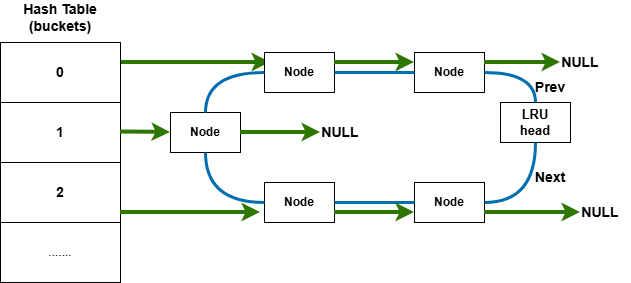

# LAB-7: 文件系统 之 磁盘管理

经过之前的实验，我们已经拥有了一个支持多进程调度的内核。在 Lab-7 中，我们将目光投向了**持久化存储**，围绕磁盘管理构建文件系统的基础设施，建立从**底层驱动**到**上层资源管理**的完整链路。

**吴晨曦**：完成了 **缓冲系统（Buffer）** 的实现，文件系统的初始化逻辑，以及对应的系统调用和README文档。

**丁熙妍**：完成了 **位图管理（Bitmap）** 的实现，内核页表与设备映射的适配，磁盘中断的响应与处理，以及对应的系统调用和README文档。

## 代码组织结构

```
ANOS
├── LICENSE        开源协议
├── .vscode        配置了可视化调试环境
├── registers.xml  配置了可视化调试环境
├── .gdbinit.tmp-riscv xv6自带的调试配置
├── common.mk      Makefile中一些工具链的定义
├── Makefile       编译运行整个项目 (CHANGE)
├── kernel.ld      定义了内核程序在链接时的布局
├── pictures       README使用的图片目录 (CHANGE, 日常更新)
├── README.md      实验报告 (CHANGE, 日常更新)
└── src            源码
    ├── kernel     内核源码
    │   ├── arch   RISC-V相关
    │   │   ├── method.h
    │   │   ├── mod.h
    │   │   └── type.h
    │   ├── boot   机器启动
    │   │   ├── entry.S
    │   │   └── start.c
    │   ├── lock   锁机制
    │   │   ├── spinlock.c
    │   │   ├── sleeplock.c
    │   │   ├── method.h
    │   │   ├── mod.h
    │   │   └── type.h
    │   ├── lib    常用库
    │   │   ├── cpu.c
    │   │   ├── print.c
    │   │   ├── uart.c
    │   │   ├── utils.c
    │   │   ├── method.h
    │   │   ├── mod.h
    │   │   └── type.h
    │   ├── mem    内存模块
    │   │   ├── pmem.c
    │   │   ├── kvm.c (本实验补充, 内核页表增加磁盘相关映射 + vm_getpte处理pgtbl为NULL的情况)
    │   │   ├── uvm.c
    │   │   ├── mmap.c
    │   │   ├── method.h
    │   │   ├── mod.h
    │   │   └── type.h
    │   ├── trap   陷阱模块
    │   │   ├── plic.c (本实验补充, 增加磁盘中断相关支持)
    │   │   ├── timer.c
    │   │   ├── trap_kernel.c (本实验补充, 在外设处理函数中识别和响应磁盘中断)
    │   │   ├── trap_user.c
    │   │   ├── trap.S
    │   │   ├── trampoline.S
    │   │   ├── method.h
    │   │   ├── mod.h (CHANGE, include 文件系统模块)
    │   │   └── type.h
    │   ├── proc   进程模块
    │   │   ├── proc.c (本实验补充, 在proc_return中调用文件系统初始化函数)
    │   │   ├── swtch.S
    │   │   ├── method.h
    │   │   ├── mod.h (CHANGE, include 文件系统模块)
    │   │   └── type.h
    │   ├── syscall 系统调用模块
    │   │   ├── syscall.c (本实验补充, 新增系统调用)
    │   │   ├── sysfunc.c (本实验补充, 新增系统调用)
    │   │   ├── method.h (CHANGE, 新增系统调用)
    │   │   ├── mod.h (CHANGE, include文件系统模块)
    │   │   └── type.h (CHANGE, 新增系统调用)
    │   ├── fs     文件系统模块
    │   │   ├── bitmap.c (本实验完成, bitmap相关操作)
    │   │   ├── buf.c (本实验完成, 内存中的block缓冲区管理)
    │   │   ├── fs.c (本实验完成, 文件系统相关)
    │   │   ├── virtio.c (NEW, 虚拟磁盘的驱动)
    │   │   ├── method.h (NEW)
    │   │   ├── mod.h (NEW)
    │   │   └── type.h (NEW)
    │   └── main.c (CHANGE, 增加virtio_init)
    ├── mkfs       磁盘映像初始化
    │   ├── mkfs.c (NEW)
    │   └── mkfs.h (NEW)
    └── user       用户程序
        ├── initcode.c (CHANGE, 日常更新)
        ├── sys.h
        ├── syscall_arch.h
        └── syscall_num.h (CHANGE, 日常更新)
```

相对于上一个实验, 本实验主要增加了以下功能：

- 实现了**虚拟磁盘驱动 (VirtIO)**，打通了内核与磁盘的通信渠道。
- 实现了**缓冲系统(Buffer)**，构建了内存与磁盘间的数据交换桥梁，并利用哈希表进行了高速缓存优化。
- 实现了**位图管理(Bitmap)**，为文件系统的元数据和数据块分配提供支持。
- 完善了**硬件抽象层**，包括 **MMIO 内存映射**的适配以及 **PLIC 磁盘中断**的响应与分发。

## 具体实现

### 1. buf.c

在操作系统中，磁盘 I/O 的速度远慢于内存访问。为了解决这一速度失配问题，本次实验我们在 [buf.c](src/kernel/fs/buf.c) 中实现了一个**基于LRU（最近最少使用）算法的缓冲系统**。它是文件系统的“地基”，让上层文件系统可以**像操作内存数组一样读写磁盘块**（Block）。

缓冲系统的实现基于以下**数据结构**：

- **物理载体 (`buf_cache` 数组)**：静态分配的 `buffer_t` 数组，作为**缓冲区的实际存储空间**。每个 buffer 包含元数据（`block_num`, `ref`, `slk`）和数据指针（`data`）。其中`block_num`很重要，是连接**磁盘block**和**内存data**对应关系的桥梁。
- **逻辑结构 (两级链表)**：
  - **活跃链表 (Active List)**：存放当前正在被进程使用（`ref > 0`）的 buffer。
  - **非活跃链表 (Inactive List)**：存放当前无人使用（`ref == 0`）的 buffer。
  - 使用给出的**辅助函数 `insert_node`**可以将节点插入到**指定链表**（Active/Inactive）的**头部或尾部**。最活跃的buffer位于`head->next`，最不活跃的位于`head->prev`。

实现了以下`buf.c`中的**函数**：

- **`buffer_init`**：**初始化**缓冲系统，设置全局自旋锁并将所有buffer 节点有序归入非活跃链表 
- **`buffer_get`**：根据块号**查找或置换 buffer**，并维护 LRU 状态
- **`buffer_put`**：**buffer归还**，减少引用次数`ref--`，当 `ref==0`时，将其移入**非活跃链表头部**
- **`buffer_read`**：在持有**睡眠锁**的安全前提下，将磁盘块数据**加载**至缓冲区的物理内存页 。
- **`buffer_write`**：在持有**睡眠锁**的安全前提下，将缓冲区中已修改的数据**写回**磁盘对应的逻辑块 。
- **`buffer_freemem`**：**清理无用buffer资源**，释放无人引用的物理页并清除映射关系

这些函数的**典型使用流程**如下：

```c
buffer_init() /* 缓冲系统初始化-在fs_init中进行*/
buffer_get (获取) -> 通过缓冲区读写数据 -> buffer_write (如有修改则写回) -> buffer_put (归还)
buf_freemem(N_BUFFER); /* 一段时间后清理无用缓存 */
```

并通过以下**双锁机制**进行了**并发控制**：

- **全局自旋锁 (`lk_buf_cache`)**：
  - **保护对象**：Buffer Cache 的链表结构、引用计数 `ref`、块号映射 `block_num`。
  - **特点**：持有时间极短，仅在链表操作期间持有。
- **缓冲区睡眠锁 (`b->slk`)**：
  - **保护对象**：Buffer 内部的实际数据 (`data`)。
  - **特点**：由于磁盘 I/O (`virtio_disk_rw`) 是耗时操作，持有该锁的进程允许**睡眠**，从而让出 CPU 给其他进程调度。

- 同时，在 `buffer_get` 中，我严格遵守了 **“先释放全局自旋锁，再获取缓冲区睡眠锁”** 的顺序，**防止系统发生死锁**

接下来重点介绍一下我们在这部分实现的`buffer_get`的**核心逻辑**和**基于哈希表的高速缓存优化**。

#### 核心逻辑：buffer_get 的三级流水线

`buffer_get(uint32 block_num)` 是缓冲系统中最复杂的核心接口，我们采用了如下的**三级查找策略**：

- **一级查找：活跃链表命中 (Active Hit)**

目标块正在被其他进程使用，或者非常热门。在`active` 链表中寻找，找到后将该节点移动到活跃链表的`head->next`，增加引用计数 `ref`。能够直接复用，无需任何内存分配或磁盘 I/O。

- **二级查找：非活跃链表复活 (Inactive Hit)**

目标块之前被访问过，目前没人用，但还未被淘汰。在 `inactive` 链表中寻找，找到后将该节点从不活跃链表“提拔”到活跃链表的`head->next`，引用计数 `ref` 置 1。

注意此时需检查 `buf->data` 是否为 `NULL`（可能此前被 `freemem` 回收了物理页，或者`buffer_init`初始化后初次使用）。若为空，还需要调用 `pmem_alloc` 重新分配物理内存，并**持有锁**调用 `buffer_read` 从磁盘**加载数据**。

- **三级处理：缓存未命中与置换 (Cache Miss & Eviction)**

内存中没有目标块，且没有空闲位置，必须淘汰旧块。逻辑如下：

1. **选受害者**：从非活跃链表的`head->prev`取出一个 `victim`节点。
2. **重映射**：修改其 `block_num` 为新的目标块号。
3. **激活**：将其移入活**跃链表尾部**（`head->prev`），`ref` 置 1。
4. **I/O**：分配物理内存（如需），并**持有锁**调用 `buffer_read` 从磁盘**加载数据**。

#### 性能优化：基于哈希表的 $O(1)$ 查找

在初始实现中，`buffer_get` 需要**遍历活跃和非活跃两个链表来寻找目标块**，时间复杂度为 $O(N)$。当缓冲区规模扩大时，线性扫描将成为文件系统的性能瓶颈。因此，在石老师理论课的启发下，我引入了**哈希表**（Hash Table）机制，实现了查找效率的跨越式提升。

##### 优化的结构设计

我为缓冲系统建立了一套“双轨制”结构：**哈希表负责“定位”，双向链表负责“置换”**。如图所示：



- **哈希桶 (`buf_hash` 数组)**：采用**链式哈希（Chaining）**处理冲突。通过 `block_num % BUFFER_HASH_SIZE`（取质数 61）将块号映射到对应的桶中。
- **协同工作**：每个 `buffer_node_t` 同时具备两套指针：一套用于**维护 LRU 顺序的 `prev/next`**，另一套用于**哈希冲突链的 `hash_next`**。

##### 优化的操作逻辑

- **高速命中**：在 `buffer_get` 开始处，首先通过 `hash_find` 在 $O(1)$ 时间内定位节点。如果命中，直接进行链表位置调整（移至活跃链表）并返回。

  ```c
  /* 优化前：O(N)复杂度的链表遍历查找 */
  for (node = buf_head_active.next; node != &buf_head_active; node = node->next) {
      if (node->buf.block_num == block_num) {
          /* 缓存命中 */
      }
  }
  /* 优化后：O(1)复杂度的直接查找 */    
  buffer_node_t *node = hash_find(block_num);
  ```

- **动态维护**：在**Cache Miss**发生置换时，除了修改 `block_num`，还需要同步调用 `hash_remove` 移除受害者（Victim）的旧映射，并调用 `hash_insert` 建立新块号的映射。

  ```c
  // 维护哈希：移除旧映射，插入新映射
  hash_remove(victim);
  victim->buf.block_num = block_num;
  hash_insert(victim);
  ```

- **内存回收同步**：在 `buffer_freemem` 回收物理页并重置 `block_num` 时，**同步从哈希表中摘除节点**，防止失效的映射导致后续查找异常。

### 2. fs.c & proc.c

在建立好底层的缓冲系统后，我们在 [fs.c](src/kernel/fs/fs.c)中完成了**文件系统初始化的函数**并在[proc.c](src/kernel/proc/proc.c)中**合适的时机**进行调用。

- **文件系统初始化与超级块读入**：

  `buffer_init`缓冲区初始化 ->`buffer_get` 读入磁盘第 0 号块（Superblock）->将缓冲区中的内容拷贝到内核全局变量 `sb` 中->调用 `sb_print` 输出磁盘布局信息便于调试验证 。

- **初始化时机**：由于磁盘读取涉及进程睡眠，`fs_init` 不能在内核启动早期的关中断环境下运行。我们选择在 `proczero` 进程第一次通过 `proc_return` 返回用户态前这一“最早安全时机”执行 。

  ```c
  static void proc_return()
  {
      proc_t *p = myproc();
      spinlock_release(&p->lk); 
      fs_init(); // <---初始化文件系统的时机
      trap_user_return();
  }
  ```

### 3. bitmap.c

在文件系统中，我们需要高效地管理成千上万个 inode 和 data block 的分配状态。**位图 (Bitmap)** 是最经典且节省空间的解决方案：使用 **1 个 bit** 来标记 1 个资源的占用情况（0 代表空闲，1 代表占用）。

为了形象地展示 Bitmap 的工作原理，我绘制了下图：

```
磁盘布局: [ Superblock | Bitmap Block 0 | ... | Data Block 0 | Data Block 1 | ... ]
                            |
                            v
Bitmap Block 0 内部:
Byte 0: [ 1 1 0 1 0 0 0 0 ] 
          ^ ^ ^
          | | +-- 对应 Data Block 2 （ 0 表示空闲，可分配 ）
          | +---- 对应 Data Block 1 （ 1 表示已占用 ）
          +------ 对应 Data Block 0 （ 1 表示已占用 ）
```

在 `bitmap.c`中，我实现了**从底层位操作到上层资源管理**的完整逻辑，具体包括对 inode 和 data block 的**查找、分配与释放**：

#### 底层原子操作：查找与置位

底层的核心函数是 `bitmap_search_and_set`，它负责在一个具体的 bitmap block 中寻找空闲位：

- 首先调用 `buffer_get` 读取 bitmap block 到内存。
- 通过双重循环遍历 block 中的每个字节和每个位：
  - 如果一个**字节**的值为 `0xFF`（即 8 位全被占用），且该字节完全在有效范围内，则直接跳过。
  - 否则，**逐位**检查该字节，寻找第一个为 `0` 的空闲位。
  - 找到后，通过**位运算** `|= (1U << j)` 将其置 1，并立即调用 `buffer_write` 将修改**写回磁盘**，最后释放 buffer。
- 需要注意的是：由于磁盘的总资源数往往不是 `BLOCK_SIZE * 8` 的整数倍，**最后一个 bitmap block 通常是不满的**，因此函数接收 `valid_count` 参数，在检查位时进行**边界判断**，避免防止分配出超出磁盘容量的无效资源。

#### 上层资源管理：分配与释放

基于底层的位操作，我们实现了对 inode 和 data block 的分配与释放：`bitmap_alloc_block/inode` 和 `bitmap_free_block/inode`。

- **资源分配**：
  - 这是一个**跨 Block 的搜索过程**，函数根据 Superblock 中记录的 bitmap 起始位置和块数，循环遍历每一个 bitmap block。
  - 遍历过程中，动态计算每个 block 的 `valid_count`（**只有最后一个 block 需要特殊截断**），并调用**底层函数 `bitmap_search_and_set`** 进行查找。
  - 一旦找到空闲位，通过公式 `全局ID = 起始ID + 已扫描位数 + 块内偏移` 计算出最终的 `block_num` 或 `inode_num`并返回。

- **资源释放**：
  - 释放过程相对简单，就是**资源分配的逆过程**。
  - 根据传入的全局 ID，计算出它属于第几个 bitmap block 以及在该 block 中的第几个 bit。
  - 调用底层函数 **`bitmap_clear`**，通过**位运算** `&= ~(1U << bit_offset)` 将目标位清零，并调用 `buffer_write` 将修改**写回磁盘**，完成释放。

------

## 测试与修复

### test1：文件系统初始化与超级块读取的基础测试

**测试代码**见[initcode.c](src/user/initcode.c) 的注释对应部分，在用户程序打印 "hello, world!" 之前，内核在 `proc_return` 时期调用了 `fs_init`。底层的 `virtio_disk_rw` 会被触发，读取磁盘第 0 块（Superblock）并通过 `sb_print` 打印磁盘元数据信息。

**测试结果**见：[test-1.png](pictures/test-1.png)，可以看到 Superblock 信息正确输出，验证了磁盘驱动与文件系统初始化的连通性。

### test2：Bitmap 资源分配与释放的压力测试

**测试代码**见[initcode.c](src/user/initcode.c) 的注释对应部分，测试逻辑分为三阶段：

1. **分配**：连续申请 20 个 block，检查 bitmap 是否全为 1。
2. **间隔释放**：释放偶数索引的 block，检查 bitmap 是否变为 `0101...` 的间隔状态。
3. **完全释放**：释放剩余奇数索引的 block，检查 bitmap 是否全变回 0。 （**Inode 的测试逻辑同理**）

**测试结果**见：[test-2.png](pictures/test-2.png)，可以看到位图状态从全 1 到间隔 0/1 再到全 0，完美符合预期。

### test3：缓冲系统核心逻辑的综合测试

测试代码见[initcode.c](src/user/initcode.c) 的对应部分，测试包含两个阶段：

1. **读写测试**：`Get` -> `Write ("ABC...")` -> `Put` -> `Flush` -> `Get` -> `Read`。验证数据是否真正写入磁盘（持久化），以及 `buffer_read` 能否正确加载数据。
2. **LRU 与生命周期测试**：连续 `Get` 多个 Block，观察活跃链表（Active）的变化；执行 `Put` 后，观察节点是否移动到非活跃链表（Inactive）；执行 `Flush` 后，验证非活跃节点是否被回收。

**测试结果及相关标注**见：[test-3(1).png](pictures/test-3(1).png)和[test-3(2).png](pictures/test-3(2).png)，结果成功证明了 **`virtio` 驱动读写的正确性**以及**LRU 算法的正确实现**。

### test4：缓冲区满载与循环置换测试

测试代码见[initcode.c](src/user/initcode.c) 的对应部分，该补充测试旨在验证当缓冲区达到容量上限（`N_BUFFER = 8`）时，**LRU 置换算法与哈希表同步的正确性**。测试分为四个阶段：

1. **满载填充**：连续获取 8 个不同的磁盘块（7000-7007），观察它们全部进入 **Active 链表**。
2. **释放入队**：将这 8 个块全部归还。根据 LRU 逻辑，它们会按顺序进入 **Inactive 链表**，其中最早被归还的 **7000 号块**将位于**链表尾部**（因为最久未使用）。
3. **强制置换**：获取 2 个全新的块（7008, 7009）。由于缓冲区已满，系统必须从 Inactive 链表尾部踢出“受害者”。预期结果是 **7000 和 7001 被置换**，其对应的 buffer 节点被重新映射给 7008 和 7009。
4. **哈希同步验证**：重新获取已被踢出的 7000 号块。此时哈希表应无法找到该块，系统必须再次触发置换逻辑。预期结果是**踢出下一个受害者 7002**，并重新从磁盘加载 7000 号块的数据。

**测试结果及相关标注**见：[test-4(1).png](pictures/test-4(1).png)和[test-4(2).png](pictures/test-4(2).png)，结果成功证明了证明了 **LRU 置换策略**准确地选择了最久未使用的节点，并且**哈希表在置换发生时能够正确地删除旧映射并插入新映射**。

------

## 总结与思考

- **硬件抽象与驱动开发的严谨性**
  在实现 VirtIO 驱动和适配内核页表的过程中，我们深刻体会到了操作系统作为“硬件管家”的职责：

  > **驱动程序直接操作物理内存（DMA）和寄存器（MMIO）**，任何一个页表映射的缺失（如 `kvm_init` 中漏掉设备地址映射）或中断使能位的遗漏（如 PLIC 配置错误），都会导致系统静默失败或崩溃。

  这让我们认识到，在内核开发中，必须严格遵守硬件规范，建立清晰的地址空间视图。

- **缓存一致性与性能权衡**
  缓冲系统（Buffer）的设计是本次实验的核心难点。我们不仅要通过 **LRU 算法**解决**内存有限性与磁盘数据无限性之间的矛盾**，还要引入**哈希表**来解决 **$O(N)$ 线性查找的性能瓶颈**。
  在实现过程中，我们发现“**缓存置换**”是一个牵一发而动全身的操作：

  > 它涉及链表节点的移动、哈希映射的更新以及磁盘 I/O 的触发。如何保证这三者在并发环境下的状态一致性（特别是**双锁机制的运用**），是保证文件系统数据不损坏的关键。

- **资源管理的粒度与边界**
  Bitmap 模块的实现让我们对资源管理有了更具象的理解。虽然位图原理简单，但在处理“**磁盘总块数非 8 的倍数**”这一边界情况时，必须**引入 `valid_count` 进行精确控制**，否则会导致分配出不存在的物理块。这种**对边界条件的敏感度**，是操作系统内核代码健壮性的重要体现。
  此外，从底层的位操作到上层的 Block/Inode 分配接口的封装，也体现了操作系统**分层设计**的思想。

- **异步 I/O 与进程调度的协同**
  本次实验打通了从磁盘中断到进程唤醒的完整链路:

  > 磁盘 I/O 是**慢速操作**，必须**依赖中断机制实现异步通知**。通过 PLIC 的配置和 Trap Handler 的分发，我们让因等待 I/O 而睡眠的进程能够在数据就绪时被及时唤醒。

  这让我们理解了操作系统是如何利用“**中断**”这一机制，**在慢速外设和高速 CPU 之间建立起高效的协作模式**，避免了 CPU 的忙等待浪费。