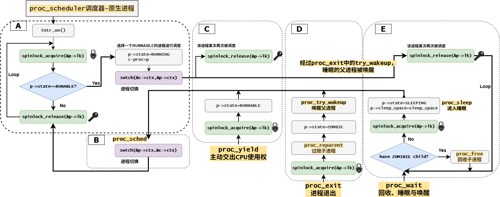
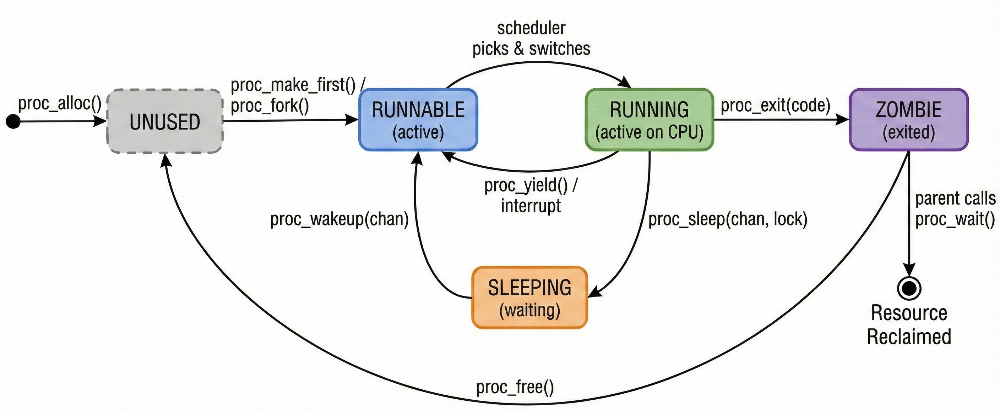
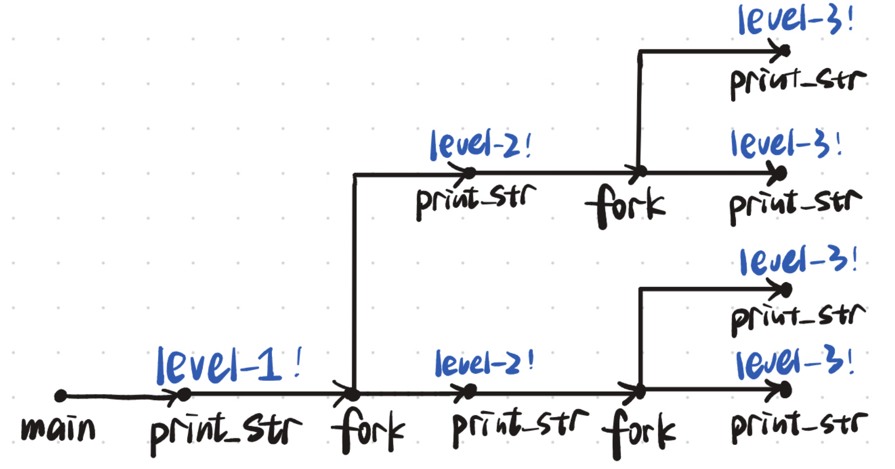
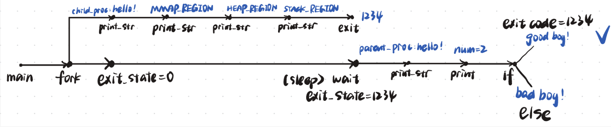

# LAB-6: 单进程走向多进程——进程调度与生命周期

经过之前的实验，proczero已经比较成熟了，在lab6中，我们通过“复制proczero"**从单进程走向了多进程**，并且主要关注了两个问题：**进程调度** + **生命周期**。

我们的分工如下：

**丁熙妍**：完成了**spinlock.c睡眠锁**，**kvm_init多进程内核初始化**，**时间片轮转的相关支持**，以及对应的README文档。

**吴晨曦**：完成了**proc.c中与进程相关的核心函数**，以及对应的README文档。

---

## 代码组织结构

```
ECNU-OSLAB-2025-TASK
├── LICENSE        开源协议
├── .vscode        配置了可视化调试环境
├── registers.xml  配置了可视化调试环境
├── .gdbinit.tmp-riscv xv6自带的调试配置
├── common.mk      Makefile中一些工具链的定义
├── Makefile       编译运行整个项目
├── kernel.ld      定义了内核程序在链接时的布局
├── pictures       README使用的图片目录 (CHANGE, 日常更新)
├── README.md      实验指导书 (CHANGE, 日常更新)
└── src            源码
    ├── kernel     内核源码
    │   ├── arch   RISC-V相关
    │   │   ├── method.h
    │   │   ├── mod.h
    │   │   └── type.h
    │   ├── boot   机器启动
    │   │   ├── entry.S
    │   │   └── start.c
    │   ├── lock   锁机制
    │   │   ├── spinlock.c
    │   │   ├── sleeplock.c (本实验完成, 实现睡眠锁)
    │   │   ├── method.h (CHANGE)
    │   │   ├── mod.h (CHANGE, 增加头文件)
    │   │   └── type.h (CHANGE)
    │   ├── lib    常用库
    │   │   ├── cpu.c
    │   │   ├── print.c
    │   │   ├── uart.c
    │   │   ├── utils.c
    │   │   ├── method.h
    │   │   ├── mod.h
    │   │   └── type.h
    │   ├── mem    内存模块
    │   │   ├── pmem.c
    │   │   ├── kvm.c (本实验补充, kvm_init从单进程内核栈初始化到多进程内核栈初始化)
    │   │   ├── uvm.c
    │   │   ├── mmap.c
    │   │   ├── method.h
    │   │   ├── mod.h
    │   │   └── type.h
    │   ├── trap   陷阱模块
    │   │   ├── plic.c
    │   │   ├── timer.c (本实验补充, 新增timer_wait函数, 增加时钟中断调度逻辑)
    │   │   ├── trap_kernel.c (本实验补充, 增加时钟中断调度逻辑)
    │   │   ├── trap_user.c (本实验补充, 增加时钟中断调度逻辑)
    │   │   ├── trap.S
    │   │   ├── trampoline.S
    │   │   ├── method.h (CHANGE, 增加timer_wait函数声明)
    │   │   ├── mod.h
    │   │   └── type.h
    │   ├── proc   进程模块
    │   │   ├── proc.c (本实验完成, 核心工作)
    │   │   ├── swtch.S
    │   │   ├── method.h (CHANGE)
    │   │   ├── mod.h
    │   │   └── type.h (CHANGE)
    │   ├── syscall 系统调用模块
    │   │   ├── syscall.c (CHANGE, 支持新的系统调用)
    │   │   ├── sysfunc.c (本实验补充, 实现新的系统调用)
    │   │   ├── method.h (CHANGE)
    │   │   ├── mod.h
    │   │   └── type.h (CHANGE)
    │   └── main.c (CHANGE)
    └── user       用户程序
        ├── initcode.c (CHANGE)
        ├── sys.h
        ├── syscall_arch.h
        └── syscall_num.h (CHANGE)
```

相比于上一个实验，本次实验主要增加了以下功能：

- 实现了**多进程**的**资源管理、进程调度与生命周期**的维护。
- 实现了**睡眠锁**机制，支持进程在等待资源时主动放弃 CPU 进入睡眠状态。
- 实现了**时钟中断驱动的调度支持**，包括 `timer` 模块的更新、`sys_sleep` 的底层实现以及**时间片轮转**的触发。
- 完善了**系统调用**，支持 `fork`、`exit`、`wait`、`getpid`、`sleep` 等多进程相关的系统调用。
- 完善了**内核初始化**，支持多进程内核栈的初始化。

---

## 具体实现

### 1. proc.c

在 `proc.c` 中，我们完成了**进程管理的核心逻辑**，主要可以分为**资源管理**、**调度机制**和**生命周期**三个部分。在实现过程中，最需要注意的（~~最令人头疼的~~）是以下两点：

- **各个函数的调用流程**（比如进程交出CPU使用权时，会通过`proc_yield`调用`proc_sched`，从而回到`proc_scheduler`原生进程，这就是一个调用流程。）
- **锁的持有与释放**（锁的正确使用是建立在调用流程熟悉的基础之上的，在涉及进程结构体中的**共享字段**的访问与修改时就要给该进程上锁，有时候锁的持有和释放**并不在一个函数内**，所以要注意不要重复持有/释放）

为了明确这两点，我们将本次实验中**核心的调用流程和锁的情况**梳理为下图所示：



如图所示，**原生进程**运行`proc_scheduler`，通过**循环扫描**的方式进行进程调度【图中A框】，然后通过`swtch`**切换到用户进程**，然后用户进程通过`proc_sched`**交出CPU使用权**，再通过`swtch`**切换回原生进程**【图中B框】。在我们实现的实验中，交出CPU使用权的原因可能是**时间片耗尽**（`proc_yield`）【图中C框】，**进程退出**（`proc_exit`）【图中D框】，或**因没有子进程可回收而睡眠**（`proc_wait`和`proc_sleep`）【图中E框】。

明确了整体的框架，接下来介绍我们在[proc.c](src/kernel/proc/proc.c)中具体的实现：

#### 资源管理：进程仓库

在资源管理部分，我们引入了 `proc_list` 数组作为**资源仓库**并实现了以下与**进程资源管理**相关的基本函数：

- `proc_init`：初始化进程锁和全局PID锁。
- `proc_alloc`：申请一个**UNUSED**的**进程控制块（PCB）**并填充基本信息，包括预设**内核栈与上下文**等。这里的一个关键点是设置 `ctx.ra = (uint64)proc_return`，确保**新进程被调度时能正确返回用户态**。同时要注意申请返回时是**带锁**的！
  - `proc_return`：调用`trap_user_return`**回到用户态**，并且在回去前**释放进程锁**
- `proc_free`：负责回收进程资源。利用了在lab-5最后实现的**释放用户态页表**的辅助函数，并手动**清空进程结构体**，**设置状态为`UNUSED`**。

#### 调度机制：上下文切换循环

实现了**基于循环扫描**以及**基于时间片轮转**的调度器。

- `proc_scheduler`：基于循环扫描的**调度器**，通过不断扫描 `proc_list`，寻找 `RUNNABLE` 的进程。找到后，通过 `swtch` 切换上下文。
  - **锁的交接**：调度器在切换前持有进程锁 `p->lk`，切换后由被调度进程（或 `proc_sched` 返回后）负责释放，保证状态转换原子性。
  - **中断开启**：在扫描循环中必须开启中断（`intr_on`），**否则如果所有进程都处于 SLEEPING 状态，CPU 将死锁在关中断状态**，无法响应时钟中断来唤醒进程（原先因为没有注意这一点造成了错误，具体见“测试与修复”的test4）。
- `proc_sched`：进程**交出CPU使用权**的通用接口。它负责修改进程状态（`c->proc = NULL`），并调用 `swtch` 切回调度器上下文。
- `proc_yield`：在基于**时间片轮转**进行调度时调用，强制将当前 `RUNNING` 的进程置为 `RUNNABLE` 并让出 CPU。

#### 生命周期：初始与复制、退出与回收、睡眠与唤醒

进程有五种状态：`unused`、`zombie`、`sleeping`、`runnable`、`running`，这五种状态通过相关函数进行转化的过程如下图所示：



与生命周期的维护相关的函数如下所示，我们认为可以分为**初始与复制**、**推出与回收**、**睡眠与唤醒**这三类：

- **初始与复制**

  进程的产生有两种方式，通过`proc_make_first`产生的第一个进程，或通过`proc_fork`继承自父进程：

  - `proc_make_first`：第一个用户进程 `proczero`。不同于 `fork` 的复制逻辑，它需要**手动申请**物理页、构建用户页表（映射 trampoline、trapframe、initcode 代码段及用户栈）、初始化 `trapframe` 和内核上下文 `ctx`，最后将其状态设置为 `RUNNABLE`，使其成为调度器启动后的第一个执行目标。

  - `proc_fork`：实现了进程的**完整复制**。在进行test2的测试时发现了有以下两个要注意的地方（具体内容见“测试与修复”）：
    - **元数据拷贝**：不仅要复制 `trapframe` 和页表，还**必须复制 `heap_top`、`ustack_npage` 等内存布局元数据**。若不复制，会导致孙子进程 Fork 时无法正确计算内存大小，引发**缺页异常**。

    - **防止Fork Bomb**：必须手动**调整子进程的 `epc += 4`**，防止子进程醒来后重复执行 fork 系统调用。

- **退出与回收**

  `proc_exit` 与`proc_wait`配合，实现了**父子进程的同步回收**：

  - `proc_exit` 负责将自己标记为 `ZOMBIE` 并**唤醒父进程**；如果父进程已死，则将子进程**过继**给 `proczero`（通过`proc_reparent`）。
  - `proc_wait` 负责**回收 `ZOMBIE` 子进程的资源**。为了避免忙等待，引入了 **`sleep/wakeup` 机制**。

- **睡眠与唤醒**

  - `proc_sleep`：**传入外部锁**，并进入睡眠状态，交出CPU使用权。对于**外部锁并非自身锁**的情况（如等待磁盘读写），函数内部先获取进程锁 `p->lk`，再释放传入的锁，然后切换上下文，回来后需要先释放自身锁，再重新获取外部锁。**外部锁即为自身锁**的情况直接带着这把锁睡眠即可。

    > 关于**为什么`proc_sleep`一定要传入一把锁**？
    >
    > 原因是这是一把**外部锁**，`proc_sleep`作为一个进程睡眠等待的**通用接口**，虽然在等待子进程的情况下，这把锁就是**自身锁**；但若是在等待磁盘读写/等待管道数据等情况下，这把锁就**不再是自身锁**。所以只有传入这把锁，才能在`proc_sleep`中释放这把外部锁！
    >
    > 那么**为什么一定要在`proc_sleep`内释放外部锁**？
    >
    > 原因是如果在睡眠前就放掉了这把锁，会造成**丢失唤醒**的问题：**子进程的唤醒信号**可能会在**父进程睡眠**之间的**时间窗口**内发出并被错过，导致父进程因收不到信号而永久沉睡。所以只能将这把外部锁传入`proc_sleep`，并在`proc_sleep`中获取了进程自身锁后，再释放那把外部锁，完成“**锁的接力**”，防止唤醒信号的丢失。

  - `proc_try_wakeup`&`proc_wakeup`：

    - `proc_wakeup`：**通用唤醒逻辑**。遍历整个进程数组，寻找所有状态为 `SLEEPING` 且**等待频道（`sleep_space`）与传入目标一致**的进程，将其唤醒。
    - `proc_try_wakeup`**：专用于 `proc_exit` 的定向唤醒逻辑**。它不遍历整个进程数组，而是直接获取当前进程的**父进程**。如果父进程存在，且正在睡眠等待子进程退出（即 `sleep_space` 等于父进程自身地址），则将其唤醒。

通过对上述核心函数的实现与剖析，我们深刻体会到了**锁在多进程管理中的核心地位**。为确保并发安全，我们需要明确进程结构体中哪些是“竞争点”，因此对进程结构体中的**共享字段**进行了梳理：

> **进程结构体中哪些字段会被共享访问？特例是什么？**
>
> - **共享访问的字段**（必须持有 `p->lk` 才能访问）
>   - **state（状态）**：这是**最核心**的共享字段。调度器（`proc_scheduler`）需读取它寻找 `RUNNABLE`；父进程（`proc_wait`）需读取它判断 `ZOMBIE`；唤醒者（`proc_wakeup`）需读取它判断 `SLEEPING`。
>   - **parent（父进程指针）**：涉及**父子进程间的同步**。子进程退出（`proc_exit`）时需通过它找到父进程；父进程等待（`proc_wait`）时需通过它确认子进程归属。
>   - **exit_code（退出码）**：典型的“**生产者-消费者**”模型数据。子进程退出时写入，父进程等待时读取。
>   - **sleep_space（睡眠频道）**：进程睡眠时写入，唤醒者（可能是另一个进程或中断处理程序）需要读取并比对该字段来决定是否唤醒。
>   - **pid**：全局进程查找（如 kill 或调试）时会被访问。
>
> - **特例字段**
>   - **当前运行的进程访问自己的私有字段**（如 `tf`、`kstack`、`pgtbl`、`context`）通常不需要加锁。
>     - **原因**：这些资源在进程 `RUNNING` 状态下是私有的，只有当前 CPU 能访问，不存在并发竞争。
>     - **打破特例的情况**：当进程处于 **`FORK`（父进程读写子进程页表/Trapframe）** 或 **`EXIT`（父进程回收子进程资源）** 阶段时，这些字段会被其他进程访问，此时必须加锁保护。

### 2. sleeplock.c

完成 `proc.c`的核心工作（特别是 `proc_sleep` 和 `proc_wakeup`）后，我们就有能力实现更高级的同步原语——**睡眠锁**(`sleeplock`)。

在[sleeplock.c](src/kernel/lock/sleeplock.c)中，我们在自旋锁和进程睡眠唤醒机制的基础上，建立了睡眠锁这种新的锁类别。它与我们之前实现的自旋锁（`spinlock`）有**显著的区别**，适用于不同的场景：

| 特性       | 自旋锁 (`spinlock`)                        | 睡眠锁 (`sleeplock`)                           |
| ---------- | ------------------------------------------ | ---------------------------------------------- |
| 一致性保证 | 依赖开关中断和原子指令                     | 依赖自旋锁保护内部状态                         |
| 获取失败时 | **忙等** (Busy-wait)，不断尝试             | **睡眠** (Sleep)，主动让出 CPU                 |
| 适用场景   | 保护**短期**持有的资源（如修改链表、状态） | 保护**长期**持有的资源（如磁盘 I/O、文件读写） |
| 中断环境   | 持有期间必须关中断                         | 持有期间可以开中断（因为会睡眠）               |


**实现逻辑**：

睡眠锁的结构体中包含一个**内部自旋锁**（保护锁自身状态）以及锁的状态信息。它的整体框架与自旋锁非常相似，但在获取和释放时会**调用进程管理层的接口**：

- 获取锁 (`sleeplock_acquire`)：
  - 首先获取内部自旋锁，并检查锁是否已被占用。
  - 如果已被占用，**调用 `proc_sleep` 让当前进程进入睡眠状态**，等待唤醒。
  - 被唤醒后，循环检查锁状态，直到成功获取锁。
  - 成功获取后，登记持有者信息，并释放内部自旋锁。

- 释放锁 (`sleeplock_release`)：
  - 获取内部自旋锁，并清除持有者信息。
  - **调用 `proc_wakeup` 唤醒所有在该锁上睡眠的进程**。
  - 释放内部自旋锁。

这一机制在后续的**文件系统**实验中将发挥重要作用，因为文件读写通常耗时较长，如果使用自旋锁会导致 CPU 资源的极大浪费。

### 3. sysfunc.c

我们在 lab-5 中已经建立了完善的系统调用流程，在本次实验中，我们将 `proc.c` 和 `timer.c` 中实现的核心功能封装成了系统调用，便于在用户空间进行测试和使用。

本次实验新增了以下系统调用：

| 系统调用        | 函数原型                          | 功能描述                   |
| :-------------- | :-------------------------------- | :------------------------- |
| `SYS_print_str` | `uint64 sys_print_str(char *str)` | 打印字符串                 |
| `SYS_print_int` | `uint64 sys_print_int(int num)`   | 打印 32 位整数             |
| `SYS_getpid`    | `uint64 sys_getpid()`             | 获取当前进程的 PID         |
| `SYS_fork`      | `uint64 sys_fork()`               | 进程复制（创建子进程）     |
| `SYS_wait`      | `uint64 sys_wait(uint64 addr)`    | 等待子进程退出并获取退出码 |
| `SYS_exit`      | `uint64 sys_exit(int exit_code)`  | 进程退出                   |
| `SYS_sleep`     | `uint64 sys_sleep(uint64 ntick)`  | 进程睡眠 ntick 个时钟周期  |

其中前 2 个主要用于**调试输出**，中间 4 个主要调用了 **`proc.c` 中的对应函数**，这里不再赘述。因此我们重点介绍一下最后一个系统调用 **`sys_sleep`** 的实现。

#### sys_sleep

这个系统调用的作用是让当前进程睡眠 `ntick` 个时钟周期。它依赖于 [`timer.c`](src/kernel/timer/timer.c) 中的实现：

1. **进入睡眠 (`timer_wait`)**：
   - 记录当前的系统 tick 数 `start_ticks`。
   - 循环检查 `sys_timer.ticks - start_ticks < ntick`。
   - 如果时间未到，调用 `proc_sleep`，让当前进程以**系统时钟 `sys_timer`** 为资源进入**睡眠状态**。
2. **时钟更新与唤醒 (`timer_update`)**：
   - 每当发生时钟中断时，内核会调用 `timer_update`，更新 `sys_timer.ticks`。
   - 调用 `proc_wakeup((void *)&sys_timer)`，**唤醒所有在系统时钟上睡眠的进程**。
3. **检查与返回**：
   - 进程被唤醒后，回到 `timer_wait` 的循环中再次检查时间。
   - 如果发现已经到达了目标时间，则**离开循环，系统调用返回**；否则**重新进入睡眠状态**。

---

## 测试与修复

### test1

**这是对于sys_getpid和sys_print_str的基础测试**，确保用户进程能够打印字符，测试代码见[`initcode`](src/user/initcode.c)中注释的对应部分。

测试通过的截图见：[`test1.png`](pictures/test1.png)

### test2

**这是对于fork的测试**，测试代码见[`initcode`](src/user/initcode.c)注释的对应部分。

根据代码绘制的**进程图**如下所示：预期应该输出1个level-1，2个level-2，4个level-3（部分进程的level-3可能会随机在子/父进程的level-2之前输出）。



测试过程中遇到的问题：出现**unknow exception**！

根据调试结果：


- scause = 12 (0xc): Instruction Page Fault（取指缺页异常）。
- sepc = 0: 异常发生时的程序计数器（PC）为 0。

- stval = 0: 导致异常的虚拟地址为 0。

结论：子进程试图从地址 0x0 处取指令执行，但该地址无效（未映射或不可执行）。

原因：在`proc_fork` 中，**没为子进程复制`tf->user_to_kern_epc`**。父进程调用fork时，其`tf->user_to_kern_epc`保存的是ecall指令的地址。子进程被创建时，tf是新分配并清零的。于是当子进程被调度运行并返回用户态时，会**跳转到 epc (即 0) 处执行，导致取指缺页异常**。

修复：

```c
// memset(tf, 0, PGSIZE); 错误！
// 【修复1】直接拷贝父进程的 trapframe 内容，而不是清零
*tf = *parent->tf; 
// 【修复2】子进程的 epc 需要 +4，跳过当前的 ecall 指令
// 否则子进程醒来后会再次执行 ecall，导致无限递归 fork
tf->user_to_kern_epc += 4;
```

然后：


可以看到：子进程也跑起来了：打印了 level-2! -> level-3!
但最终依然发生了缺页，发现原因是：**没有复制父进程的堆栈和堆顶指针**，导致子进程访问了未映射的地址。

```c
// 【修复3】复制堆栈和堆顶指针
child->heap_top = parent->heap_top;
child->ustack_npage = parent->ustack_npage;
```

修复后通过了测试，测试结果见：[`test2.png`](pictures/test2.png)，输出符合预期。

### test3

**这是对于fork，wait和exit的综合测试**，测试代码见[`initcode`](src/user/initcode.c)注释的对应部分。

代码的**进程图**如下所示（除去测试前面部分的mmap和heap的打印），预期是子进程先依次输出`child_proc:hello!`、`MMAP_REGION`、`HEAP_REGION`、`STACK_REGION`，然后以退出码1234退出，父进程起初`exit_state=0`，但**经过`syscall(SYS_wait, &exit_state)`后，等待子进程退出（中间sleep），并在子进程退出后将其退出码写入`exit_state`**，于是`exit_state=1234`。之后依次输出`parent_proc:hello!`、`num=2`，若程序正常执行的话由于`exit_state`已经等于1234，**最后应该输出`good boy!`**。



测试结果见：[`test3.png`](pictures/test3.png)，最后输出了`good boy`，其他输出也符合预期，测试通过。

### test4

**这是对于wait和sleep的测试**：子进程睡眠30个时钟周期后唤醒父进程，具体测试代码见[`initcode`](src/user/initcode.c)的对应部分。

测试过程中遇到的问题：只输出了 Ready to sleep! 


发现是因为：proc_scheduler中**没有开启中断**，导致所有进程sleep时CPU死锁在关中断状态，无法响应时钟中断唤醒进程。

```c
void proc_scheduler()
{
    cpu_t *c = mycpu();
    for (;;) {
        // 【修复】开启中断，否则所有进程 sleep 时 CPU 会死锁在关中断状态
        intr_on(); 
    ...
    }
}
```

修复后成功通过了测试，测试结果截图见：[`test4(1).png`](pictures/test4(1).png) 和 [`test4(2).png`](pictures/test4(2).png)，可以看到在**子进程睡眠30个时钟周期后成功唤醒了父进程（proc1）**，另外由于时钟每更新一次就需要唤醒子进程（proc2）检查自己是否睡到了30个周期，所以proc2一直在交替显示sleeping/wakeup。

### test5

**这是对于孤儿进程过继（Reparent）的测试**，补充的测试代码见 [`initcode`](src/user/initcode.c) 的对应部分。


代码的**各阶段进程关系图**如下所示：

```
阶段 1: 创建子进程 A
[PID 1] Initcode
   |
   +--- fork() ---> [PID 2] Child A

阶段 2: A 创建孙子进程 B
[PID 1] Initcode
   |
   +--- [PID 2] Child A
         |
         +--- fork() ---> [PID 3] Grandchild B

阶段 3: A 立即退出，B 成为孤儿
[PID 1] Initcode
   |
   +--- [PID 2] Child A (exited)
         |
         +--- [PID 3] Grandchild B (orphan)

阶段 4: B 被过继给 PID 1
[PID 1] Initcode
   |
   +--- [PID 3] Grandchild B (reparented to PID 1)

阶段 5: PID 1 等待回收 A 和 B
[PID 1] Initcode (waits for A: gets PID 2, then waits for B: gets PID 3)
   |
   +--- [PID 3] Grandchild B (reaped by PID 1)
```

预期结果是：

1. `Child (A) exit immediately`：子进程 A 先退出。
2. `Wait 1: pid=2`：PID 1 成功回收了 A。
3. `Grandchild (B) exit`：B 进程随后退出。
4. `Wait 2: pid=3`：PID 1 成功回收了 B（**证明 B 成功过继给了 PID 1**，否则 PID 1 无法 wait 到它）。

测试结果见：[`test5(1).png`](pictures/test5(1).png) 和[`test5(2).png`](pictures/test5(2).png)，可以看到输出完全符合预期，证明了 `proc_exit` 中的 `proc_reparent` 逻辑正确，**孤儿进程被正确托付给了 PID 1**。

### test6

**这是对于抢占式调度（Preemption）的测试**，补充的测试代码见[`initcode`](src/user/initcode.c)注释的对应部分。

测试逻辑是：父进程 fork 出一个子进程，然后**父子进程同时进入一个长循环**，分别打印 'A' 和 'B'。

预期结果是：由于我们实现了**时间片轮转**，内核会在时钟中断时强制切换进程，所以输出的 'A' 和 'B' 应该是**交替出现**的，而不是先输出一大堆 'A' 再输出一大堆 'B'。

测试结果见：[`test6.png`](pictures/test6.png)，可以看到输出的 'A' 和 'B' 是交替出现的，证明了**时间片轮转调度机制工作正常**。

### test7

**这是对于并发压力测试（Concurrent Stress Fork）的测试**，补充的测试代码见[`initcode`](src/user/initcode.c)注释的对应部分。

测试逻辑是：父进程**连续 fork 5个子进程**，让它们同时存在于系统中。子进程们会打印自己的 PID 并退出，父进程则**循环调用 `wait` 回收所有子进程**。

测试结果见：[`test7.png`](pictures/test7.png)，可以看到父进程成功创建了 PID 2-6 的子进程（`Forked child pid=...`），并且最终成功回收了所有子进程（`Reaped child pid=...`），验证了：

- `proc_alloc` 可以正确分配不同的 PID 和进程表槽位。
- `proc_list` 锁的并发安全性。
- `wait` 能否正确处理多个僵尸进程。

## 总结与思考

- **并发与原子性的深刻教训** 

  从单进程到多进程的跨越，最核心的挑战在于**并发控制**。在实现 `proc_sleep` 时，我们深刻理解了为什么必须“传入外部锁”并在“获取进程锁后”才能释放它——这是为了消除“检查条件”与“进入睡眠”之间的**时间窗口**，防止**丢失唤醒（Lost Wakeup）**。此外，`proc_scheduler` 中**忘记开启中断导致死锁**的 Bug，也让我们认识到：操作系统内核中，**锁的使用范围**、**中断的开关时机**以及**上下文切换的原子性**，都十分重要，是维持系统稳定运行的基石。

- **进程：从“代码+数据”到“元数据集合”** 

  在修复 Test2 中子进程缺页异常的过程中，我们意识到进程不仅仅是页表指向的物理内存（**代码和数据**），更是描述这些内存布局的**元数据**。Lab-5 中引入的 `heap_top` 和 `ustack_npage` 等字段，在 Lab-6 的 `fork` 操作中必须被**完整遗传**。任何一个元数据的遗漏（如 `epc` 未跳过 `ecall`、堆顶指针未复制），都可能导致程序在运行时出现难以追踪的逻辑错误。

