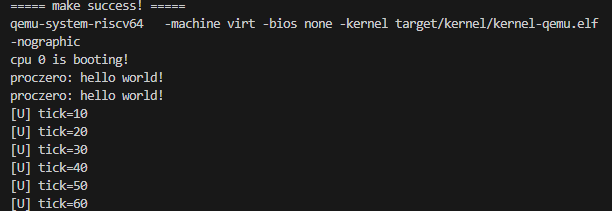
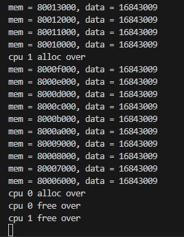
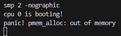

# LAB-2: 内存管理初步


在lab-2中, 我们开始认识和管理“程序除了CPU外最常访问的共享资源——内存”。

内存管理的实现不是一步到位的, lab-2中我们实现了**物理内存和内核态虚拟内存的管理**, 剩余部分将在后面的实验逐渐完善。

我们的分工如下：
**丁熙妍**：完成了**物理内存**部分，以及对应的实验文档。
**吴晨曦**：完成了**虚拟内存**部分，以及对应的实验文档。


## 代码组织结构
```
ECNU-OSLAB-2025-TASK
├── LICENSE        开源协议
├── .vscode        配置了可视化调试环境
├── registers.xml  配置了可视化调试环境
├── common.mk      Makefile中一些工具链的定义
├── Makefile       编译运行整个项目 (CHANGE, 增加trap和mem目录作为target)
├── kernel.ld      定义了内核程序在链接时的布局 (CHANGE, 增加一些关键位置的标记)
├── pictures       README使用的图片目录 (CHANGE, 日常更新)
├── README.md      实验指导书 (CHANGE, 日常更新)
└── src            源码
    └── kernel     内核源码
        ├── arch   RISC-V相关
        │   ├── method.h
        │   ├── mod.h
        │   └── type.h
        ├── boot   机器启动
        │   ├── entry.S
        │   └── start.c
        ├── lock   锁机制
        │   ├── spinlock.c
        │   ├── method.h
        │   ├── mod.h
        │   └── type.h
        ├── lib    常用库
        │   ├── cpu.c
        │   ├── print.c
        │   ├── uart.c
        │   ├── utils.c (NEW, 工具函数)
        │   ├── method.h (CHANGE, utils.c的函数声明)
        │   ├── mod.h
        │   └── type.h
        ├── mem    内存模块
        │   ├── pmem.c (本实验完成, 物理内存管理)
        │   ├── kvm.c (本实验完成, 内核态虚拟内存管理)
        │   ├── method.h (NEW)
        │   ├── mod.h (NEW)
        │   └── type.h (NEW)
        ├── trap   陷阱模块
        │   ├── method.h (NEW)
        │   ├── mod.h (NEW)
        │   └── type.h (NEW, 增加CLINT和PLIC寄存器定义)
        └── main.c (本实验完成)
```


## 第一阶段: 物理内存

### 1.1 物理内存布局

首先需要关注的文件是 **kernel.ld** 文件, 它规定了内核文件 **kernel-qemu.elf** 在载入内存时的布局

物理内存按照地址空间划分为三个部分：

- **0x80000000 ~ KERNEL_DATA** 存放了 **kernel-qemu.elf的代码**

- **KERNEL_DATA ~ ALLOC_BEGIN** 存放了 **kernel-qemu.elf的数据**

- **ALLOC_BEGIN ~ ALLOC_END** 属于 **未使用的可分配的物理页**


前两个区域的物理页会一直被内核占用, 不会纳入动态分配和回收的范围, 需要管理的只有第三个区域的物理页。

### 1.2 基本原理

物理内存管理的基本原理: **4KB物理页切分 + 空闲链表组织**

**ALLOC_BEGIN ~ ALLOC_END** 这块物理空间被切分为N个4KB物理页(不会有剩余)

此外, 考虑到内核与用户空间的强制隔离, 我们设置了两个`alloc_region`, 基于**KERNEL_PAGE**进行边界划分：

`kernel_region` 记录了内核空间的空闲物理页情况, `user_region` 记录了用户空间的空闲物理页情况

`alloc_region` 描述了一组空闲页链表, 包括起止位置、空闲页面数量、链表头节点、保证一致性的锁

下图显示了物理页的申请和释放在链表上是如何体现的：



### 1.3 函数实现

物理内存管理的函数主要在 **pmem.c** 中实现，其中使用了 **utils.c** 中的一些辅助函数。

### 1.3.1 pmem_init：初始化物理内存
初始化两段可分配物理内存区域（内核区与用户区）, 包括基本数值和空闲链表：
- 初始化`kern_region`和`user_region`的基本数值： `begin` , `end` , `allocable` , `list_head` , `lk`
- 使用`pmem_free`**将两段区域的所有物理页加入各自的空闲链表**


```c
// 物理内存的初始化
// 本质上就是填写kern_region和user_region, 包括基本数值和空闲链表
void pmem_init(void)
{
    // 初始化kern_region和user_region的锁
    spinlock_init(&kern_region.lk, "kernel_region_lock");
    spinlock_init(&user_region.lk, "user_region_lock");

    // 划分内核和用户内存区域的边界
    uint64 boundary = (uint64)ALLOC_BEGIN + KERN_PAGES * PGSIZE;

    // 初始化kern_region剩余内容
    kern_region.begin = (uint64)ALLOC_BEGIN;
    kern_region.end = boundary;
    kern_region.allocable = 0; // 可分配的空闲页面数
    kern_region.list_head.next = NULL; // 可分配链的链头节点

    // 初始化user_region剩余内容
    user_region.begin = boundary;
    user_region.end = (uint64)ALLOC_END;
    user_region.allocable = 0; 
    user_region.list_head.next = NULL; 

    // 将内核区域的物理页加入空闲链表
    // 相当于把内核区域的物理页都free掉
    for (uint64 p = kern_region.begin; p < kern_region.end; p += PGSIZE)
    {
        pmem_free(p, true);
    }
    // 将用户区域的物理页加入空闲链表
    for (uint64 p = user_region.begin; p < user_region.end; p += PGSIZE)
    {
        pmem_free(p, false);
    }
}
```


### 1.3.2 pmem_alloc:申请空闲页面
申请一个4KB的物理页：
- 根据`is_kernel`选择对应的`alloc_region`
- 获取`alloc_region`的锁, 从链表头取出第一个节点（**头删法**）；更新链表头和`allocable`，释放锁
- 若无可用页，则调用`panic`锁死
- 若申请成功，则使用`memset`将该页**清零**，并返回该页的地址


```c
// 尝试返回一个可分配的清零后的物理页
// 失败则panic锁死
void* pmem_alloc(bool in_kernel)
{
    // 申请一个空闲页面：
    // 取出空闲链表的第一个空闲页作为分配的页面，并清零后返回

    page_node_t *page;

    // 分配区域：内核区域 or 用户区域
    alloc_region_t *ar = &user_region;
    if (in_kernel)
    {
        ar = &kern_region;
    }

    // 取出空闲链表的第一个节点
    spinlock_acquire(&ar->lk);
    page = ar->list_head.next;
    if (page) {
        ar->list_head.next = page->next;
        ar->allocable--;
    }
    spinlock_release(&ar->lk);

    // 分配失败，则panic锁死
    if (!page) {
        panic("pmem_alloc: out of memory");
    }

    // 清零后返回
    memset(page, 0, PGSIZE);
    return page;
}
```


### 1.3.3 pmem_free:释放物理页
回收一个物理页：
- 根据`is_kernel`选择对应的`alloc_region`
- 检查**参数**`page`（要释放的物理页起始地址）的**合法性**
- **调试填充**：使用 `memset`将页面的每个字节都写成1，便于后续发现野指针/重复释放错误。
- 获取`alloc_region`的锁, 将该页插入链表头（**头插法**）；更新链表头和`allocable`，释放锁

```c
// 释放一个物理页
// 失败则panic锁死
void pmem_free(uint64 page, bool in_kernel)
{
    // page: 要释放的物理页的起始地址
    // 释放一个之前申请的物理页：
    // 将它插入空闲链表的表头

    // 分配区域：内核区域 or 用户区域
    alloc_region_t *ar = &user_region;
    if (in_kernel)
    {
        ar = &kern_region;
    }

    // 检查page的合法性
    if (page % PGSIZE != 0 || page < ar->begin || page >= ar->end)
    {
        panic("pmem_free: invalid page");
    }

    // 调试用：填充为垃圾值
    memset((void *)page, 1, PGSIZE);

    // 插入到空闲链表的表头
    page_node_t *p = (page_node_t *)page;
    spinlock_acquire(&ar->lk);
    p->next = ar->list_head.next;
    ar->list_head.next = p;
    ar->allocable++;
    spinlock_release(&ar->lk);
}
```


### 1.4 测试用例

**test-1：**

```c
volatile static int started = 0;

volatile static int over_1 = 0, over_2 = 0;

static int* mem[1024];

int main()
{
    int cpuid = r_tp();

    if(cpuid == 0) {

        print_init();
        pmem_init();

        printf("cpu %d is booting!\n", cpuid);
        __sync_synchronize();
        started = 1;

        for(int i = 0; i < 512; i++) {
            mem[i] = pmem_alloc(true);
            memset(mem[i], 1, PGSIZE);
            printf("mem = %p, data = %d\n", mem[i], mem[i][0]);
        }
        printf("cpu %d alloc over\n", cpuid);
        over_1 = 1;
        
        while(over_1 == 0 || over_2 == 0);
        
        for(int i = 0; i < 512; i++)
            pmem_free((uint64)mem[i], true);
        printf("cpu %d free over\n", cpuid);

    } else {

        while(started == 0);
        __sync_synchronize();
        printf("cpu %d is booting!\n", cpuid);
        
        for(int i = 512; i < 1024; i++) {
            mem[i] = pmem_alloc(true);
            memset(mem[i], 1, PGSIZE);
            printf("mem = %p, data = %d\n", mem[i], mem[i][0]);
        }
        printf("cpu %d alloc over\n", cpuid);
        over_2 = 1;

        while(over_1 == 0 || over_2 == 0);

        for(int i = 512; i < 1024; i++)
            pmem_free((uint64)mem[i], true);
        printf("cpu %d free over\n", cpuid);        
 
    }
    while (1);    
}
```

这个测试用例的作用是：

1. cpu-0和cpu-1并行申请内核空间的全部物理内存, 赋值并输出信息

2. 待申请全部结束, 并行释放所有申请的物理内存
   
输出结果如下：



成功通过test_1！


**test-2：**

```c
// 测试目标：耗尽内核/用户区域内存 
void test_case_1()
{
    void *page = NULL;

    while (1)
    {
        page = pmem_alloc(true);
        // page = pmem_alloc(false);
    }
}

#define TEST_CNT 10

// 测试目标: 常规申请和释放操作
void test_case_2()
{
    alloc_region_t *user_ar = &user_region;
    uint64 user_pages[TEST_CNT];

    for (int i = 0; i < TEST_CNT; i++)
        user_pages[i] = 0;

    printf("=== test_case_2: Phase 1 - Allocate User Pages ===\n");
    for (int i = 0; i < TEST_CNT; i++)
    {
        user_pages[i] = (uint64)pmem_alloc(false);

        printf("Allocated user page[%d] @ %p\n", i, (void *)user_pages[i]);

        if (!(user_pages[i] >= user_ar->begin && user_pages[i] < user_ar->end))
        {
            printf("Assertion failed: Page address out of bounds! Page: %p, Region: [%p, %p)\n",
                   (void *)user_pages[i], (void *)user_ar->begin, (void *)user_ar->end);
            panic("Page address out of user region bounds");
        }

        memset((void *)user_pages[i], 0xAA, PGSIZE);
    }

    printf("=== test_case_2: Phase 2 - Pre-free Check ===\n");
    spinlock_acquire(&user_ar->lk);
    int expected_before = (user_ar->end - user_ar->begin) / PGSIZE - TEST_CNT;
    int actual = user_ar->allocable;
    printf("Expected allocable: %d, Actual: %d\n", expected_before, actual);
    assert(user_ar->allocable == expected_before, "Allocable count incorrect before free");
    spinlock_release(&user_ar->lk);

    printf("=== test_case_2: Phase 3 - Free Pages ===\n");
    for (int i = 0; i < TEST_CNT; i++)
    {
        pmem_free(user_pages[i], false);
        printf("Free user page[%d] @ %p\n", i, (void *)user_pages[i]);
    }

    printf("=== test_case_2: Phase 4 - Post-free Check ===\n");
    spinlock_acquire(&user_ar->lk);
    int expected_after = (user_ar->end - user_ar->begin) / PGSIZE;
    actual = user_ar->allocable;
    printf("Expected allocable: %d, Actual: %d\n", expected_after, actual);
    assert(user_ar->allocable == expected_after, "Allocable count not restored after free");
    if (user_ar->list_head.next != NULL)
        printf("Free list head @ %p\n", user_ar->list_head.next);
    else
        panic("Free list is empty after freeing pages");
    spinlock_release(&user_ar->lk);

    printf("=== test_case_2: Phase 5 - Reallocate & Verify Zero ===\n");
    for (int i = 0; i < TEST_CNT; i++)
    {
        void *page = pmem_alloc(false);
        printf("Reallocated page[%d] @ %p\n", i, page);

        bool non_zero = false;
        for (int j = 0; j < PGSIZE / sizeof(int); j++)
        {
            if (((int *)page)[j] != 0)
            {
                non_zero = true;
                printf("Non-zero value detected at offset %d: 0x%x\n", j, ((int *)page)[j]);
                break;
            }
        }
        assert(!non_zero, "Memory not zeroed after free");
        printf("Zero verification passed\n");
    }

    printf("test_case_2 passed!\n");
}
```

这个测试用例的作用是：

1. 测试内存耗尽的`panic`是否正常触发

2. 测试用户空间物理页申请和释放的正确性
   
test_case_1时发现`panic`未能正常触发, 经过排查是**因为`panic`逻辑有误**：`panic`里先设置`panicked=1`，再调用`printf`；而`printf`开头检测到如果`panicked==1`就直接返回，因此看不到`panic`的输出信息。
**修改`panic`函数**：将`panicked=1`放到`printf`之后。

```c
/* 报错并终止输出 */
void panic(const char *s)
{
    push_off(); //关中断

    if(!panicked){ //避免不同核重复调用
        printf("panic! %s\n", s?s:"<null>"); //先报错
        panicked = 1; //再锁死
    }

    while (1){
        asm volatile("wfi"); //安全停机
    }
}
```

test_case_1输出结果如下：



成功通过test_case_1！


test_case_2输出结果如下：

```
cpu 0 is booting!
=== test_case_2: Phase 1 - Allocate User Pages ===
Allocated user page[0] @ 87fff000
Allocated user page[1] @ 87ffe000
Allocated user page[2] @ 87ffd000
Allocated user page[3] @ 87ffc000
Allocated user page[4] @ 87ffb000
Allocated user page[5] @ 87ffa000
Allocated user page[6] @ 87ff9000
Allocated user page[7] @ 87ff8000
Allocated user page[8] @ 87ff7000
Allocated user page[9] @ 87ff6000
=== test_case_2: Phase 2 - Pre-free Check ===
Expected allocable: 31730, Actual: 31730
=== test_case_2: Phase 3 - Free Pages ===
Free user page[0] @ 87fff000
Free user page[1] @ 87ffe000
Free user page[2] @ 87ffd000
Free user page[3] @ 87ffc000
Free user page[4] @ 87ffb000
Free user page[5] @ 87ffa000
Free user page[6] @ 87ff9000
Free user page[7] @ 87ff8000
Free user page[8] @ 87ff7000
Free user page[9] @ 87ff6000
=== test_case_2: Phase 4 - Post-free Check ===
Expected allocable: 31740, Actual: 31740
Free list head @ 87ff6000
=== test_case_2: Phase 5 - Reallocate & Verify Zero ===
Reallocated page[0] @ 87ff6000
Zero verification passed
Reallocated page[1] @ 87ff7000
Zero verification passed
Reallocated page[2] @ 87ff8000
Zero verification passed
Reallocated page[3] @ 87ff9000
Zero verification passed
Reallocated page[4] @ 87ffa000
Zero verification passed
Reallocated page[5] @ 87ffb000
Zero verification passed
Reallocated page[6] @ 87ffc000
Zero verification passed
Reallocated page[7] @ 87ffd000
Zero verification passed
Reallocated page[8] @ 87ffe000
Zero verification passed
Reallocated page[9] @ 87fff000
Zero verification passed
test_case_2 passed!
cpu 0 test over
```

成功通过test_case_2！
