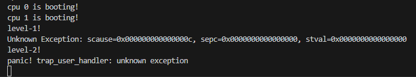
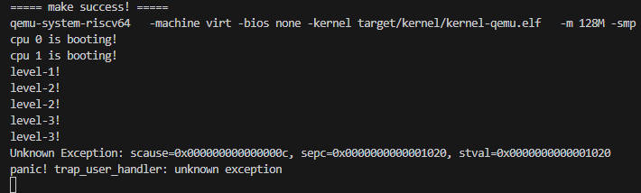
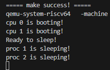

# LAB-6: 单进程走向多进程——进程调度与生命周期

经过之前的实验，proczero已经比较成熟了，在lab6中，我们通过“复制proczero"**产生了更多进程**，并且主要关注了两个问题：**进程调度** + **生命周期**。

我们的分工如下：

**丁熙妍**：完成了**spinlock.c睡眠锁**，**kvm_init多进程内核初始化**，**时间片轮转的相关支持**，以及对应的README文档。

**吴晨曦**：完成了**proc.c中与进程相关的核心函数**，以及对应的README文档

---

## 代码组织结构

```
ECNU-OSLAB-2025-TASK
├── LICENSE        开源协议
├── .vscode        配置了可视化调试环境
├── registers.xml  配置了可视化调试环境
├── .gdbinit.tmp-riscv xv6自带的调试配置
├── common.mk      Makefile中一些工具链的定义
├── Makefile       编译运行整个项目
├── kernel.ld      定义了内核程序在链接时的布局
├── pictures       README使用的图片目录 (CHANGE, 日常更新)
├── README.md      实验指导书 (CHANGE, 日常更新)
└── src            源码
    ├── kernel     内核源码
    │   ├── arch   RISC-V相关
    │   │   ├── method.h
    │   │   ├── mod.h
    │   │   └── type.h
    │   ├── boot   机器启动
    │   │   ├── entry.S
    │   │   └── start.c
    │   ├── lock   锁机制
    │   │   ├── spinlock.c
    │   │   ├── sleeplock.c (本实验完成, 实现睡眠锁)
    │   │   ├── method.h (CHANGE)
    │   │   ├── mod.h (CHANGE, 增加头文件)
    │   │   └── type.h (CHANGE)
    │   ├── lib    常用库
    │   │   ├── cpu.c
    │   │   ├── print.c
    │   │   ├── uart.c
    │   │   ├── utils.c
    │   │   ├── method.h
    │   │   ├── mod.h
    │   │   └── type.h
    │   ├── mem    内存模块
    │   │   ├── pmem.c
    │   │   ├── kvm.c (本实验补充, kvm_init从单进程内核栈初始化到多进程内核栈初始化)
    │   │   ├── uvm.c
    │   │   ├── mmap.c
    │   │   ├── method.h
    │   │   ├── mod.h
    │   │   └── type.h
    │   ├── trap   陷阱模块
    │   │   ├── plic.c
    │   │   ├── timer.c (本实验补充, 新增timer_wait函数, 增加时钟中断调度逻辑)
    │   │   ├── trap_kernel.c (本实验补充, 增加时钟中断调度逻辑)
    │   │   ├── trap_user.c (本实验补充, 增加时钟中断调度逻辑)
    │   │   ├── trap.S
    │   │   ├── trampoline.S
    │   │   ├── method.h (CHANGE, 增加timer_wait函数声明)
    │   │   ├── mod.h
    │   │   └── type.h
    │   ├── proc   进程模块
    │   │   ├── proc.c (本实验完成, 核心工作)
    │   │   ├── swtch.S
    │   │   ├── method.h (CHANGE)
    │   │   ├── mod.h
    │   │   └── type.h (CHANGE)
    │   ├── syscall 系统调用模块
    │   │   ├── syscall.c (CHANGE, 支持新的系统调用)
    │   │   ├── sysfunc.c (本实验补充, 实现新的系统调用)
    │   │   ├── method.h (CHANGE)
    │   │   ├── mod.h
    │   │   └── type.h (CHANGE)
    │   └── main.c (CHANGE)
    └── user       用户程序
        ├── initcode.c (CHANGE)
        ├── sys.h
        ├── syscall_arch.h
        └── syscall_num.h (CHANGE)
```

相比于上一个实验，本次实验主要增加了以下功能：

- 实现了多进程的资源管理、进程调度与生命周期的维护
- 实现了

---

## 具体实现

### proc.c

在 `proc.c` 中，我们完成了**进程管理的核心逻辑**，主要可以分为**资源管理**、**调度机制**和**生命周期**三个部分。在实现过程中，最需要注意的~~（最令人头疼的）~~是以下两点：

- **各个函数的调用流程**（比如进程交出CPU使用权时，会通过`proc_yield`调用`proc_sched`，从而回到`proc_scheduler`原生进程，这就是一个调用流程。）
- **锁的持有与释放**（锁的正确使用是建立在调用流程熟悉的基础之上的，在涉及进程结构体中的**共享字段**的访问与修改时就要给该进程上锁，有时候锁的持有和释放**并不在一个函数内**，所以要注意不要重复持有/释放）

为了明确这两点，我们将本次实验中**核心的调用流程和锁的情况**梳理为下图所示：


如图所示，**原生进程**运行`proc_scheduler`，通过**循环扫描**的方式进行进程调度【图中A框】，然后通过`swtch`**切换到用户进程**，然后用户进程通过`proc_sched`**交出CPU使用权**，再通过`swtch`**切换回原生进程**【图中B框】。在我们实现的实验中，交出CPU使用权的原因可能是**时间片耗尽**（`proc_yield`）【图中C框】，**进程退出**（`proc_exit`）【图中D框】，或是**因没有子进程可回收而睡眠**（`proc_wait`和`proc_sleep`）【图中E框】等。

明确了整体的框架，接下来简要介绍我们在[proc.c](src/kernel/proc/proc.c)中具体的实现：

#### 资源管理：进程仓库

资源管理是实现多进程的**基础**，我们引入了 `proc_list` 数组作为**资源仓库**并实现了以下与**进程资源管理**相关的函数：

- `proc_init`：初始化进程锁和全局PID锁。
- `proc_alloc`：申请一个**UNUSED**的**进程控制块（PCB）**并填充一些基本信息，包括预设**内核栈与上下文**等。这里的一个关键点是设置 `ctx.ra = (uint64)proc_return`，确保**新进程被调度时能正确返回用户态**。同时要注意申请返回时是**带锁**的！
  - `proc_return`：调用`trap_user_return`**回到用户态**，并且在回去前**释放进程锁**
- `proc_free`：负责回收进程资源。利用了在lab-5最后实现的**释放用户态页表**的辅助函数，并手动**清空进程结构体**，**设置状态为`UNUSED`**。

#### 调度机制：上下文切换循环

实现了基于**循环扫描**以及基于**时间片轮转**的调度器。

- `proc_scheduler`：**调度器**，通过不断扫描 `proc_list`，寻找 `RUNNABLE` 的进程。找到后，通过 `swtch` 切换上下文。
  - **锁的交接**：调度器在切换前持有进程锁 `p->lk`，切换后由被调度进程（或 `proc_sched` 返回后）负责释放。这是保证状态转换原子性的关键。
  - **中断开启**：在扫描循环中必须开启中断（`intr_on`），**否则如果所有进程都处于 SLEEPING 状态，CPU 将死锁在关中断状态**，无法响应时钟中断来唤醒进程。
- `proc_sched`：进程**交出CPU使用权**的通用接口。它负责修改进程状态（`c->proc = NULL`，并调用 `swtch` 切回调度器上下文。
- `proc_yield`：实现了**时间片轮转**。在时钟中断处理中调用，强制将当前 `RUNNING` 的进程置为 `RUNNABLE` 并让出 CPU。

#### 生命周期：初始与复制、退出与回收、睡眠与唤醒

进程有五种状态：`unused`、`zombie`、`sleeping`、`runnable`、`running`，这五种状态的转化过程如下图所示：


与生命周期的维护相关的函数如下所示，可以分为**初始与复制**、**推出与回收**、**睡眠与唤醒**这三类：

- **初始与复制**

  进程的产生有两种方式，通过`proc_make_first`产生的的第一个进程，或通过`proc_fork`继承自父进程：

  - `proc_make_first`：第一个用户进程 `proczero`。不同于 `fork` 的复制逻辑，它需要**手动**申请物理页、构建用户页表（映射 trampoline、trapframe、initcode 代码段及用户栈）、初始化 `trapframe` 和内核上下文 `ctx`，最后将其状态设置为 `RUNNABLE`，使其成为调度器启动后的第一个执行目标。

  - `proc_fork`：实现了进程的完整复制。在进行test3的测试时发现了有以下两个要注意的地方：

    - **元数据拷贝**：不仅要复制 `trapframe` 和页表，还**必须复制 `heap_top`、`ustack_npage` 等内存布局元数据**。若不复制，会导致孙子进程 Fork 时无法正确计算内存大小，引发**缺页异常**。

    - **防止Fork Bomb**：必须手动**调整子进程的 `epc += 4`**，防止子进程醒来后重复执行 fork 系统调用。

- **退出与回收**

  `proc_exit` 与`proc_wait`配合，实现了**父子进程的同步回收**：

  - `proc_exit` 负责将自己标记为 `ZOMBIE` 并**唤醒父进程**；如果父进程已死，则将子进程**过继**给 `proczero`（通过`proc_reparent`）。
  - `proc_wait` 负责回收 `ZOMBIE` 子进程的资源。为了避免忙等待，引入了 `sleep/wakeup` 机制。

- **睡眠与唤醒**

  - `proc_sleep`：传入外部锁，等待sleep_space对应的资源, 并进入睡眠状态。函数内部先获取进程锁 `p->lk`，再释放传入的锁，然后切换上下文。

    > 关于为什么`proc_sleep`一定要传入一把锁？
    >
    > 原因是这是一把**外部锁**，`proc_sleep`作为一个进程睡眠等待的**通用接口**，在等待子进程的情况下，这把锁就是**自身锁**；但若是在等待磁盘读写/等待管道数据等情况下，这把锁就**不再是自身锁**。所以只有传入这把锁，才能在`proc_sleep`中释放这把外部锁！
    >
    > 那么为什么一定要在`proc_sleep`内释放外部锁呢？
    >
    > 原因是如果在睡眠前就放掉了这把锁，会造成**丢失唤醒**的问题：**子进程的唤醒信号**可能会在**父进程睡眠**之间的**时间窗口**内发出并被错过，导致父进程因收不到信号而永久沉睡。所以只能将这把外部锁传入`proc_sleep`，并在`proc_sleep`中获取了进程自身锁后，再释放那把外部锁，完成“**锁的接力**”，防止唤醒信号的丢失。

  - `proc_try_wakeup`&`proc_wakeup`：

    - `proc_wakeup`：**通用唤醒逻辑**。遍历整个进程数组，寻找所有状态为 `SLEEPING` 且**等待频道（`sleep_space`）与传入目标一致**的进程，将其唤醒。
    - `proc_try_wakeup`**：专用于 `proc_exit` 的定向唤醒逻辑**。它不遍历整个进程数组，而是直接获取当前进程的**父进程**。如果父进程存在，且正在睡眠等待子进程退出（即 `sleep_space` 等于父进程自身地址），则将其唤醒。

---

## 测试与修复

### test1

**这是对于sys_getpid和sys_print的基础测试**，测试代码见[`initcode`](src/user/initcode.c)注释的对应部分。

测试通过的截图见：[`test1.png`](pictures/test1.png)

### test2

**这是对于fork的测试**，测试代码见[`initcode`](src/user/initcode.c)注释的对应部分，根据代码绘制的**进程图**如下所示：预期应该输出1个level-1，2个level-2，4个level-3（部分进程的level-3可能会随机在子/父进程的level-2之前输出）


测试过程中遇到的问题：出现unknow exception！

根据调试结果：



- scause = 12 (0xc): Instruction Page Fault（取指缺页异常）。
- sepc = 0: 异常发生时的程序计数器（PC）为 0。

- stval = 0: 导致异常的虚拟地址为 0。

结论：子进程试图从地址 0x0 处取指令执行，但该地址无效（未映射或不可执行）。

原因：在`proc_fork` 中，**没为子进程复制`tf->user_to_kern_epc`**。父进程调用fork时，其`tf->user_to_kern_epc`保存的是ecall指令的地址。子进程被创建时，tf是新分配并清零的。于是当子进程被调度运行并返回用户态时，会**跳转到 epc (即 0) 处执行，导致取指缺页异常**。

修复：

```c
// memset(tf, 0, PGSIZE); 错误！
// 【修复1】直接拷贝父进程的 trapframe 内容，而不是清零
*tf = *parent->tf; 
// 【修复2】子进程的 epc 需要 +4，跳过当前的 ecall 指令
// 否则子进程醒来后会再次执行 ecall，导致无限递归 fork
tf->user_to_kern_epc += 4;
```

然后：



可以看到：子进程也跑起来了：打印了 level-2! -> level-3!
但最终依然发生了缺页，发现原因是：**没有复制父进程的堆栈和堆顶指针**，导致子进程访问了未映射的地址。

```c
// 【修复3】复制堆栈和堆顶指针
child->heap_top = parent->heap_top;
child->ustack_npage = parent->ustack_npage;
```

修复后通过了测试，测试结果见：[`test2.png`](pictures/test2.png)，输出符合预期。

### test3

**这是对于fork，wait和exit的综合测试**，测试代码见[`initcode`](src/user/initcode.c)注释的对应部分。代码的**进程图**如下所示（除去测试前面部分的mmap和heap的打印），预期是子进程先依次输出`child_proc:hello!`、`MMAP_REGION`、`HEAP_REGION`、`STACK_REGION`，然后以退出码1234退出，父进程起初`exit_state=0`，但**经过`syscall(SYS_wait, &exit_state)`等待子进程退出（中间sleep），并在子进程推出后将其退出码写入了`exit_state`**，于是`exit_state=1234`。之后依次输出`parent_proc:hello!`、`num=2`，若程序正常执行的话应该输出`good boy!`。


测试结果见：[`test3.png`](pictures/test3.png)，最后输出了`good boy`，其他输出也符合预期，测试通过。

### test4

**这是对于wait和sleep的测试**：子进程睡眠30个时钟周期后唤醒父进程，具体测试代码见[`initcode`](src/user/initcode.c)的对应部分。

测试过程中遇到的问题：只输出了 Ready to sleep! 



发现是因为：proc_scheduler中**没有开启中断**，导致所有进程sleep时CPU死锁在关中断状态，无法响应时钟中断唤醒进程。

```c
void proc_scheduler()
{
    cpu_t *c = mycpu();
    for (;;) {
        // 【修复】开启中断，否则所有进程 sleep 时 CPU 会死锁在关中断状态
        intr_on(); 
    ...
    }
}
```

修复后成功通过了测试，测试结果截图见：[`test4.png`](pictures/test4.png)，可以看到在子进程睡眠30个时钟周期后成功唤醒了父进程（proc1），另外由于时钟每更新一次就唤醒子进程检查自己是否睡到了30个周期，所以proc2一直在交替显示sleeping/wakeup。

