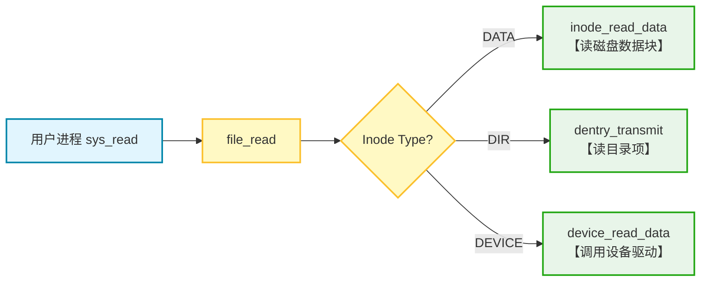

# LAB-9: 文件系统 之 文件管理与全系统整合

在 Lab-7 和 Lab-8 中，我们自底向上构建了磁盘驱动、Buffer Cache、Inode 管理以及目录树结构，实现了对物理磁盘的抽象。然而，对于操作系统之上的用户程序而言，**直接操作 Inode 是繁琐且不安全的**。

Lab-9 是整个操作系统内核构建的最终章。在本实验中，我们将打通文件系统与进程管理、内存管理的“任督二脉”：
- 我们将屏蔽底层 Inode 与设备的差异，实现“**一切皆文件**”的抽象。
- 同时，我们将赋予内核加载并执行用户态 ELF 程序的能力，让我们的 OS 真正 **“活”起来**。

我们的分工如下：

**吴晨曦**：

**丁熙妍**：完成了 **目录项（Dentry）** 的高级功能（相对路径解析、逆向路径解析、文件/目录的创建、硬链接）；完成了 **文件抽象层（File）** 与 **设备管理（Device）** 的实现，负责 file_t 结构体的生命周期管理及设备文件的读写分发。


## 代码组织结构

```
ANOS
├── LICENSE        开源协议
├── .vscode        配置了可视化调试环境
├── registers.xml  配置了可视化调试环境
├── .gdbinit.tmp-riscv xv6自带的调试配置
├── common.mk      Makefile中一些工具链的定义
├── Makefile       编译运行整个项目 (CHANGE)
├── picture        README使用的图片目录 (CHANGE)
├── README.md      实验报告 (CHANGE)
└── src            源码
    ├── kernel     内核源码
    │   ├── arch   RISC-V相关
    │   │   ├── method.h
    │   │   ├── mod.h
    │   │   └── type.h
    │   ├── boot   机器启动
    │   │   ├── entry.S
    │   │   └── start.c
    │   ├── lock   锁机制
    │   │   ├── spinlock.c
    │   │   ├── sleeplock.c
    │   │   ├── method.h
    │   │   ├── mod.h
    │   │   └── type.h
    │   ├── lib    常用库
    │   │   ├── cpu.c
    │   │   ├── console.c (NEW, 行缓冲的输入输出)
    │   │   ├── print.c (CHANGE, 在print_init中调用console_init进行初始化)
    │   │   ├── uart.c (CHANGE, 将uart_intr中的switch-case逻辑换成cons_edit)
    │   │   ├── utils.c
    │   │   ├── method.h (CHANGE)
    │   │   ├── mod.h
    │   │   └── type.h (CHANGE)
    │   ├── mem    内存模块
    │   │   ├── pmem.c (本实验补充, 增加函数pmem_stat用于获取剩余页面数量信息)
    │   │   ├── kvm.c
    │   │   ├── uvm.c (本实验补充, 修改uvm_heap_grow以支持flag的输入)
    │   │   ├── mmap.c
    │   │   ├── method.h (CHANGE)
    │   │   ├── mod.h
    │   │   └── type.h
    │   ├── trap   陷阱模块
    │   │   ├── plic.c
    │   │   ├── timer.c
    │   │   ├── trap_kernel.c
    │   │   ├── trap_user.c
    │   │   ├── trap.S
    │   │   ├── trampoline.S
    │   │   ├── method.h
    │   │   ├── mod.h
    │   │   └── type.h
    │   ├── proc   进程模块
    │   │   ├── proc.c (本实验补充, 增加open_file和cwd的初始化、设置、销毁逻辑)
    │   │   ├── exec.c (本实验完成, 操作ELF文件以填充新的进程)
    │   │   ├── swtch.S
    │   │   ├── method.h (CHANGE)
    │   │   ├── mod.h
    │   │   └── type.h (CHANGE)
    │   ├── syscall 系统调用模块
    │   │   ├── syscall.c (本实验补充, 新的系统调用)
    │   │   ├── sysfunc.c (本实验补充, 新的系统调用)
    │   │   ├── method.h (本实验补充, 新的系统调用)
    │   │   ├── mod.h
    │   │   └── type.h (本实验补充, 新的系统调用)
    │   ├── fs     文件系统模块
    │   │   ├── bitmap.c
    │   │   ├── buffer.c
    │   │   ├── inode.c
    │   │   ├── device.c (本实验完成, 增加设备文件操作逻辑)
    │   │   ├── dentry.c (本实验补充, 增加目录和路径的功能)
    │   │   ├── fs.c (本实验补充, 增加文件操作逻辑)
    │   │   ├── virtio.c
    │   │   ├── method.h (CHANGE)
    │   │   ├── mod.h
    │   │   └── type.h (CHANGE)
    │   └── main.c
    ├── mkfs       磁盘映像初始化
    │   ├── mkfs.c (CHANGE, 增加输入参数的支持)
    │   └── mkfs.h (CHANGE)
    ├── loader     存放链接脚本
    │   ├── kernel.ld (CHANGE, 移动了位置)
    │   └── user.ld (NEW, 定义了用户态ELF程序的链接规则)
    └── user       用户程序
        ├── initcode.c (CHANGE, 启动测试程序)
        ├── syscall.c (NEW, 封装了系统调用)
        ├── help.c (NEW, 其他公共库函数)
        ├── test_1.c (NEW, 测试点)
        ├── test_2.c (NEW, 测试点)
        ├── test_3.c (NEW, 测试点)
        ├── test_4.c (NEW, 测试点)
        ├── help.h (NEW, 库函数和重要定义)
        ├── sys.h
        ├── syscall_arch.h
        └── syscall_num.h (CHANGE, 新的系统调用)
```

相对于上一个实验, 本实验主要增加了以下功能：

- **实现了“一切皆文件”的抽象**：引入 `file_t` 结构体，屏蔽了底层 Inode 与字符设备的差异，为上层提供了统一的读写接口。
- **构建了设备驱动框架**：实现了 `stdin`, `stdout`, `null`, `zero` 等虚拟字符设备，并支持行缓冲的控制台 I/O。
- **实现了 ELF 程序加载器**：完成了 `exec` 逻辑，能够解析 ELF 文件头，加载代码段/数据段，并构建用户栈，使内核具备了运行用户程序的能力。
- **完善了进程与文件系统的交互**：在进程控制块中集成了 **当前工作目录 (CWD)** 和 **打开文件表**，支持 `fork` 时的文件描述符继承。
- **增强了目录与路径功能**：支持了基于当前工作目录 (CWD) 的 **相对路径解析**；实现了**文件/目录的创建**操作；实现了 **逆向路径解析**，支持从 Inode 回溯绝对路径；实现了 **硬链接 (Hard Link)** 机制，允许不同路径指向同一 Inode。
- **构建了用户态运行环境**：扩充了系统调用接口 (`syscall`)，新增了 `open`, `exec` 等核心调用，并提供了 `printf`, `open` 等基础用户态库函数，为用户程序的运行奠定了基础。

## 具体实现

### 1. dentry.c

在 Lab-8 的基础上，我们进一步完善了目录操作，重点实现了**相对路径解析**、**逆向路径解析**和**硬链接**。

#### 1.1 路径解析的增强 (`__path_to_inode`)

为了支持相对路径（如 `./file.txt`）和绝对路径（如 `/home/user/file.txt`）的统一解析，我们在 `__path_to_inode` 中引入了**起始目录判断逻辑**：
- 若路径以 `/` 开头，从**根目录** `ROOT_INODE` 开始解析。
- 若路径不以 `/` 开头，从当前进程的 `cwd`（**当前工作目录**）开始解析。

#### 1.2 文件/目录的创建 (`path_create_inode`)

这是 `open(O_CREATE)` 和 `mkdir` 的核心后端。它不仅仅是创建一个 Inode，还负责维护目录树的一致性：
1.  **解析父目录**：首先调用 `path_to_parent_inode` 找到目标路径的父目录 Inode。
2.  **查重与创建**：在父目录中检查是否重名。若无重名，则分配新的 Inode。
3.  **关联目录项**：在父目录中创建新的 Dentry 指向新 Inode。
4.  **原子性保证**：如果中间任何一步失败（如磁盘满），会触发**回滚机制** —— 将新分配的 Inode 的 `nlink` 置 0，防止产生孤儿 Inode。


#### 1.3 逆向路径解析 (`inode_to_path`)

为了支持 `getcwd` （获取当前工作目录路径）等功能，我们需要**从一个 Inode 回溯出它的绝对路径**。这依赖于我们新增的底层函数 **`dentry_search_2`**。

- **反向查找 (`dentry_search_2`)**：
  不同于普通的 `dentry_search` 是通过文件名查找 Inode 号， `dentry_search_2` 则是**通过 Inode 号反查文件名**。
  - 它遍历目录的数据块，对比每个目录项的 `inode_num`，若匹配则将对应的 `name` 拷贝出来。

- **回溯流程 (`inode_to_path`)**：
  基于 `dentry_search_2`，我们实现了自底向上的路径构建：
  1. 检查当前 Inode 是否为根目录。
  2. 若不是，在当前目录中查找 **`..`（父目录）** 的 `inode_num`。
  3. 进入父目录，调用 **`dentry_search_2`** 反查子 Inode 对应的**文件名**。
  4. 将文件名拼接到缓冲区前端，重复上述步骤，直到到达根目录。
  

#### 1.4 硬链接机制 (`path_link` / `path_unlink`)

硬链接机制是文件系统灵活性的体现，允许文件系统中的**多个目录项（Dentry）指向同一个物理 Inode**，从而实现文件的多路径访问。

- **创建硬链接 (`path_link`)**：
  该操作本质上是“**增加引用**”。
  1.  首先解析 `old_path` 获取目标 Inode，并**禁止对目录创建硬链接**，以防环路。
  2.  解析 `new_path` 的父目录，并在其中创建一个新的 Dentry，使其指向目标 Inode。
  3.  原子性地**增加目标 Inode 的 `nlink` 计数**并同步回磁盘。

- **解除硬链接 (`path_unlink`)**：
  该操作本质上是“**减少引用**”。
  1.  在父目录中查找并删除对应的 Dentry（将 `name` 清零）。
  2.  获取目标 Inode 锁，**递减其 `nlink` 计数**。
  3.  **资源回收**：当 `nlink` 降为 0 且内存引用 `ref` 也为 0 时（在 `inode_put` 中触发），系统会**自动回收**该 Inode 及其占用的所有数据块，实现文件的物理删除。

### 2. fs.c

这是实现“一切皆文件”的关键。在深入实现之前，我们需要先厘清 **File** 与 **Inode** 的核心区别：

- **Inode (全局共享)**：代表文件的**物理实体**。它是**静态**的，记录了文件的大小、磁盘块位置等信息，且需要**持久化存储**在磁盘上。
- **File (进程私有)**：代表进程对文件的**一次打开操作**。它是**动态**的，记录了当前的**读写偏移量 (offset)**、**访问权限 (readable/writable)** 等运行时状态，仅存在于内存中，**不持久化**。

#### 2.1 File 的生命周期管理

我们引入了 `file_t` 结构体作为进程与底层资源之间的中间层，并实现了一系列管理函数：

- **初始化与分配 (`file_init` / `file_alloc`)**：
  - 初始化全局文件表锁 `lk_file_table`。
  - 分配时，线性扫描 `file_table` 寻找 `ref == 0` 的空闲槽位。

- **打开文件 (`file_open`)**：
  这是连接用户路径与内核资源的桥梁。
  1.  调用 `path_to_inode` 解析路径获取 Inode。
  2.  若文件不存在且指定了 `O_CREATE`，则调用 `path_create_inode` **创建新文件**。
  3.  若是设备文件，调用 `device_open_check` 进行权限检查。
  4.  分配 `file_t`，初始化权限位和 `offset = 0`，并绑定 Inode。

- **复制与关闭 (`file_dup` / `file_close`)**：
  - `file_dup`：仅**增加引用计数** `ref`（如 `fork` 时子进程继承父进程文件表）。
  - `file_close`：**递减引用计数**。当 `ref` 降为 0 时，释放 `file_t` 槽位，并调用 `inode_put` 释放底层的 Inode。

- **指针移动 (`file_lseek`)**：
  调整 `file->offset`，支持 **`SET` (绝对位置)**、**`ADD` (相对当前)**、**`SUB` (向前回退)** 三种模式。


#### 2.2 统一的读写分发逻辑 (`file_read` / `file_write`)

我们在 `fs.c` 中实现了统一的 I/O 入口。根据底层 Inode 的类型，请求会被路由到不同的处理模块，具体流程如下：



- **普通文件 (DATA)**：调用 `inode_read_data` / `inode_write_data`，直接读写磁盘数据块，并自动更新 `offset`。
- **目录文件 (DIR)**：调用 `dentry_transmit`。该函数遍历目录的数据块，将有效的 `dentry_t` 结构体序列化并拷贝到用户缓冲区。
  - 这里需要注意：底层函数 `dentry_transmit` 是**无状态**的（每次调用默认从头开始），因此我们在 `file_read` 中利用 `file->offset` 维护了**读取进度**。这确保了当用户分多次调用 `read` 时，系统能**跳过已读内容**，正确地遍历整个目录，而不是死循环读取第一个文件。
- **设备文件 (DEVICE)**：调用 `device_read_data` / `device_write_data`，转发给设备驱动程序（不经过磁盘 Buffer Cache）。

### 3. device.c

设备文件不占用磁盘数据块，而是通过 **主设备号 (Major)** 映射到内核中的函数指针表。我们构建了一个**通用的设备驱动框架**，使得内核可以像操作文件一样操作硬件或虚拟设备。

#### 3.1 基础设备实现

我们在 `device.c` 中集成了多种基础字符设备：

- **标准输入 (`stdin`,  Major 1)**：映射到 `cons_read`，从控制台缓冲区读取输入。
- **标准输出 (`stdout`,  Major 2)**：映射到 `cons_write`，向控制台输出字符。
- **标准错误 (`stderr`,  Major 3)**：映射到 `cons_write`，但在输出内容前会自动添加 `"ERROR: "` 前缀，用于区分错误信息。
- **空设备 (`null`,  Major 4)**：写入操作直接丢弃（返回写入长度），读取操作立即返回 0 (EOF)。
- **零设备 (`zero`,  Major 5)**：读取时利用 `pmem_alloc` 分配全 0 页进行高效拷贝，提供无限的 0 数据流。
- **交互设备 (`gpt0`,  Major 6)**：一个简单的问答交互设备，演示了设备驱动处理复杂逻辑的能力。
  
#### 3.2 设备驱动框架的设计

为了管理上述设备，我们设计了通用的驱动框架：

- **注册与初始化 (`device_init`)**：
  1.  清空全局设备表 `device_table`。
  2.  **注册**所有支持的设备回调函数。
  3.  **自动创建设备节点**：检查磁盘上的 `/dev` 目录及 `/dev/stdin` 等文件是否存在。若不存在，自动调用 `path_create_inode` 创建对应的**设备类型 Inode**，确保了文件系统的一致性。

- **权限检查 (`device_open_check`)**：
  在文件打开阶段，根据主设备号**检查操作的合法性**。例如，`stdin` 只允许读，`stdout` 只允许写。如果用户尝试以错误的模式（如写 stdin）打开设备，系统将**拒绝该请求**。

- **读写接口 (`device_read_data` / `device_write_data`)**：
  这是**设备操作的统一入口**。函数内部根据传入的 `major` 主设备号，在 `device_table` 中查找对应的函数指针（`read` 或 `write`），并进行调用转发。

## 测试与验证

### test5：多进程文件共享

测试代码见 `src/user/test_5.c`。本补充测试旨在验证 `fork` 后**父子进程对文件资源的共享机制**，逻辑如下：

```
父进程打开文件 -> Fork -> 子进程写入 -> 子进程退出 -> 父进程检查 offset -> 父进程继续写入
```

测试结果见：[test-5.png](pictures/test-5.png)，可以看到父进程成功检测到了子进程写入后产生的**偏移量变化**（Current offset is 18），且在子进程退出后**仍能继续写入**，最终文件内容完整拼接了双方的数据。这验证了 `file_t` 结构体在 `fork` 时的**正确复制与引用计数管理**。

## 总结与思考