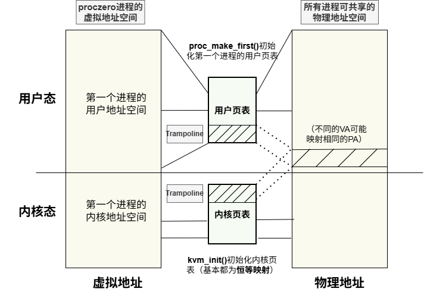
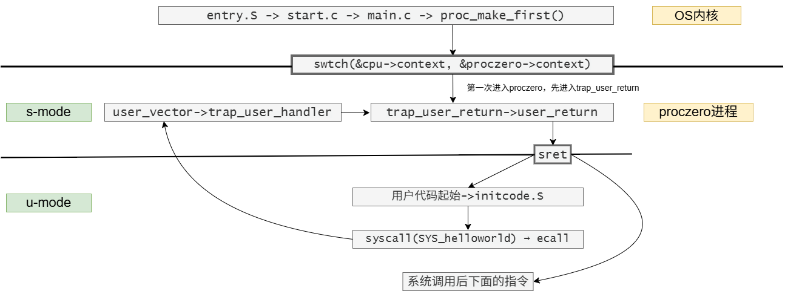
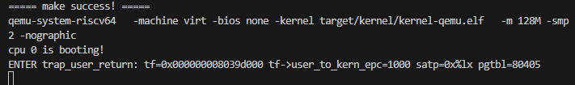
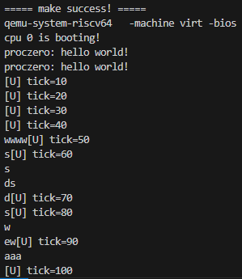

# LAB-4: 第一个用户进程的诞生

在lab-4中，我们实现了第一个用户进程的诞生，重点完成了**用户进程管理**和**用户态陷阱处理**，并成功测试了**内核对用户程序syscall的响应**。

我们的分工如下：

**丁熙妍**：完成了`porc.c`中**用户进程管理**和**系统调用的测试修复**，以及对应的实验文档。

**吴晨曦**：完成了`kvm.c`中**内核页表补充映射**和`trap_user.c`中**用户态陷阱处理**，以及对应的实验文档

---

## 代码组织结构

```
ECNU-OSLAB-2025-TASK
├── LICENSE        开源协议
├── .vscode        配置了可视化调试环境
├── registers.xml  配置了可视化调试环境
├── .gdbinit.tmp-riscv xv6自带的调试配置
├── common.mk      Makefile中一些工具链的定义
├── Makefile       编译运行整个项目
├── kernel.ld      定义了内核程序在链接时的布局 (CHANGE, 支持trampsec)
├── pictures       README使用的图片目录 (CHANGE, 日常更新)
├── README.md      实验指导书 (CHANGE, 日常更新)
└── src            源码
    ├── kernel     内核源码
    │   ├── arch   RISC-V相关
    │   │   ├── method.h
    │   │   ├── mod.h
    │   │   └── type.h
    │   ├── boot   机器启动
    │   │   ├── entry.S
    │   │   └── start.c
    │   ├── lock   锁机制
    │   │   ├── spinlock.c
    │   │   ├── method.h
    │   │   ├── mod.h
    │   │   └── type.h
    │   ├── lib    常用库
    │   │   ├── cpu.c (CHANGE, 新增myproc函数)
    │   │   ├── print.c
    │   │   ├── uart.c
    │   │   ├── utils.c
    │   │   ├── method.h (CHANGE, 新增myproc函数)
    │   │   ├── mod.h
    │   │   └── type.h (CHANGE, 扩充CPU结构体 + 帮助)
    │   ├── mem    内存模块
    │   │   ├── pmem.c
    │   │   ├── kvm.c (本实验完成, 增加内核页表的映射内容 trampoline + KSTACK(0))
    │   │   ├── method.h
    │   │   ├── mod.h
    │   │   └── type.h
    │   ├── trap   陷阱模块
    │   │   ├── plic.c
    │   │   ├── timer.c
    │   │   ├── trap_kernel.c (CHANGE, 去掉了提示信息的static标记)
    │   │   ├── trap_user.c (本实验完成, 用户态陷阱处理)
    │   │   ├── trap.S
    │   │   ├── trampoline.S
    │   │   ├── method.h (CHANGE, 增加函数定义)
    │   │   ├── mod.h
    │   │   └── type.h
    │   ├── proc   进程模块
    │   │   ├── proc.c (本实验完成, 进程管理核心逻辑)
    │   │   ├── swtch.S (NEW, 上下文切换)
    │   │   ├── method.h (NEW)
    │   │   ├── mod.h (NEW)
    │   │   └── type.h (NEW)
    │   └── main.c (CHANGE, 日常更新)
    └── user       用户程序
        ├── initcode.c (NEW)
        ├── sys.h (NEW)
        ├── syscall_arch.h (NEW)
        └── syscall_num.h (NEW)
```

相比于上一个实验，本次实验主要增加了以下功能：

- 补充了**内核页表的映射**（tampoline区域和KSTACK(0)内核栈）
- 完成了第一个用户进程**proczero的初始化**（包括用户页表映射和上下文切换等）
- 完成了**用户态陷阱的处理流程**（包括内核态到用户态的准备工作，用户态系统调用的处理等）

---

## 具体实现概述

### 0. 第一个用户进程诞生的流程理解

为了完成“第一个用户进程的诞生”，我们首先理解梳理了第一个用户进程诞生的**地址空间机制**以及对应的**执行流**。

- **地址空间**：

  如图所示，整个过程涉及**用户态与内核态两种特权级下的虚拟地址空间**，并通过**页表机制**映射到统一的物理内存。其中`Trampoline`区域在用户页表和内核页表**共享映射**，用于从用户态安全地进入内核态。 `satp` 寄存器的状态决定了是否开启/开启了哪种状态的页表，明确**何时使用哪个地址空间**对完成本实验很重要！（原先就因为用错物理/虚拟地址debug了好几天！！:(



- **执行流**：

  	程序启动后，首先进入**OS内核执行流**：`entry.S->start.c->main.c->proc_make_first`，经过`proc_make_first`函数的最后一步: `swtch(old_context, new_context)`切换到了**proczero进程**：`trap_user_return->trampoline中的user_return`，然后通过`user_return`的最后一步`sret`回到用户态进入`initcode.c`，在initcode中通过`syscall(SYS_helloworld);`进行了系统调用，进入**用户态陷阱处理程序**：`user_vector->trap_user_handler->trap_user_return->user_return`，处理完系统调用又继续回到用户态程序执行下面的指令。梳理为如下图所示：（理解执行流对实验中debug也非常重要，之前我们一直无法进入`trap_user_handler`函数，理解执行流才方便**定位到底哪一环出错**！理解了好久终于明白了！）

  

  	其中，关于**如何转到`initcode`用户代码**的：`initcode.c`被编译成字节数组嵌入内核，在 `proczero` 初始化时，它被映射到用户空间的用户代码起始位置，并通过设置 `sepc` 在`sret`进入用户态后实现精确跳转。 
  	
  	ok！理解了**地址空间机制**和**进程诞生流程**，接下来就可以实现具体的代码了！

### 1. [kvm.c](src/kernel/mem/kvm.c)补充映射

在`kvm.c`中补充映射了trampoline和KSTACK(0)区域，建立了**trampoline区域**和**第一个进程的内核栈**在**内核页表**上的映射：

```c
m_mappages(kernel_pgtbl,TRAMPOLINE,(uint64)trampoline,PGSIZE, PTE_R | PTE_W | PTE_X); // 映射 trampoline 区域
vm_mappages(kernel_pgtbl,KSTACK(0),(uint64)kstack_pa,PGSIZE, PTE_R | PTE_W); // 映射 KSTACK(0)
```

### 2. [proc.c](src/kernel/proc/proc.c)

在 `proc.c` 中，我们主要完成了**第一个用户进程 `proczero` 的创建和管理**。这涉及到两个核心函数：  `proc_pgtbl_init` 负责为新进程构建基础的地址空间，而 `proc_make_first` 负责一步步组装出 `proczero` 并启动它。

#### 进程控制块 `proc_t` 与地址空间

在创建第一个进程之前，我们需要先了解 `proc_t` 结构体，它封装了运行一个程序所需的所有核心信息，包括：

```
proc_t (进程控制块)
│
├── pid (进程ID)                                   
│
├── pgtbl (用户页表根指针)  ---------------------> [用户页表物理页]
│                                                  │
│                                                  ├─ VA(TRAMPOLINE) -> PA(trampoline_page)
│                                                  ├─ VA(TRAPFRAME)  -> PA(本进程的tf_page)
│                                                  ├─ VA(UCODE)      -> PA(本进程的ucode_page)
│                                                  └─ VA(USTACK)     -> PA(本进程的ustack_page)
│
├── tf (trapframe指针) --------------------------> [trapframe物理页] (保存U->S切换时的完整寄存器)
│   │                                              │
│   ├─ user_to_kern_epc (用户PC)                    └─ (a0-a7, s0-s11, ra, sp, ...)
│   ├─ sp (用户栈指针)
│   └─ user_to_kern_... (给trampoline用的内核信息)
│
├── kstack (内核栈基地址) -----------------------> [内核栈物理页] (S模式下函数调用使用)
│
└── ctx (context，保存S->S切换时的少量寄存器)                                 
    │
    ├─ ra (返回地址)
    └─ sp (内核栈指针)
```

- **`pgtbl` （用户页表）**：定义了进程的**私有虚拟地址空间**，用于实现地址隔离和访问控制。
- **`tf` （trapframe）**：在**用户态 ⇔ 内核态切换**时，完整地保存和恢复所有通用寄存器，用于在**特权级切换**时传递上下文。
- **`ctx` （context）**：在**内核态进程之间**进行切换（`swtch` 已在 `swtch.S`中由汇编实现）时，保存少量必须的寄存器（返回地址ra和栈指针sp），用于在**内核态内部切换执行流**。

#### proc_pgtbl_init

`proc_pgtbl_init`函数是一个辅助函数，负责**创建一个全新、空白的用户页表**，并完成两个最基础且最重要的映射 -- **trapframe** 和 **trampoline** 区域：

```c
vm_mappages(upgtbl, (uint64)TRAMPOLINE, (uint64)trampoline, PGSIZE, PTE_R | PTE_X);  // 可读、不可写、可执行
vm_mappages(upgtbl, (uint64)TRAPFRAME, (uint64)trapframe, PGSIZE, PTE_R | PTE_W);  //需要读写
```

#### proc_make_first

`proc_make_first`函数是本次实验的核心，它负责**从无到有创建出第一个用户进程 `proczero`**，其中我们主要完成了以下步骤：

- 申请trapframe的物理页（位于**内核空间**，用于保存**用户态和内核态切换**时的寄存器状态）

```c
trapframe_t *tf = (trapframe_t *)pmem_alloc(true);
```

- 创建用户页表，并映射`trampoline`和`trapframe`区域（`proc_pgtbl_init`中已实现）

```c
pgtbl_t upgtbl = proc_pgtbl_init((uint64)tf);
```

- 映射用户代码 ucode（本实验中为 **`initcode`嵌入内核的字节数组**，需要申请一个物理页、将`initcode`数组内容拷贝进去、完成映射）

```c
// 拷贝initcode到用户代码页
memmove(ucode_pa, initcode, (uint32)initcode_len);
// 映射
vm_mappages(upgtbl, UCODE_VA, (uint64)ucode_pa, PGSIZE, PTE_R | PTE_W | PTE_X | PTE_U); 
```

- 映射用户栈 ustack （需要申请一个物理页、完成映射）

```c
// 映射
vm_mappages(upgtbl,USTACK_VA,(uint64)ustack_pa,PGSIZE,PTE_R | PTE_W | PTE_U);
```

- 初始化进程控制块 `proc_t` 的各项字段（设置pid、页表指针、堆顶指针、用户栈页数、trapframe指针）

```c
proczero.pid = 1;
proczero.pgtbl = upgtbl;
proczero.heap_top = 2 * PGSIZE; 
proczero.ustack_npage = 1;       
proczero.tf = tf;
```

- 设置用户态初始状态（**在trapframe中设置好proczero第一次进入用户态时的状态**：PC 指向用户代码起始位置 `UCODE_VA`，栈指针指向用户栈顶 `USTACK_TOP`）

```c
tf->user_to_kern_epc = UCODE_VA;  
tf->sp = USTACK_TOP;
```

- 设置内核态初始状态（**在context中设置好proczero内核执行流的起点**：`swtch`切换后，返回地址指向 `trap_user_return`，栈指针指向该进程的内核栈顶）

```c
proczero.kstack = (uint64)KSTACK(mycpuid());
proczero.ctx.ra = (uint64)trap_user_return; 
proczero.ctx.sp = proczero.kstack + PGSIZE; 
```

- 启动第一个用户进程（将proczero设置为当前CPU的运行进程，并通过`swtch`**将执行流切换到 proczero 的上下文**，开始执行其内核入口；随后由 `trap_user_return → trampoline.user_return → sret` **真正进入用户态**，开始执行用户代码！）

```c
cpu_t *c = mycpu();
c->proc =  &proczero;
swtch(&c->ctx, &proczero.ctx);
```

### 3. [trap_user.c](src/kernel/trap/trap_user.c)

用户态陷阱处理结构（A-B-C-D）：

```text
user_vector-->trap_user_handler-->trap_user_return-->user_return
```

其中`user_vector`和`user_return`的代码在`trampoline.S`汇编中，`trap_user_return`和`trap_user_handler`这两个用户态陷阱处理的核心函数在本次实验中完成。

#### trap_user_return

trap_user_return的作用是为进程**从内核态进入用户态前做准备工作**，我们主要完成了以下事情：

- **保存内核态必要信息**到trapframe，并将trapframe地址写入sscratch
- 将`user_vector`设为S-mode的**trap处理入口**
- 通过写入sepc设置**返回用户态后PC指针**
- 通过写入sstatus设置**sret后返回到U-mode**（主要针对proczero第一次进入用户态时，需要手动将S-mode的上一个状态设置为U-mode）
- 最后，**调用`trampoline.S`中的`user_return`**

前两点相当于为进入用户态以后再发生trap做准备，第三第四点相当于为正确地返回用户态的正确位置做准备，最后一点就是调用user_return，再在该汇编中切换回用户页表、恢复用户态寄存器，真正进入到用户态。

> 要注意的是trap_user_return中的地址设置都要使用**正确的虚拟地址**！在`trap_user_return()`函数运行时使用的是**内核页表**，在`trampoline.S`中的`user_return`时，通过`csrw satp, a1`指令切换到了**用户页表**。一定要使用的**对应页表下的虚拟地址**，否则会有bug（相关bug的调试与修复见“测试与修复”的测试一）

#### trap_user_handler

`trap_user_handler`的实现和上个实验实现的`trap_kernel_handler`类似，主要有以下两点新实现的不同：

- 进入`trap_user_handler`后会重写trap入口, 将它设为`trap_kernel_handler`，方便处理“**已经在内核里的中断**”

  ```c
  w_stvec((uint64)kernel_vector);
  ```


- 多处理了**系统调用**（`trap_id`=8），虽然系统调用属于异常，但是返回时要通过修改epc来设置 **PC=PC+4**，表示继续执行系统调用执行后面的指令，而不是重复再执行系统调用的指令

  ```c
  case 8: // Environment call from U-mode (ecall)
  {
      uint64 num = tf->a7; // 系统调用号
      switch (num) {
          case SYS_helloworld: // 第一个用户进程的系统调用：打印信息
              printf("proczero: hello world!\n");
              break;
      }
      tf->user_to_kern_epc += 4; // PC = PC + 4
      break;
  }
  ```

---

## 测试与修复

### 测试一: 系统调用

#### 问题一：未短暂关闭 S 态中断导致的“窗口期”问题**

**问题分析**

一开始，我们发现无法输出两次“hello world”，通过在 `trap_user_return` 中调试打印寄存器，发现：

- sepc为`0x80000866`：这是一个**内核地址**，说明陷阱发生时，CPU 正在执行内核代码，而不是用户代码 `initcode`。
- scause为`0x8000000000000009`：最高位为1，表示这是一个**中断**，并且低位为9，说明这是**S-mode external interrupt（S 态外部中断）**。

根据以上信息，我们发现这是一个经典的“**窗口期**”问题：在 `trap_user_return` 函数中，从设置 sepc 准备返回用户态，到最终 sret 指令执行之间，存在一个时间窗口。由于**此时 S 态中断是开启的**，一个**突如其来的 S 态中断**（如外部中断、时钟中断）会：

- 打断 `trap_user_return` 的执行
- 硬件自动将当前的 PC 值（为内核地址）写入 sepc
- 进入**内核态的中断处理流程**，处理 S 态中断

当 S 态中断处理完成，再次调用 `trap_user_return` 时，它会读取这个**被污染的、指向内核地址的 sepc**，并用它作为下一次 sret 的返回地址。结果 CPU **在用户态尝试执行一个内核地址**，导致返回失败，无法再次进入 `trap_user_handler`，也就无法处理 `initcode` 里的系统调用了，因此看不到两次“hello world”的输出。

**修复方案**

为了解决这个问题，我们需要在 `trap_user_return` 中，**在设置 sepc 之前，短暂关闭 S 态中断**，以防止在这个关键时间窗口内发生 S 态中断污染 sepc。

具体实现是：在 `trap_user_return` 的开头调用 **`intr_off()` 关闭中断**，避免在设置 stvec/sepc/sstatus 的关键窗口被打断。

同时我们在 sstatus 中**把 SPIE 置为 1**，这样在 sret 返回用户态后，中断会通过sstatus 的 SPIE 位**自动恢复中断**，因此我们也不需要再显式调用 intr_on() 恢复中断！

```c
void trap_user_return()
{
    intr_off(); // 关键修复：先关闭中断，锁住"窗口"
    // ...
    // 设置sstatus：清 SPP，设置 SPIE=1
    uint64 s = r_sstatus();
    s &= ~SSTATUS_SPP;   // 清 SPP (返回到 U-mode)
    s |= SSTATUS_SPIE;   // 使能 sret 返回后中断恢复
    w_sstatus(s);
    // ...
}
```

通过这个修复，我们成功创建了一个**短暂的临界区**，防止了 S 态中断在关键时刻打断 `trap_user_return`，从而避免了 sepc 被污染的问题。

#### 问题二：地址空间问题导致无法进入 trap_user_handler

**问题分析**

- 修复了问题一之后，我们依然无法输出两次“hello world”，通过调试打印，发现此时可以进入`trap_user_return`，但无法进入`trap_user_handler`：

  

  我们怀疑是`proczero`**为下一次陷阱所做的准备工作出了问题**，特别是与**地址空间**相关的设置。

  我们仔细梳理了从用户态发起系统调用到进入`trap_user_handler`的流程，发现我们在以下两步出现问题：

  - 硬件需要根据 `stvec` 的值，跳转到 `user_vector` 执行，而此时 `satp` 仍然指向**用户页表**。所以，`stvec`也 必须指向**用户页表下的有效地址**，否则 CPU 无法正确跳转到 `user_vector`。
  - `user_vector` 需要通过读取 `sscratch` 中的 `trapframe` 的地址来保存所有用户寄存器。所以`sscratch` 必须保存**用户页表下的 `trapframe` 地址**，否则 `user_vector` 无法正确保存寄存器。

  此外，还需注意：**`user_return` 也必须使用用户页表下的有效地址**，因为它会在切换回用户态时被调用。而我们在 `trap_user_return` 函数中（此时运行在**内核页表**环境下）错误地**使用了只在内核空间有效的地址来为下一次陷阱做准备**。

**修复方案**

正确的做法是：必须使用在**用户和内核两个地址空间中都有效**的虚拟地址。而`TRAMPOLINE` 和 `TRAPFRAME` 这两个区域正是为此设计的，它们被同时映射到了用户和内核页表中。

因此，我们需要修改  `trap_user_return`，必须使用这些**共享的虚拟地址**来完成设置：

```c
// 将 trapframe 地址写入 sscratch，必须使用用户页表下也有效的 TRAPFRAME 虚拟地址！
w_sscratch((uint64)TRAPFRAME);
// w_sscratch((uint64)tf); // 错误：tf 是内核虚拟地址

// 将 S-mode 的 trap 入口再设置回 user_vector，必须使用 TRAMPOLINE 虚拟地址！
uint64 user_vector_addr = (uint64)TRAMPOLINE + (uint64)(user_vector - trampoline);
w_stvec(user_vector_addr);
// w_stvec((uint64)user_vector); // 错误：user_vector 是链接地址

// 跳转到 trampoline.S 的 user_return 处，同样使用 TRAMPOLINE 虚拟地址！
uint64 user_return_addr = (uint64)TRAMPOLINE + (uint64)(user_return - trampoline);
((void (*)(trapframe_t*, uint64))user_return_addr)((trapframe_t*)TRAPFRAME, user_satp);
// ((void (*)(trapframe_t*, uint64))user_return)(tf, user_satp); // 错误：user_return 是链接地址，tf是内核虚拟地址
```

修复后成功输出两次"hello world"！

### 测试二: 用户态的时钟中断和串口中断

为了测试时钟中断，在 `timer_interrupt_handler` 中添加了打印tick：

```c
// 打印tick信息
uint64 ticks = timer_get_ticks();
if (ticks % 10 == 0) {
    printf("[U] tick=%d\n", (int)ticks);
}
```



成功通过系统调用和用户态的中断测试！

---

## 思考与总结

- 关于**地址可见性与页表切换**

  - 在本次实验中，我对虚拟内存系统的核心机制——**地址可见性（Address Visibility）与页表切换（Page Table Switching）** 有了深刻的认识。特别是在实现用户态与内核态之间的上下文切换过程中，我意识到：

    > **物理地址、内核页表映射的虚拟地址、用户页表映射的虚拟地址三者并不等价，它们的可访问性完全依赖于当前激活的页表（即 `satp` 寄存器的状态）**。 

  - 另外，也要注意在调用 `pmem_alloc()` 分配内存时，返回的是一个可在**当前地址空间中**安全访问的地址，并不是永远等于物理地址！

- 关于**临界区保护与并发问题**

  - “窗口期”问题的修复过程让我深刻体会到：即使在单核环境下，**中断也会引入并发**。`trap_user_return` 函数中，从准备返回用户态的寄存器（如`sepc`）到最终执行 `sret` 指令之间，构成了一个**临界区**。

  - 如果不使用 `intr_off()` 关闭中断来保护这个临界区，任何外部中断（如时钟中断）都可能“恰好”在此时发生，污染关键寄存器，导致系统状态不一致。因此，我认识到：

    > **中断屏蔽是保护临界区最基础且有效的手段之一**。

- 关于 **`TRAMPOLINE` 和 `TRAPFRAME` 设计**

  - “地址空间问题”的解决让我明白了`TRAMPOLINE` 和 `TRAPFRAME` 这两个特殊区域的精妙设计：

    > 在多特权级、多地址空间的操作系统中，**共享映射区域的设计是实现安全、高效上下文切换的关键**。

  - 通过将这两个区域**同时映射到内核页表和所有用户页表中的同一个虚拟地址**，我们能够确保无论CPU当前处于哪个地址空间，都能通过这个**固定的虚拟地址**找到陷阱处理的入口（`user_vector`）和出口（`user_return`），从而安全、可靠地完成特权级切换。如果没有这个共享区域，地址空间的隔离将使得这种切换变得异常困难。