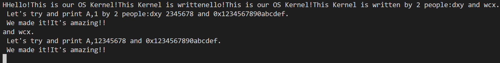
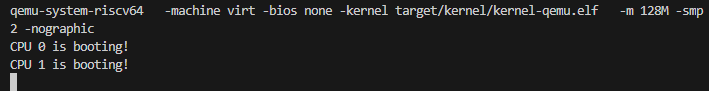
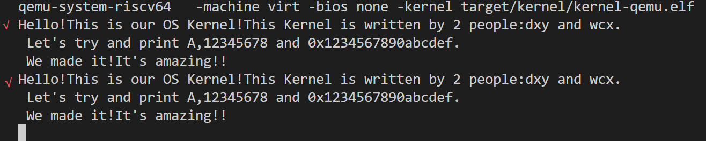
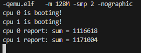
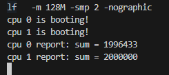
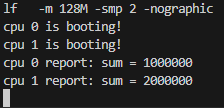

# LAB-1: 机器启动

lab1的核心目标是**机器启动**，具体来讲，我们主要完成了：

1. 通过BIOS→_entry→start→main**进入main函数**
2. 借助MMIO读写串口设备（UART） 寄存器以完成**字符打印**，并借助stdarg.h的va_list类型实现**printf格式化输出**
3. 通过编写自旋锁函数并在printf中使用以实现双核的**有序输出**

我们的分工如下：

- **吴晨曦**：完成了`start.c`和`print.c `，以及对应的实验文档。
- **丁熙妍**：完成了`spinlock.c`和`main.c `，以及对应的实验文档。


## 1. 代码组织结构

```
ECNU-OSLAB-2025-TASK  
├── LICENSE        开源协议  
├── .vscode        配置了可视化调试环境
├── registers.xml  配置了可视化调试环境  
├── Makefile       编译运行整个项目  
├── common.mk      Makefile中一些工具链的定义  
├── kernel.ld      定义了内核程序在链接时的布局  
├── pictures       README使用的图片目录  
├── README.md      实验指导书  
└── src            源码
    └── kernel     内核源码
        ├── arch   RISC-V相关
        │   ├── method.h  
        │   ├── mod.h  
        │   └── type.h  
        ├── boot   机器启动
        │   ├── entry.S  
        │   └── start.c (本实验完成)  
        ├── lock   锁机制
        │   ├── spinlock.c (本实验完成)  
        │   ├── method.h  
        │   ├── mod.h  
        │   └── type.h  
        ├── lib    常用库
        │   ├── cpu.c  
        │   ├── print.c (本实验完成)  
        │   ├── uart.c  
        │   ├── method.h  
        │   ├── mod.h  
        │   └── type.h  
        └── main.c (本实验完成)  
```

## 2. 进入main函数（start.c）

首先完成start.c函数，为了补全start.c函数，我首先了解了程序是如何进入main函数的。

程序启动后**entry.S**中调用了start函数（`call start`），在这个`start()`函数中，程序需要**进入main函数**并且**从M-mode进入S-mode**，然而从更高特权级的M-mode降级到S-mode不能直接切换，而是需要**利用异常返回机制手动构造一个异常返回环境**，即start.c中需要采取以下步骤：

- 首先通过`w_mstatus(status)`修改`m_status`寄存器，假装在发生“（假）异常”前的环境状态为**S-mode**
- 然后通过`mepc`设定**返回原先环境后的下一条指令**（**设定为main函数**），实现进入main函数
- 最后使用`mret`回到之前的环境状态（即**我们假装的S-mode**），实现从M-mode进入S-mode

基于以上逻辑，我在**start.c**中补充了如下代码：

```c
// 设置M-mode的返回地址为main函数
w_mepc((uint64)main);

// 理由mret回到上一个状态（M-mode->S-mode）
asm volatile ("mret");
```

## 3. 串口与格式化输出

为了证明我真正进入了main函数，需要让main函数打印点东西，也就是使用**printf函数**。基本的单个字符的输入输出是通过串口设备来实现的，之后在串口输出接口的基础上，可以完成printf的格式化输出。

### 3.1 串口输出

通过**MMIO（Memory-Mapped I/O）技术**能够把设备的寄存器“映射”到一段特定的内存地址空间上，从而**读写串口设备的寄存器**，也就是控制串口设备。

我发现在**uart.c**中通过以上**读写寄存器**的理论主要实现了以下串口输入/输出接口：

```c
//uart.c中实现的串口输出接口
void uart_init(void); //uart 初始化
void uart_putc_sync(int c);// 单个字符输出
int uart_getc_sync(void);// 单个字符输入
void uart_intr(void);// 中断处理(键盘输入->屏幕输出)
```

接下来我所做的就是在这些**串口输出接口**的基础上，加上**对可变参数的解析**，来实现下面的`printf`格式化输出。

### 3.2 格式化输出（printf.c）

在UART接口的基础上，我将使用**stdarg.h**和**va_list**类型来逐个获得printf函数的**可变参数**。

通过查询资料，得知stdarg.h是编译器自带的库，而其中的`va_list`类型相当于一个函数参数的指针，可以用来遍历函数的参数。具体主要有以下函数：

```c
#include <stdarg.h>
va_list ap;        // 参数指针
va_start(ap, fmt); // 指向第一个可变参数
va_arg(ap, type);  // 获取下一个类型为 type 的参数
va_end(ap);        // 清理（可选）
```

在此基础上，我开始编写**printf**函数时。核心思路是首先声明一个`va_list ap`作为**参数指针**，用于**遍历可变参数**；再声明一个`const char *p`作为**字符指针**，用于**遍历格式字符串**，识别到`%`就从可变参数中取出对应值并打印。利用在源码中已经给出了`printint()`、`printptr()`等输出整数或指针的**辅助函数**，可以方便地通过判断格式化字符进行相应的输出。核心代码示例如下：

```c
for(p = fmt;*p;p++){
    //若不是格式化字符, 直接输出
    if(*p!='%'){
        uart_putc_sync(*p);
        continue;
    }
    //若识别到格式化字符
    p++;
    switch(*p){
        case 'd':
            printint(va_arg(ap,int),10,1);//利用printint辅助函数输出十进制整数
            break;
        case 'p':
            printint(va_arg(ap,uint32),16,0);//输出32为16进制无符号整数（指针）
            break;
        ... //省略其他case
        default:
           ...
    }
}
```

然后我在main中写了以下程序来验证`printf`函数的格式化输出情况：

```c
printf("Hello!This is our OS Kernel!This Kernel is written by %d people:%s and %s.\n \
Let's try and print %c,%p and %x.\n \
We made it!It's amazing!!\n", \
2, "dxy", "wcx", 'A', 0x12345678U, 0x1234567890abcdefULL);
```

运行结果如下图所示：



可以看出，程序成功**打印出了格式化内容**！不过出现了**混乱交错的现象**，因此还需要添加一种同步机制来协调共享资源的有序使用，也就是下面的自旋锁机制。

## 4.自旋锁

我们选择了一种**轻量级、无阻塞、低延迟**的同步机制 — **自旋锁**来解决输出混乱的问题。


### 4.1 自旋锁接口的实现（spinlock.c）

在 `spinlock.c ` 中完成了：

- `spinlock_init`：初始化锁的状态为未上锁

- `spinlock_holding`：辅助函数，判断当前 CPU 是否正持有指定的锁。

- `spinlock_acquire`：获取指定锁，如果锁已被占用，则**原地等待**。

- `spinlock_release`：释放指定的已持有的锁。

在实现以上四个锁的核心函数时，我主要考虑到了以下内容：

1. **锁的状态管理**  

   查看 `spinlock_t` 结构体，可以发现锁的状态不是只需要考虑是否上锁即可，而是还需要考虑**锁的持有者**来保证锁的状态完整性。  
   因此在 `spinlock_holding` 中，不仅需要检查锁是否被持有，还需要验证**持有者是否是当前cpu**，防止出现一个cpu错误释放了其他cpu持有的锁的问题。  

2. **原子性**  

   为了防止多个cpu同时操作锁，锁的获取与释放必须保证**原子性**，因此必须使用**原子性操作**：

   - 使用`__sync_lock_test_and_set(&lk->locked, 1)`获取锁，它将`lk->locked` 的值设置为 `1`，并返回设置前的旧值。
     - 如果旧值是 `0`，表示锁正空闲，则成功获取锁，循环结束。
     - 如果旧值是 `1`，表示锁已被占用，则继续**在 `while` 循环中“自旋”等待，直到该锁空闲。**

   - 使用`__sync_lock_release(&lk->locked)`释放锁：将 `lk->locked` 的值设置为 `0`，让其他等待的cpu可以获取该锁。

3. **中断管理**  

   首先，已经实现好的 `push_off` 和 `pop_off` 有什么作用呢？为什么我们需要这两个函数？  
   因为我们需要防止**死锁**。如果没有中断管理，那么就可能发生：cpu 0获取了锁，正在执行临界区代码；此时发生时钟中断，cpu 0开始执行中断处理程序；如果中断处理程序也尝试获取同一把锁，那么就会在中断上下文中等待自己释放锁，形成**自己等自己**的死锁问题。  
   而 `push_off` 和 `pop_off` 通过**嵌套式中断管理**为我们很好的解决了这个问题： 

   - 使用`push_off`关闭中断。
   - 使用`pop_off`开启中断。
   - 嵌套计数确保多次关中断操作的正确恢复。  

   因此为了避免死锁的发生，我们需要在**获取锁前关闭中断**，防止中断处理程序介入；在**释放锁后恢复原始中断状态**。

4. **内存屏障**

   由于编译器优化和CPU乱序执行可能会**重新排列指令**，因此如果没有**内存屏障**，临界区内的操作可能被重排到锁保护范围之外，导致锁的作用失效。  
   因此我使用了 `__sync_synchronize` 作为内存屏障，来保证**临界区代码不会逃离锁的保护**。

5. **使用 `assert` 做运行时检查**

   使用 `assert` 输出错误信息，**及时检查**出编程错误，避免错误自动发生导致更严重的系统故障。  

   - 在 `spinlock_acquire` 中断言**当前CPU未持有该**，防止递归获取导致死锁。
   - 在 `spinlock_release` 中断言**只有锁的持有者才能释放它**，防止应该cpu误释放其他cpu持有的锁。


### 4.2 在printf函数中使用自旋锁

在printf函数中使用自旋锁以实现有序输出，即需要在开始解析并输出格式字符串前先“**上锁**”，然后在解析输出完后再“**解锁**”，这样就可以保证每个printf执行“占坑”的时候不会有其他核的printf来同时“抢坑”了。

```c
spinlock_acquire(&print_lk);// 上锁

for(p = fmt;*p;p++){//解析并输出格式字符串
    switch(*p){
        ...
    }
}

spinlock_release(&print_lk);//解锁
```

## 5. 测试结果

### 5.1 双核的机器启动

使用完自旋锁后，可完成双核启动的**main.c**：

```c
volatile static int started = 0;

int main()
{
    int cpuid = r_tp();
    if (cpuid == 0) {
        print_init();
        printf("CPU %d is booting!\n", cpuid);
        __sync_synchronize();
        started = 1;
    } else {
        while (started == 0);
        __sync_synchronize();
        printf("CPU %d is booting!\n", cpuid);
    }
    while (1);
}
```

结果如下：



成功完成了两个核的机器启动！


### 5.2 有序输出

使用完自旋锁后，针对3.2中同样的测试用例，打印结果如下：





成功完成了两个核的有序输出！

### 5.3 并行加法

在 **main.c** 中测试双核并行加法，我们的预期是后report的cpu应该告诉我们 `sum = 2000000`

但是实际结果是这样的：  



这是因为并发编程中的**竞态条件**：

当两个cpu并发执行时，可能会发生：

1. cpu 0 读取`sum` (此时值为`x`)。
2. cpu 1 也读取`sum`(值仍为`x`)。
3. cpu 0 计算得`x + 1`，并将`x + 1`写回 sum。
4. cpu 1 计算得`x + 1`，并将`x + 1`写回 sum。

此时两个cpu的执行了加法，但结果是`sum`**只+1，而不是我们希望的+2**。

为了解决这个问题，我们需要**利用锁**来保证`sum++`“读-改-写”这三个步骤的**原子性**：
在`sum++`**前**先**获取**一个锁，在`sum++`**后**再**释放**掉这个锁。

修改 **main.c**：

```c
for(int i = 0; i < 1000000; i++)
{
    spinlock_acquire(&sum_lock); // 在sum++前获取锁
    sum++;
    spinlock_release(&sum_lock); // 在sum++后释放锁
}
```

修改后的输出如下：

 

成功完成了两个核的并行加法！


但这不是唯一解法，刚才是**在for循环内**加锁和解锁，而我们还可以**在for循环外**加锁和解锁：

```c
 spinlock_acquire(&sum_lock); // 在循环外获取锁
 for(int i = 0; i < 1000000; i++)
            sum++;
  spinlock_release(&sum_lock); // 在循环外释放锁
```

输出如下：



也成功完成了两个核的并行加法！

如果两种方法都成功通过了测试，但我们思考发现：  
**上锁和解锁的位置不同**会极大地影响程序的行为和性能，这被称为**锁的粒度**。  

1. **细粒度锁**：在 for 循环内部加锁和解锁
   两个cpu是**同时、交替**地对`sum`进行累加。每个cpu在每次循环中的会尝试获取锁，获取到的会执行`sum++`，执行完后会立即释放锁。
   - 并行度：
     锁的持有时间极短，只保护了`sum++`这个最小的临界区。循环变量`i`的增减和判断等操作仍然是并行执行的，因此**并行度高**。
   - 性能开销：
     每个cpu都要执行100万次加锁和解锁，**总的锁操作开销巨大**。


2. **粗粒度锁**：在 for 循环外部加锁和解锁
   一个cpu（如cpu 0）先获取了锁，然后**独自完成了全部100万次累加**，此时sum变为1000000，再释放锁。在这个过程中，另一个cpu（cpu 1）**只能不停地“自旋”等待**。当cpu 0释放后，cpu 1才能获取锁，继续从1000000开始累加，最终得到2000000。
   - 并行度：
     实际上是cpu 0先做，做完之后cpu 1再做，因此本质上是**串行**，而不是并行。
   - 性能开销：
     每个cpu只需要执行一次加锁和解锁，**锁操作的开销极小**。

因此，选择锁的粒度其实是在 “**锁操作开销**” 和 “**并行度**” 之间追求一种平衡：
锁的粒度越细，临界区越小，并行度就越高；但加锁/解锁就更频繁，导致锁操作开销更大。


### 5.4 补充测试: 锁的嵌套调用

**在并行加法的循环中加入 `printf` 调用**，使得每个cpu在持有 `sum_lock` 的同时，还会去竞争 `print_lk`，检验**多重锁**环境下我们写的代码是否能正常工作。

补充测试代码如下：

```c
volatile static int started = 0;
volatile static int sum = 0;
spinlock_t sum_lock;

int main()
{
    int cpuid = r_tp();
    if(cpuid == 0) {
        print_init();
        spinlock_init(&sum_lock, "sum_lock");
        printf("CPU %d is booting!\n", cpuid);
        __sync_synchronize();
        started = 1;

        for(int i = 0; i < 20; i++)
        {
            spinlock_acquire(&sum_lock);
            sum++;
            // 在持有 sum_lock 的同时，调用 printf （会尝试获取 print_lk）
            printf("CPU %d: sum is now %d, loop index is %d\n", cpuid, sum, i);
            spinlock_release(&sum_lock);
        }
        printf("CPU %d finished. Final sum: %d\n", cpuid, sum);

    } else {
        while(started == 0);
        __sync_synchronize();
        printf("CPU %d is booting!\n", cpuid);

        for(int i = 0; i < 20; i++)
        {
            spinlock_acquire(&sum_lock);
            sum++;
            // 在持有 sum_lock 的同时，调用 printf
            printf("CPU %d: sum is now %d, loop index is %d\n", cpuid, sum, i);
            spinlock_release(&sum_lock);
        }
        printf("CPU %d finished. Final sum: %d\n", cpuid, sum);
    }   
    while (1);    
}
```

输出如下：

```
CPU 0 is booting!
CPU 0: sum is now 1, loop index is 0
CPU 1 is booting!
CPU 0: sum is now 2, loop index is 1
CPU 0: sum is now 3, loop index is 2
CPU 0: sum is now 4, loop index is 3
CPU 1: sum is now 5, loop index is 0
CPU 0: sum is now 6, loop index is 4
CPU 1: sum is now 7, loop index is 1
CPU 0: sum is now 8, loop index is 5
CPU 1: sum is now 9, loop index is 2
CPU 0: sum is now 10, loop index is 6
CPU 1: sum is now 11, loop index is 3
CPU 0: sum is now 12, loop index is 7
CPU 1: sum is now 13, loop index is 4
CPU 0: sum is now 14, loop index is 8
CPU 1: sum is now 15, loop index is 5
CPU 0: sum is now 16, loop index is 9
CPU 1: sum is now 17, loop index is 6
CPU 0: sum is now 18, loop index is 10
CPU 0: sum is now 19, loop index is 11
CPU 1: sum is now 20, loop index is 7
CPU 0: sum is now 21, loop index is 12
CPU 0: sum is now 22, loop index is 13
CPU 1: sum is now 23, loop index is 8
CPU 0: sum is now 24, loop index is 14
CPU 1: sum is now 25, loop index is 9
CPU 0: sum is now 26, loop index is 15
CPU 1: sum is now 27, loop index is 10
CPU 0: sum is now 28, loop index is 16
CPU 1: sum is now 29, loop index is 11
CPU 0: sum is now 30, loop index is 17
CPU 1: sum is now 31, loop index is 12
CPU 0: sum is now 32, loop index is 18
CPU 1: sum is now 33, loop index is 13
CPU 0: sum is now 34, loop index is 19
CPU 1: sum is now 35, loop index is 14
CPU 0 finished. Final sum: 35
CPU 1: sum is now 36, loop index is 15
CPU 1: sum is now 37, loop index is 16
CPU 1: sum is now 38, loop index is 17
CPU 1: sum is now 39, loop index is 18
CPU 1: sum is now 40, loop index is 19
CPU 1 finished. Final sum: 40
```

成功完成了锁的嵌套调用！

## 6. 实验思考

本次实验使我们经历了从**单核线性**思维到**多核并发**思维的转变：

我们以往的编程主要停留在单核环境，编写的代码都是在单个CPU核心上顺序执行的，因此早已经习惯了顺序执行的确定性思维。  
而在多核环境中，我们发现这比我们想象中要复杂得多，比如并发的**时间不确定性**——两个CPU指令的交错顺序完全不可预测。  
这就导致任何在单核环境下看似非常简单的操作，在并发情况下都会暴露出"读-改-写"这三个步骤的脆弱性。  
为了解决这个问题，我们采用了自旋锁这个同步机制，成功实现了多核的有序输出，维护了**多核环境下的系统秩序**。