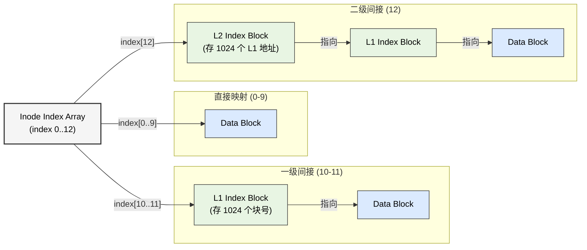
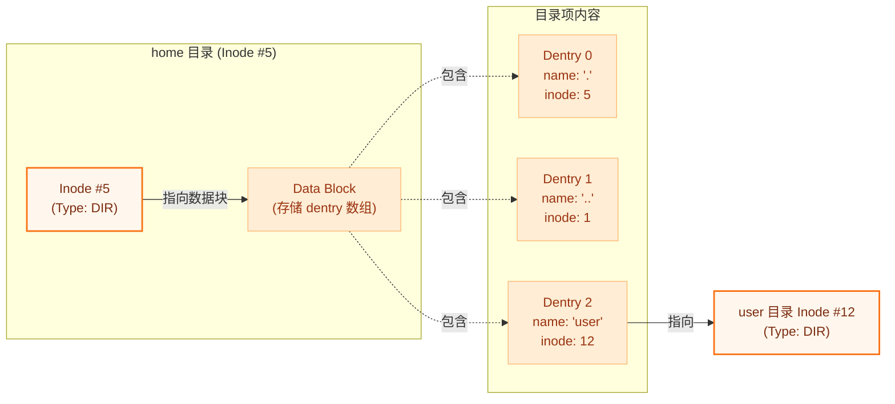
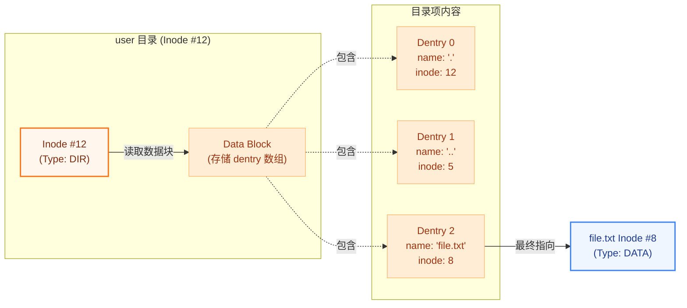
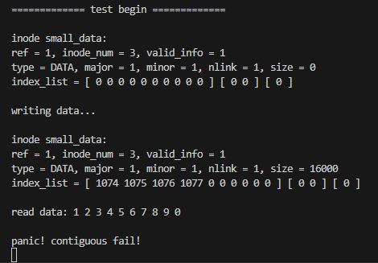
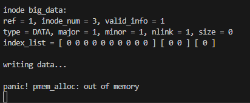
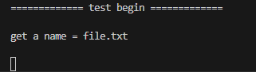
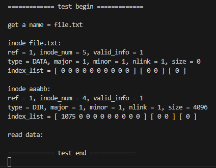

# LAB-8: 文件系统 之 数据组织与层次结构

经过 Lab-7 的磁盘管理实验，我们已经能够通过 Buffer Cache 高效地读写磁盘块。在 Lab-8 中，我们将在此基础上构建文件系统的核心逻辑，解决两个关键问题：**如何组织大文件的数据（Inode）** 以及 **如何构建人类可读的目录树（Dentry）**。

**吴晨曦**：完成了 **Inode 管理** 的核心逻辑，包括多级索引映射、数据读写接口以及 Inode 的生命周期管理。

**丁熙妍**：完成了 **目录项（Dentry）** 的管理逻辑，实现了从文件名到 Inode 的映射；构建了 **路径解析系统**，支持从绝对路径查找目标文件或父目录。


## 代码组织结构

```
ANOS
├── LICENSE        开源协议
├── .vscode        配置了可视化调试环境
├── registers.xml  配置了可视化调试环境
├── .gdbinit.tmp-riscv xv6自带的调试配置
├── common.mk      Makefile中一些工具链的定义
├── Makefile       编译运行整个项目
├── kernel.ld      定义了内核程序在链接时的布局
├── picture        README使用的图片目录 (CHANGE)
├── README.md      实验指导书 (CHANGE)
└── src            源码
    ├── kernel     内核源码
    │   ├── arch   RISC-V相关
    │   │   ├── method.h
    │   │   ├── mod.h
    │   │   └── type.h
    │   ├── boot   机器启动
    │   │   ├── entry.S
    │   │   └── start.c
    │   ├── lock   锁机制
    │   │   ├── spinlock.c
    │   │   ├── sleeplock.c
    │   │   ├── method.h
    │   │   ├── mod.h
    │   │   └── type.h
    │   ├── lib    常用库
    │   │   ├── cpu.c
    │   │   ├── print.c
    │   │   ├── uart.c
    │   │   ├── utils.c (CHANGE, 新增strlen函数)
    │   │   ├── method.h (CHANGE)
    │   │   ├── mod.h
    │   │   └── type.h
    │   ├── mem    内存模块
    │   │   ├── pmem.c
    │   │   ├── kvm.c
    │   │   ├── uvm.c
    │   │   ├── mmap.c
    │   │   ├── method.h
    │   │   ├── mod.h
    │   │   └── type.h
    │   ├── trap   陷阱模块
    │   │   ├── plic.c
    │   │   ├── timer.c
    │   │   ├── trap_kernel.c
    │   │   ├── trap_user.c
    │   │   ├── trap.S
    │   │   ├── trampoline.S
    │   │   ├── method.h
    │   │   ├── mod.h
    │   │   └── type.h
    │   ├── proc   进程模块
    │   │   ├── proc.c
    │   │   ├── swtch.S
    │   │   ├── method.h
    │   │   ├── mod.h
    │   │   └── type.h
    │   ├── syscall 系统调用模块
    │   │   ├── syscall.c
    │   │   ├── sysfunc.c
    │   │   ├── method.h
    │   │   ├── mod.h
    │   │   └── type.h
    │   ├── fs     文件系统模块
    │   │   ├── bitmap.c
    │   │   ├── buf.c
    │   │   ├── inode.c (本实验完成, 核心工作)
    │   │   ├── dentry.c (本实验完成, 核心工作)
    │   │   ├── fs.c (本实验补充, 增加inode初始化逻辑和测试用例)
    │   │   ├── virtio.c
    │   │   ├── method.h (CHANGE)
    │   │   ├── mod.h
    │   │   └── type.h (CHANGE)
    │   └── main.c
    ├── mkfs       磁盘映像初始化
    │   ├── mkfs.c (CHANGE, 更复杂的文件系统初始化)
    │   └── mkfs.h (CHANGE)
    └── user       用户程序
        ├── initcode.c
        ├── sys.h
        ├── syscall_arch.h
        └── syscall_num.h
```

## 具体实现

### 1. inode.c

Inode（索引节点）是文件系统的核心数据结构，它负责记录文件的元数据（大小、类型等）以及**数据块的物理位置**。为了支持从小文件到超大文件的灵活存储，我们实现了**多级索引机制**。

#### 数据块映射 

文件系统需要将文件的**逻辑块号**（Logical Block Num, 第几个块）转换为磁盘上的**物理块号**（Physical Block Num）。

**三级映射与动态分配**：

我们在 `locate_or_add_block` 函数中实现了**三级映射**逻辑，并支持**按需分配**（即当逻辑块不存在时，自动分配物理块并清零）。

具体的映射逻辑如下图所示：



具体实现逻辑：

1.  **直接映射 (Direct Mapping)**：
    - **范围**：逻辑块号 `0 ~ 9`。
    - **实现**：直接从 `inode->index[0...9]` 中获取物理块号。这是访问最快的方式，覆盖了 40KB 以内的小文件。
2.  **一级间接映射 (Level 1 Indirect)**：
    - **范围**：逻辑块号 `10 ~ 10 + 2048 - 1`。
    -  **实现**：`inode->index[10]` 和 `inode->index[11]` 指向**一级索引块**。每个索引块中存储了 1024 个物理块号。
    - **计算**：通过 `(lbn - 10) / 1024` 确定使用哪个一级索引块，通过取模确定块内偏移。
3.  **二级间接映射 (Level 2 Indirect)**：
    - **范围**：逻辑块号 `2058` 起，支持 GB 级大文件。
    - **实现**：`inode->index[12]` 指向一个**二级索引块**。该块中存储了 1024 个一级索引块的地址，每个一级索引块再指向 1024 个数据块。
    - **计算**：需要先读取二级索引块，再读取一级索引块，最后获取数据块。

**递归释放**：

为了防止内存泄漏，我们在 `free_data_blocks` 中实现了**递归释放**逻辑：
-  采用**深度优先**策略，先释放叶子节点（数据块），再释放中间节点（索引块）。
-  `__free_data_blocks` 函数接收当前块号和层级（level），如果 `level > 0`，则读取该块内容并**递归调用自身**释放子块，最后释放当前块。

#### 

### 2. dentry.c

对于用户而言，记忆数字形式的 `inode_num` 是痛苦的。文件系统通过 **目录（Directory）** 和 **目录项（Dentry）** 建立 **文件名 -> Inode** 的映射。

#### 目录项管理

目录本质上是一种特殊的**文件**，其数据块中存储的是 `dentry_t` 结构体数组：

```c
typedef struct dentry {
    char name[MAXLEN_FILENAME]; // 文件名
    uint32 inode_num;           // 对应的 Inode 编号
} dentry_t;
```

为了管理目录项，我们实现了以下核心操作：

-  **`dentry_search`**：
	-  读取目录的数据块，遍历所有 `dentry` 槽位。
	-  比较 `dentry->name` 与目标文件名，若匹配则返回对应的 `inode_num`。
  
- **`dentry_create`**：
	-  在目录中寻找一个空闲槽位（`name[0] == 0`）。
	-  如果目录块未分配，则**自动分配并初始化**。
	-  写入新的文件名和 Inode 编号，并**更新目录大小**。
  
- **`dentry_delete`**：
	-  找到目标目录项，将其 `name` 清零，标记为空闲。
	-  这实现了文件的**解引用**：当 Inode 的引用计数归零时，文件才会被真正删除。


#### 路径解析

为了支持 `/home/user/file.txt` 这样的绝对路径访问，我们在 `__path_to_inode` 中实现了路径解析逻辑。

这是一个**循环查找**的过程 —— 系统从根目录出发，**通过每一级目录项找到下一级的 Inode**，最终到达目标文件。如下图所示，以 `/home/user/file.txt` 为例：

**第一步**：在根目录中找到 `home` (Inode #5)，接着在 `home` 目录中找到 `user` (Inode #12)。



**第二步**：进入 **user 目录 (Inode #12)**，在其数据块中寻找 `file.txt` 对应的目录项，最终定位到目标文件的 Inode (#8)。



**具体实现逻辑**：

基于上述的循环查找思想，我们在 `__path_to_inode` 函数中实现了具体的解析逻辑。该函数是 `path_to_inode` 和 `path_to_parent_inode` 的核心后端。

其核心流程如下：

1. **初始化**：从**根目录 Inode** (`ROOT_INODE`) 开始，获取其 Inode 并加锁。
2. **循环解析**：使用 `get_element` 函数逐级提取路径分量（例如从 `/home/user` 中提取 `home`）。
3. **父目录判断**：
   - 如果调用者请求**查找父目录**（`find_parent_inode == true`），且当前提取的 name 是路径的最后一级（`*path == '\0'`），则说明**当前的 `ip` 就是目标父目录**，解锁 `ip` 并返回。
   - **注意**：这里必须调用 `inode_unlock(ip)` 解锁 `ip` 后再返回，否则会导致**调用者再次加锁时发生死锁**！
4. **目录项查找**：
   - 调用 `dentry_search` 在当前目录 `ip` 中查找名为 `name` 的子项。
   - 如果未找到或当前 `ip` 不是目录类型，则解析失败，释放资源并返回 `NULL`。
5. **切换目录**：
   - **交替加锁**：注意在切换到下一级目录前，必须严格遵守 “**先解锁当前层，再获取下一层**” 的顺序：
	
		``` c
		inode_unlock(ip);      // 1. 释放当前目录锁
		next_ip = inode_get(next_inode_num);
		inode_put(ip);         // 2. 释放当前目录引用
		ip = next_ip;
		inode_lock(ip);        // 3. 锁定下一级目录
		```

		否则会导致死锁！

6. **继续循环**：直到路径解析完毕，如果**不需要找父目录** （`find_parent_inode == false`）），则当前的 `ip` 即为目标文件的 Inode，解锁并返回。


##  测试与修复

我们在 `fs_init` 中添加了 inode 初始化函数 `inode_init()` 以及相关测试用例，全面验证了文件系统的功能。

### test1: inode的访问 + 创建 + 删除

**测试代码**见 `src/kernel/fs/fs.c` 中的 `fs_test` 函数。测试逻辑包括：
1.  **创建**：调用 `inode_create` 分配一个新的 Inode。
2.  **查找**：通过 `inode_get` 获取 Inode，验证引用计数 `ref` 是否正确增加。
3.  **引用管理**：调用 `inode_dup` 和 `inode_put`，观察引用计数的变化。
4.  **删除**：当引用计数归零时，验证 Inode 是否被正确释放，位图是否清零。

**测试结果**见：[test-1.png](picture/test-1.png)，可以看到 Inode 的分配、引用计数变化及释放过程均符合预期，验证了 Inode 生命周期管理的正确性。


### test2: 写入和读取inode管理的数据

**测试代码**见 `src/kernel/fs/fs.c` 中的对应部分。测试旨在验证多级索引机制的有效性：
1.  **连续内存申请**：申请 5 个物理页作为写入源数据，并增加了**物理地址连续性检测**，兼容了内存分配器可能的递增或递减分配策略。
2.  **大数据写入**：向文件写入超过直接映射范围的数据（触发一级和二级间接索引）。
3.  **数据回读校验**：读取刚写入的数据，并验证内容是否正确。

**测试过程中遇到的问题与修复**：

1. **内存分配假设错误**：
   - 助教提供的测试用例假设连续调用 `pmem_alloc` 一定能获得地址递增的连续物理页。然而我们**未通过物理地址连续性检测**：
  
		

	- 经过检查，发现是因为：
	  - Buffer Cache 的初始化和运行会**打乱物理内存布局**。
	  - 并且本实验的 `pmem_alloc` 实现是采用的**递减分配**策略，导致连续调用时地址递减。
	- **修复**：
		- 我们将测试用例中的大块内存申请逻辑**提前到所有文件系统操作之前**（即 `buffer_init` 之前），确保物理内存尚未被碎片化。
		- 并且增加了对分配方向（递增/递减）的**兼容检测逻辑**。如果检测到内存碎片（既不递增也不递减），则触发 panic 提前报错。

2. **测试规模过大**
    - 助教的测试用例中试图写入约 175MB 数据（循环 10000 次），导致系统内存耗尽，出现 `Out of memory` 错误，如下图所示：

   		
		
	- 经过检查，发现是因为：我们的测试环境（QEMU 分配的内存）有限，无法支撑如此大规模的内存申请。
	- **修复**：
		- 我们将写入循环次数从 10000 减至 100，既能覆盖多级索引的逻辑，又避免了内存不足的问题。

**测试结果**见：[test-2.png](picture/test-2.png)，数据读写完全一致，多级索引工作正常。

### test3: 目录项的增加、删除、查找操作

**测试代码**见 `src/kernel/fs/fs.c` 中的对应部分。测试逻辑如下：
1.  **创建目录项**：在根目录下调用 `dentry_create` 创建名为 `test_dir` 的子目录。
2.  **查找目录项**：调用 `dentry_search` 查找 `test_dir`，验证是否能返回正确的 `inode_num`。
3.  **删除目录项**：调用 `dentry_delete` 删除该目录项，再次查找应返回失败。

**测试结果**见：[test-3.png](picture/test-3.png)，成功在根目录下创建、查找并删除了目录项，验证了目录管理功能的正确性。


### test4: 文件路径的解析

**测试代码**见 `src/kernel/fs/fs.c` 中的对应部分。测试旨在验证 `path_to_inode` 解析复杂路径的能力：
1.  **多级路径**：解析如 `///AABBC///aaabb/file.txt` 这样包含冗余斜杠和多级目录的路径。
2.  **父目录查找**：调用 `path_to_parent_inode` 查找目标文件的父目录，用于创建新文件。

**测试过程中遇到的问题与修复**：
1. **死锁问题**：
   - 测试时，我们发现系统卡在如下图位置：

   		

   - 经过检查，发现是因为： `path_to_parent_inode` 在找到父节点后**忘记解锁**，导致**调用者再次加锁时发生死锁**。
   
   - **修复**：
  		我们在 `path_to_parent_inode` 函数中，找到父节点并返回前添加了 `inode_unlock(ip)` 这一**解锁操作**后，死锁解除，解决了该问题。

		``` c
		if (find_parent_inode && *path == '\0') {
			inode_unlock(ip); // 【修复】返回前必须解锁！
			return ip;
		}
		```

2. **未读取到数据**：
   - 修复完死锁问题后，结果显示路径解析成功找到了 Inode，但**读取到的数据为空**，控制台未打印 "This is file context!"，如下图所示：
  
   		

	- 经过检查，发现是因为：助教的测试代码在创建并写入 `ip_3` (file.txt) 后，**忘记调用 `inode_rw(ip_3, true)` 将其元数据写回磁盘**。导致后续重新读取时，内核认为这是一个空文件。
  
   - **修复**：
  		在释放 `ip_3` 之前，增加元数据同步操作 `inode_rw(ip_3, true)`。
   

**测试结果**见：[test-4.png](picture/test-4.png)，成功解析了复杂路径并读取了目标文件内容，验证了路径解析系统的正确性。


## 总结与思考
